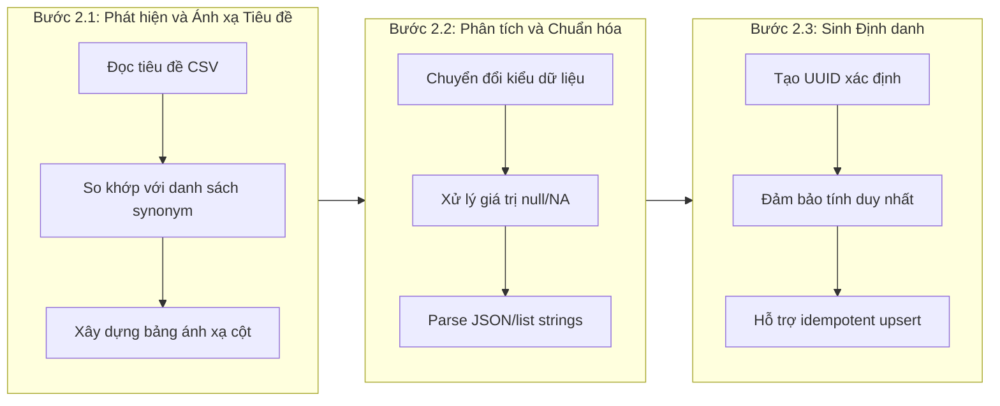

# Quy trình Thu thập và Xử lý Dữ liệu (Data Pipeline)

## 1. Giới thiệu

Quy trình thu thập và xử lý dữ liệu (Data Pipeline) là thành phần nền tảng của hệ thống MealAgent, chịu trách nhiệm chuyển đổi dữ liệu thô từ các nguồn khác nhau thành cơ sở tri thức phục vụ cho việc lập kế hoạch bữa ăn thông minh. Quy trình này kết hợp ba công nghệ chính: tiền xử lý Python để chuẩn hóa dữ liệu, cơ sở dữ liệu vector Weaviate để lưu trữ và truy xuất ngữ nghĩa, và Elysia framework để sinh metadata hỗ trợ truy vấn.

Quy trình được thiết kế dựa trên các nguyên tắc sau:

- **Tính linh hoạt**: Hệ thống có khả năng xử lý nhiều định dạng CSV với cấu trúc cột khác nhau thông qua cơ chế ánh xạ synonym.
- **Tính nhất quán**: Định danh UUID được sinh xác định (deterministic) cho phép thực hiện upsert idempotent, tránh tạo bản ghi trùng lặp.
- **Tính mở rộng**: Kiến trúc batch processing cho phép xử lý hiệu quả với bộ dữ liệu lớn.
- **Tính ngữ nghĩa**: Cơ chế vector embedding cho phép tìm kiếm dựa trên ý nghĩa thay vì chỉ khớp từ khóa.

## 2. Kiến trúc Tổng thể

Quy trình thu thập và xử lý dữ liệu được chia thành bảy giai đoạn chính, như minh họa trong Hình 1.

```
┌─────────────────────────────────────────────────────────────────────────────────────────┐
│                           Quy trình Xử lý Dữ liệu MealAgent                              │
├─────────────────────────────────────────────────────────────────────────────────────────┤
│                                                                                          │
│  ┌─────────────────┐    ┌─────────────────┐    ┌─────────────────┐    ┌───────────────┐ │
│  │  Nguồn Dữ liệu  │───▶│   Tiền Xử lý    │───▶│   Xây dựng      │───▶│  Nhúng        │ │
│  │  Thô            │    │   (Python)      │    │   Đối tượng     │    │  Vector       │ │
│  └─────────────────┘    └─────────────────┘    └─────────────────┘    └───────────────┘ │
│         │                      │                       │                      │          │
│         ▼                      ▼                       ▼                      ▼          │
│  • USDA FoodData     • Phát hiện tiêu đề   • Xây dựng thuộc tính  • text2vec-          │
│    Central           • Phân tích trường    • Sinh UUID xác định     transformers       │
│  • Công thức         • Chuẩn hóa dữ liệu   • Tạo liên kết tham    • 1024 chiều         │
│    Việt Nam          • Sinh định danh        chiếu                                      │
│                                                                                          │
│                           ┌─────────────────────────────────────────┐                   │
│                           │      Cơ sở dữ liệu Vector Weaviate       │                   │
│                           ├─────────────────────────────────────────┤                   │
│                           │  ┌─────────────┐    ┌─────────────────┐ │                   │
│                           │  │ Collections │    │ Collections     │ │                   │
│                           │  │ Tri thức    │    │ Hỗ trợ          │ │                   │
│                           │  ├─────────────┤    ├─────────────────┤ │                   │
│                           │  │ • FdcFood   │◀──▶│ • FdcNutrient   │ │                   │
│                           │  │ • Recipe    │    │ • FdcPortion    │ │                   │
│                           │  └─────────────┘    └─────────────────┘ │                   │
│                           └─────────────────────────────────────────┘                   │
│                                              │                                           │
│                                              ▼                                           │
│                           ┌─────────────────────────────────────────┐                   │
│                           │         Tiền xử lý Elysia                │                   │
│                           │  • Sinh tóm tắt metadata                 │                   │
│                           │  • Lưu vào ELYSIA_METADATA__             │                   │
│                           └─────────────────────────────────────────┘                   │
│                                                                                          │
└─────────────────────────────────────────────────────────────────────────────────────────┘
```

**Hình 1:** Kiến trúc tổng thể của quy trình thu thập và xử lý dữ liệu

## 3. Chi tiết các Giai đoạn

### 3.1. Giai đoạn 1: Nguồn Dữ liệu Thô (Raw Data Sources)

Hệ thống MealAgent sử dụng hai nguồn dữ liệu chính để xây dựng cơ sở tri thức về thực phẩm và công thức nấu ăn.

#### 3.1.1. USDA FoodData Central

FoodData Central là cơ sở dữ liệu dinh dưỡng quốc gia của Hoa Kỳ, cung cấp thông tin chi tiết về thành phần dinh dưỡng của hàng nghìn loại thực phẩm. Dữ liệu được lưu trữ trong tệp `data/FDC_data.csv` với kích thước khoảng 9.7 MB.

**Bảng 1:** Cấu trúc dữ liệu USDA FoodData Central

| Trường | Kiểu dữ liệu | Mô tả |
|--------|--------------|-------|
| `fdc_id` | INTEGER | Định danh duy nhất của thực phẩm |
| `description` | TEXT | Mô tả chi tiết thực phẩm |
| `energy_kcal_100g` | NUMBER | Năng lượng trên 100g (kcal) |
| `protein_g_100g` | NUMBER | Hàm lượng protein trên 100g |
| `fat_g_100g` | NUMBER | Hàm lượng chất béo trên 100g |
| `carbohydrate_g_100g` | NUMBER | Hàm lượng carbohydrate trên 100g |
| `nutrients_json` | JSON | Chi tiết dinh dưỡng dạng JSON |
| `portions_json` | JSON | Thông tin đơn vị đo lường |

**Ví dụ dữ liệu thô:**

```csv
fdc_id,description,energy_kcal_100g,protein_g_100g,fat_g_100g,carbohydrate_g_100g,nutrients_json,portions_json
167512,"Chicken, broilers or fryers, breast, meat only, cooked, roasted",165,31.02,3.57,0,"[{""nutrient_id"": 1008, ""amount"": 165, ""unit"": ""kcal""}]","[{""amount"": 1, ""measure_unit"": ""cup"", ""gram_weight"": 140}]"
```

#### 3.1.2. Công thức Nấu ăn Việt Nam

Bộ dữ liệu công thức nấu ăn Việt Nam được thu thập từ nhiều nguồn, chứa thông tin về nguyên liệu, cách chế biến và hình ảnh minh họa. Dữ liệu được lưu trữ trong tệp `data/recipe.csv` với kích thước khoảng 6.7 MB.

**Bảng 2:** Cấu trúc dữ liệu công thức nấu ăn

| Trường | Kiểu dữ liệu | Mô tả |
|--------|--------------|-------|
| `food_id` | TEXT | Định danh duy nhất của công thức |
| `dish_name` | TEXT | Tên món ăn |
| `dish_type` | TEXT | Phân loại món ăn (Món nước, Món khô) |
| `serving_size` | INTEGER | Số khẩu phần |
| `cooking_time` | INTEGER | Thời gian nấu (phút) |
| `ingredients` | TEXT_ARRAY | Danh sách nguyên liệu |
| `ingredients_with_qty` | TEXT_ARRAY | Nguyên liệu kèm định lượng |
| `cooking_method_array` | TEXT_ARRAY | Các bước chế biến |
| `image_link` | TEXT | Đường dẫn hình ảnh |

**Ví dụ dữ liệu thô:**

```csv
food_id,dish_name,dish_type,serving_size,cooking_time,ingredients,ingredients_with_qty,cooking_method_array
VN001,"Phở Bò","Món nước",4,120,"[""Bánh phở"", ""Thịt bò"", ""Hành tây""]","[""500g bánh phở"", ""300g thịt bò""]","[""Ninh xương bò 3 tiếng"", ""Thái thịt mỏng""]"
```

### 3.2. Giai đoạn 2: Tiền Xử lý (Pre-processing)

Giai đoạn tiền xử lý chịu trách nhiệm chuẩn hóa và chuyển đổi dữ liệu thô thành định dạng phù hợp cho việc lưu trữ. Quy trình này được thực hiện qua ba bước chính như minh họa trong Hình 2.



**Hình 2:** Quy trình chi tiết của giai đoạn tiền xử lý

#### 3.2.1. Phát hiện và Ánh xạ Tiêu đề (Header Detection and Mapping)

Hệ thống sử dụng cơ chế synonym mapping để nhận diện cột một cách linh hoạt, cho phép xử lý các tệp CSV có tên cột khác nhau mà không cần sửa đổi code. Mỗi trường dữ liệu chuẩn được định nghĩa với một danh sách các tên đồng nghĩa.

**Bảng 3:** Ví dụ ánh xạ synonym cho các trường chính

| Trường chuẩn | Danh sách Synonym |
|--------------|-------------------|
| `fdc_id` | fdc_id, FDC_ID, fdcId, id |
| `description` | description, food_description, name, long_desc, food_name |
| `energy_kcal_100g` | energy_kcal_100g, kcal_100g, energy_kcal, energy_kcal_per_100g |
| `protein_g_100g` | protein_g_100g, protein_100g, protein_per_100g |

Hàm `find_first_col()` thực hiện việc tìm kiếm cột phù hợp trong tiêu đề CSV:

```python
def find_first_col(header: List[str], candidates: List[str]) -> Optional[str]:
    """Tìm cột đầu tiên trong header khớp với danh sách candidates."""
    lower = {h.lower(): h for h in header}
    for cand in candidates:
        if cand.lower() in lower:
            return lower[cand.lower()]
    return None
```

#### 3.2.2. Phân tích và Chuẩn hóa Trường (Field Parsing and Normalization)

Hệ thống cung cấp một bộ các hàm tiện ích để chuyển đổi và chuẩn hóa dữ liệu:

**Bảng 4:** Các hàm chuẩn hóa dữ liệu

| Hàm | Đầu vào | Đầu ra | Xử lý đặc biệt |
|-----|---------|--------|----------------|
| `to_str(x)` | Any | str | Loại bỏ khoảng trắng thừa |
| `to_float(x)` | Any | Optional[float] | Xử lý "NA", "NaN", "null" → None |
| `to_int(x)` | Any | Optional[int] | Xử lý dấu phẩy ngăn cách hàng nghìn |
| `parse_listish(s)` | str/list | List[dict] | Parse JSON hoặc Python literal |

**Ví dụ quá trình chuẩn hóa:**

| Dữ liệu thô | Sau chuẩn hóa | Hàm sử dụng |
|-------------|---------------|-------------|
| `"  Chicken breast  "` | `"Chicken breast"` | `to_str()` |
| `"165.00"` | `165.0` | `to_float()` |
| `"NA"` | `None` | `to_float()` |
| `"1,234"` | `1234` | `to_int()` |
| `'[{"id": 1}]'` (string) | `[{"id": 1}]` (list) | `parse_listish()` |

#### 3.2.3. Sinh Định danh Xác định (Deterministic ID Generation)

Hệ thống sử dụng hàm `generate_uuid5()` từ thư viện Weaviate để sinh UUID xác định dựa trên nội dung. Điều này đảm bảo rằng cùng một bản ghi sẽ luôn có cùng UUID, cho phép thực hiện upsert idempotent.

**Bảng 5:** Các hàm sinh UUID

| Hàm | Đầu vào | Định dạng UUID |
|-----|---------|----------------|
| `uuid_food(fdc_id)` | "167512" | `FdcFood:167512` |
| `uuid_nutrient(fdc_id, nutrient_id)` | "167512", 1008 | `FdcNutrient:167512:1008` |
| `uuid_portion(fdc_id, payload)` | "167512", {...} | `FdcPortion:167512:1:cup:140` |
| `uuid_recipe(recipe_id)` | "VN001" | `Recipe:VN001` |

Tính chất xác định của UUID mang lại các lợi ích:
- Chạy lại quy trình không tạo bản ghi trùng lặp
- Có thể cập nhật bản ghi hiện có thay vì tạo mới
- Đảm bảo tính toàn vẹn của liên kết tham chiếu

### 3.3. Giai đoạn 3: Xây dựng Đối tượng (Object Construction)

Giai đoạn này chuyển đổi dữ liệu đã chuẩn hóa thành các đối tượng có cấu trúc phù hợp với schema của Weaviate.

#### 3.3.1. FdcFood Object

Đối tượng FdcFood đại diện cho một thực phẩm trong cơ sở dữ liệu USDA, chứa thông tin mô tả và các giá trị dinh dưỡng trên 100g.

**Cấu trúc đối tượng FdcFood:**

```python
{
    "uuid": "a1b2c3d4-e5f6-5789-abcd-ef0123456789",
    "properties": {
        "fdc_id": 167512,
        "description": "Chicken, broilers or fryers, breast, meat only, cooked, roasted",
        
        # Macronutrients (per 100g)
        "energy_kcal_100g": 165.0,
        "protein_g_100g": 31.02,
        "fat_g_100g": 3.57,
        "carbohydrate_g_100g": 0.0,
        "sugars_g_100g": None,
        "fiber_g_100g": None,
        "sodium_mg_100g": 74.0,
        "sat_fat_g_100g": 1.01,
        
        # Micronutrients (per 100g)
        "calcium_mg_100g": 15.0,
        "iron_mg_100g": 1.04,
        "potassium_mg_100g": 256.0,
        "vitamin_c_mg_100g": 0.0,
        # ... các vi chất khác
    },
    "references": {
        "has_nutrient": ["uuid_nutrient_1", "uuid_nutrient_2", ...],
        "has_portion": ["uuid_portion_1", "uuid_portion_2"]
    }
}
```

#### 3.3.2. FdcNutrient Object

Đối tượng FdcNutrient lưu trữ chi tiết về từng chất dinh dưỡng của một thực phẩm, cho phép truy vấn linh hoạt theo loại chất dinh dưỡng.

**Cấu trúc đối tượng FdcNutrient:**

```python
{
    "uuid": "b2c3d4e5-f6a7-5890-bcde-f01234567890",
    "properties": {
        "fdc_id": 167512,
        "nutrient_id": 1008,
        "nutrient_name": "energy_kcal_100g",
        "amount_100g": 165.0,
        "unit": "kcal"
    }
}
```

#### 3.3.3. FdcPortion Object

Đối tượng FdcPortion chứa thông tin về các đơn vị đo lường phổ biến và quy đổi sang gram.

**Cấu trúc đối tượng FdcPortion:**

```python
{
    "uuid": "d4e5f6a7-b8c9-5012-def0-123456789012",
    "properties": {
        "fdc_id": 167512,
        "amount": 1.0,
        "measure_unit": "cup, chopped or diced",
        "gram_weight": 140.0
    }
}
```

#### 3.3.4. Recipe Object

Đối tượng Recipe đại diện cho một công thức nấu ăn hoàn chỉnh với đầy đủ thông tin về nguyên liệu và cách chế biến.

**Cấu trúc đối tượng Recipe:**

```python
{
    "uuid": "c3d4e5f6-a7b8-5901-cdef-012345678901",
    "properties": {
        # Thông tin cơ bản
        "food_id": "VN001",
        "dish_name": "Phở Bò",
        "dish_type": "Món nước",
        "serving_size": 4,
        "cooking_time": 120,
        "image_link": "https://example.com/pho.jpg",
        
        # Nguyên liệu
        "ingredients": ["Bánh phở", "Thịt bò", "Hành tây", "Gừng", "Quế", "Hồi"],
        "ingredients_with_qty": ["500g bánh phở", "300g thịt bò", "1 củ hành tây"],
        
        # Cách chế biến
        "cooking_method_array": [
            "Ninh xương bò với gừng đập dập trong 3 tiếng",
            "Thái thịt bò mỏng",
            "Trụng bánh phở qua nước sôi",
            "Chan nước dùng nóng lên phở và thịt bò"
        ],
        
        # Ràng buộc (populated by tools)
        "diet_type": [],
        "allergens": [],
        "devices": [],
        
        # Dinh dưỡng đã tính (computed by precompute_recipe_macros.py)
        "macros_per_serving": {
            "kcal": 450.5,
            "protein_g": 28.3,
            "fat_g": 12.1,
            "carb_g": 52.8
        },
        
        # Ánh xạ FDC (cached for performance)
        "ingredient_fdc_map": [
            {
                "ingredient_vn": "Thịt bò",
                "ingredient_en": "Beef",
                "fdc_id": 173170,
                "quantity_g": 75.0,
                "confidence": 0.95
            }
        ]
    }
}
```

### 3.4. Giai đoạn 4: Nhúng Vector (Vector Embedding)

Giai đoạn này chuyển đổi nội dung văn bản thành biểu diễn vector, cho phép tìm kiếm dựa trên ngữ nghĩa. Weaviate tự động thực hiện quá trình này khi đối tượng được thêm vào collection.

#### 3.4.1. Cấu hình Vectorizer

Hệ thống sử dụng module `text2vec-transformers` với các cấu hình sau:

**Bảng 6:** Cấu hình vectorizer theo collection

| Collection | Thuộc tính nguồn | Số chiều | Index |
|------------|------------------|----------|-------|
| FdcFood | `description` | 1024 | HNSW |
| Recipe | `dish_name`, `ingredients_with_qty`, `ingredients`, `cooking_method_array` | 1024 | HNSW |

**Schema vectorizer cho Recipe:**

```python
"vector_config": Configure.Vectors.text2vec_transformers(
    source_properties=[
        "dish_name",              # Tên món ăn
        "ingredients_with_qty",   # Nguyên liệu có số lượng
        "ingredients",            # Danh sách nguyên liệu
        "cooking_method_array"    # Các bước nấu
    ],
    vectorize_collection_name=False,
    dimensions=1024,
    vector_index_config=Configure.VectorIndex.hnsw()
)
```

#### 3.4.2. Quá trình Nhúng Vector

Quá trình nhúng vector diễn ra như sau:

1. **Nối văn bản**: Các thuộc tính nguồn được nối thành một chuỗi văn bản
2. **Tokenization**: Văn bản được tách thành các token
3. **Encoding**: Model transformer tạo biểu diễn vector 1024 chiều
4. **Indexing**: Vector được thêm vào chỉ mục HNSW

**Ví dụ văn bản đầu vào (cho Recipe):**

```
Phở Bò 500g bánh phở 300g thịt bò 1 củ hành tây 50g gừng 2 thanh quế 
3 cánh hồi Bánh phở Thịt bò Hành tây Gừng Quế Hồi 
Ninh xương bò với gừng đập dập trong 3 tiếng Thái thịt bò mỏng 
Trụng bánh phở qua nước sôi Chan nước dùng nóng lên phở và thịt bò
```

**Đầu ra vector (1024 chiều):**

```
[0.0234, -0.0156, 0.0892, 0.0412, ..., -0.0678, 0.0543]
```

#### 3.4.3. Chỉ mục HNSW (Hierarchical Navigable Small World)

Vector được lưu trữ trong chỉ mục HNSW, một cấu trúc dữ liệu tối ưu cho tìm kiếm k-nearest neighbors gần đúng (Approximate Nearest Neighbor - ANN). HNSW cung cấp:

- **Tìm kiếm nhanh**: Độ phức tạp O(log N) thay vì O(N)
- **Độ chính xác cao**: Recall > 95% trong hầu hết các trường hợp
- **Khả năng mở rộng**: Hiệu quả với hàng triệu vector

### 3.5. Giai đoạn 5: Cập nhật và Chèn vào Weaviate

Giai đoạn này thực hiện việc lưu trữ các đối tượng đã xây dựng vào cơ sở dữ liệu Weaviate.

#### 3.5.1. Batch Insert

Hệ thống sử dụng batch processing để tối ưu hiệu suất khi chèn số lượng lớn đối tượng:

```python
# Chèn FdcFood theo batch
with foods_col.batch.fixed_size(batch_size=1000) as batch_food:
    batch_food.add_object(properties=props, uuid=uuid_food(fdc_id))

# Chèn Recipe theo batch
with col.batch.fixed_size(batch_size=400) as batch:
    batch.add_object(properties=props, uuid=uuid_recipe(rid))
```

**Bảng 7:** Cấu hình batch size theo collection

| Collection | Batch Size | Lý do |
|------------|------------|-------|
| FdcFood | 1000 | Đối tượng nhỏ, không phức tạp |
| FdcNutrient | 1000 | Số lượng lớn (~20 per food) |
| FdcPortion | 1000 | Đối tượng đơn giản |
| Recipe | 400 | Đối tượng lớn, có array fields |

#### 3.5.2. Reference Wiring

Sau khi chèn các đối tượng, hệ thống tạo các liên kết tham chiếu giữa chúng:

```python
# Liên kết FdcFood với FdcNutrient và FdcPortion
with foods_col.batch.fixed_size(batch_size=1000) as batch_ref:
    batch_ref.add_reference(
        from_uuid=uuid_food(fdc_id),
        from_property="has_nutrient",
        to=uuid_nutrient(fdc_id, nutrient_id)
    )
    batch_ref.add_reference(
        from_uuid=uuid_food(fdc_id),
        from_property="has_portion",
        to=portion_uuid
    )
```

#### 3.5.3. Scalar Update

Đối với FdcFood, các giá trị scalar (macronutrients) được cập nhật sau khi tích lũy từ FdcNutrient:

```python
# Cập nhật scalar fields từ nutrients đã tích lũy
for fdc_id, fields in fdc_scalar_accum.items():
    foods_col.data.update(uuid=uuid_food(fdc_id), properties=fields)
```

### 3.6. Giai đoạn 6: Cấu trúc Cơ sở Dữ liệu Vector

Cơ sở dữ liệu Weaviate được tổ chức thành hai loại collection: Knowledge Collections (có vector) và Structured Support Collections (không có vector).

```
┌─────────────────────────────────────────────────────────────────────────┐
│                         Các Collection Weaviate                          │
├─────────────────────────────────────────────────────────────────────────┤
│                                                                          │
│  ┌──────────────────┐         has_nutrient         ┌──────────────────┐ │
│  │     FdcFood      │─────────────────────────────▶│   FdcNutrient    │ │
│  │   (vectorized)   │                              │ (không vector)   │ │
│  ├──────────────────┤         has_portion          ├──────────────────┤ │
│  │ • fdc_id         │────────────────────────────▶ │ • fdc_id         │ │
│  │ • description    │                              │ • nutrient_id    │ │
│  │ • energy_kcal    │    ┌──────────────────┐      │ • amount_100g    │ │
│  │ • protein_g      │    │   FdcPortion     │      │ • unit           │ │
│  │ • fat_g          │    │ (không vector)   │      └──────────────────┘ │
│  │ • carb_g         │    ├──────────────────┤                           │
│  │ • ...micros      │    │ • fdc_id         │                           │
│  │ • [VECTOR]       │    │ • amount         │                           │
│  └──────────────────┘    │ • measure_unit   │                           │
│                          │ • gram_weight    │                           │
│  ┌──────────────────┐    └──────────────────┘                           │
│  │     Recipe       │                                                    │
│  │   (vectorized)   │                                                    │
│  ├──────────────────┤                                                    │
│  │ • food_id        │                                                    │
│  │ • dish_name      │                                                    │
│  │ • dish_type      │                                                    │
│  │ • ingredients    │                                                    │
│  │ • cooking_method │                                                    │
│  │ • macros_per_srv │                                                    │
│  │ • [VECTOR]       │                                                    │
│  └──────────────────┘                                                    │
│                                                                          │
└─────────────────────────────────────────────────────────────────────────┘
```

**Hình 3:** Sơ đồ cấu trúc các collection và mối quan hệ

**Bảng 8:** Phân loại các collection

| Loại | Collection | Có Vector | Mục đích |
|------|------------|-----------|----------|
| Knowledge | FdcFood | Có | Tìm kiếm ngữ nghĩa thực phẩm |
| Knowledge | Recipe | Có | Tìm kiếm ngữ nghĩa công thức |
| Support | FdcNutrient | Không | Lưu chi tiết dinh dưỡng |
| Support | FdcPortion | Không | Lưu đơn vị đo lường |

### 3.7. Giai đoạn 7: Tiền xử lý Elysia (Elysia Preprocessing)

Giai đoạn cuối cùng tạo metadata summaries để hỗ trợ framework Elysia trong việc hiểu và định tuyến truy vấn.

#### 3.7.1. Mục đích

Elysia Preprocessing tạo metadata để hỗ trợ:
- **Hiểu truy vấn (Query understanding)**: Xác định ý định tìm kiếm của người dùng
- **Định tuyến collection (Collection routing)**: Chọn collection phù hợp cho truy vấn
- **Ánh xạ trường (Field mapping)**: Chuyển đổi giữa các trường generic và cụ thể

#### 3.7.2. Các Collection được Tiền xử lý

```python
DEFAULT_COLLECTIONS = [
    "UserProfile",      # Hồ sơ người dùng
    "MealPlan",         # Kế hoạch bữa ăn
    "MealPlanItem",     # Chi tiết bữa ăn trong kế hoạch
    "MealLogEntry",     # Nhật ký bữa ăn đã tiêu thụ
    "Pantry",           # Kho nguyên liệu
    "PantryItem",       # Chi tiết nguyên liệu trong kho
    "ShoppingList",     # Danh sách mua sắm
    "ShoppingItem",     # Chi tiết mặt hàng cần mua
]
```

#### 3.7.3. Cấu trúc Metadata

**Ví dụ metadata cho collection Recipe:**

```python
{
    "collection_name": "Recipe",
    "summary": "Vietnamese recipe collection with dish names, ingredients, 
                cooking methods, and nutritional information per serving.",
    
    "prompts": [
        "Find recipes for Vietnamese dishes",
        "Search for recipes containing specific ingredients",
        "Look up cooking methods and instructions",
        "Find recipes by dish type (soup, dry, etc.)"
    ],
    
    "generic_mapping": {
        "title": "dish_name",
        "subtitle": "dish_type",
        "content": "cooking_method_array",
        "id": "food_id",
        "tags": "ingredients",
        "category": "dish_type"
    },
    
    "field_descriptions": {
        "food_id": "Unique identifier for the recipe",
        "dish_name": "Name of the Vietnamese dish",
        "dish_type": "Category of dish (Món nước, Món khô, etc.)",
        "serving_size": "Number of servings this recipe makes",
        "cooking_time": "Total cooking time in minutes",
        "ingredients": "List of ingredient names",
        "macros_per_serving": "Nutritional macros per serving"
    }
}
```

Metadata được lưu trữ trong collection đặc biệt `ELYSIA_METADATA__` và được sử dụng bởi Elysia framework trong quá trình xử lý truy vấn.

## 4. Ví dụ Truy vấn Sau Khi Xử lý

### 4.1. Tìm kiếm Ngữ nghĩa (Semantic Search)

```python
# Truy vấn: Tìm món soup có thịt bò
result = recipe_collection.query.near_text(
    query="món soup có thịt bò",
    limit=5
)

# Kết quả (xếp theo độ tương đồng):
# 1. Phở Bò (similarity: 0.92)
# 2. Bún Bò Huế (similarity: 0.88)
# 3. Hủ Tiếu Bò Kho (similarity: 0.85)
```

### 4.2. Tìm kiếm Hybrid với Bộ lọc

```python
from weaviate.classes.query import Filter

# Tìm công thức có dưới 500 kcal
result = recipe_collection.query.hybrid(
    query="gà nướng healthy",
    filters=Filter.by_property("macros_per_serving.kcal").less_than(500),
    limit=10
)
```

### 4.3. Truy vấn với Tham chiếu

```python
from weaviate.classes.query import QueryReference

# Lấy thông tin thực phẩm kèm dinh dưỡng và đơn vị đo
result = fdc_food_collection.query.fetch_objects(
    filters=Filter.by_property("description").like("*chicken*"),
    return_references=[
        QueryReference(
            link_on="has_nutrient",
            return_properties=["nutrient_id", "amount_100g", "unit"]
        ),
        QueryReference(
            link_on="has_portion",
            return_properties=["amount", "measure_unit", "gram_weight"]
        )
    ]
)
```

## 5. Hướng dẫn Thực thi Pipeline

### 5.1. Tạo Collections

```bash
python -m MealAgent.migrations.create_collections --create
```

### 5.2. Import Dữ liệu FDC

```bash
python -m MealAgent.etl.ingest_fdc --csv MealAgent/data/FDC_data.csv --verify
```

### 5.3. Import Dữ liệu Recipe

```bash
python -m MealAgent.etl.ingest_recipes --csv MealAgent/data/recipe.csv --verify
```

### 5.4. Tính toán Macros cho Recipe

```bash
python -m MealAgent.scripts.precompute_recipe_macros
```

### 5.5. Tiền xử lý Elysia

```bash
python -m MealAgent.preprocessing.preprocessor
```

## 6. Thống kê Sau Import

**Bảng 9:** Thống kê số lượng bản ghi sau khi import

| Collection | Số lượng bản ghi | Ghi chú |
|------------|------------------|---------|
| FdcFood | ~8,789 | Thực phẩm từ USDA |
| FdcNutrient | ~175,780 | ~20 nutrients per food |
| FdcPortion | ~26,367 | ~3 portions per food |
| Recipe | ~15,234 | Công thức Việt Nam |

## 7. Kết luận

Quy trình thu thập và xử lý dữ liệu của MealAgent được thiết kế để đảm bảo tính linh hoạt, nhất quán và hiệu quả. Cơ chế synonym mapping cho phép xử lý nhiều định dạng CSV khác nhau, trong khi UUID xác định đảm bảo tính idempotent của các thao tác upsert. Sự kết hợp giữa vector embedding và chỉ mục HNSW cho phép tìm kiếm ngữ nghĩa nhanh chóng và chính xác. Metadata từ Elysia Preprocessing bổ sung khả năng hiểu ngữ cảnh và định tuyến truy vấn thông minh.

Kiến trúc theo mô-đun với các giai đoạn rõ ràng cho phép bảo trì và mở rộng dễ dàng khi cần thêm nguồn dữ liệu mới hoặc thay đổi cấu trúc schema.
