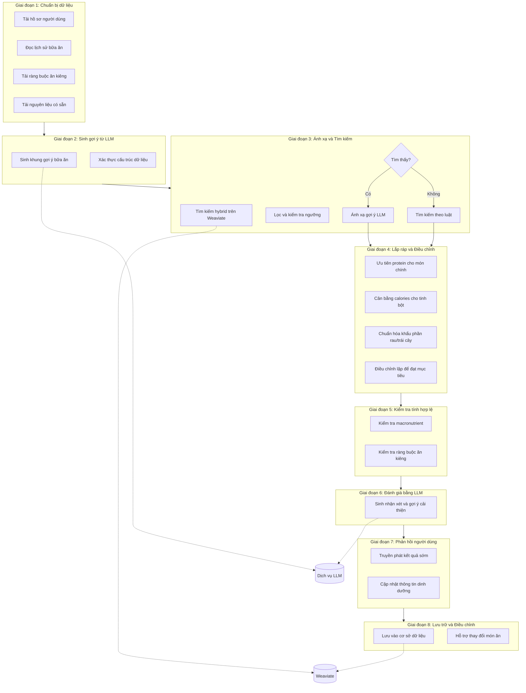
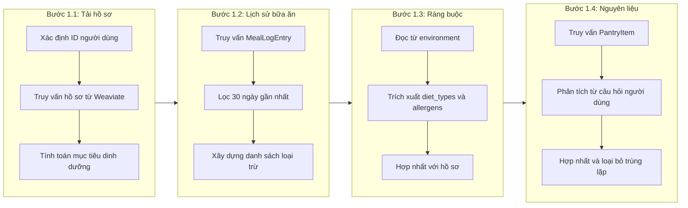
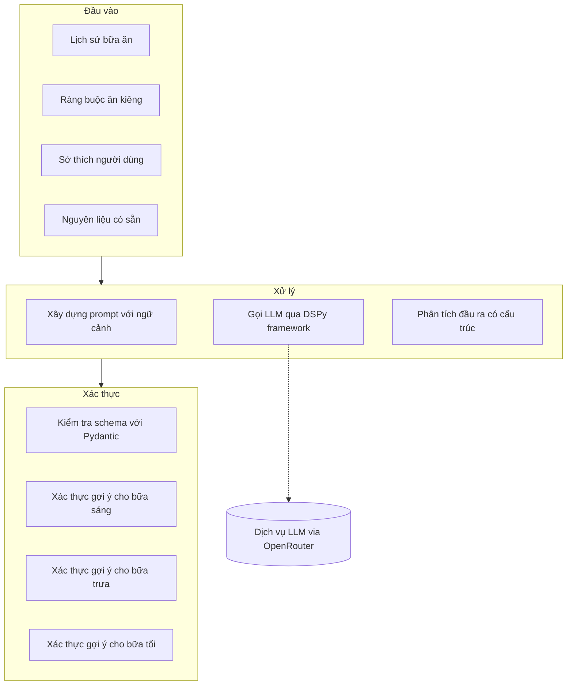
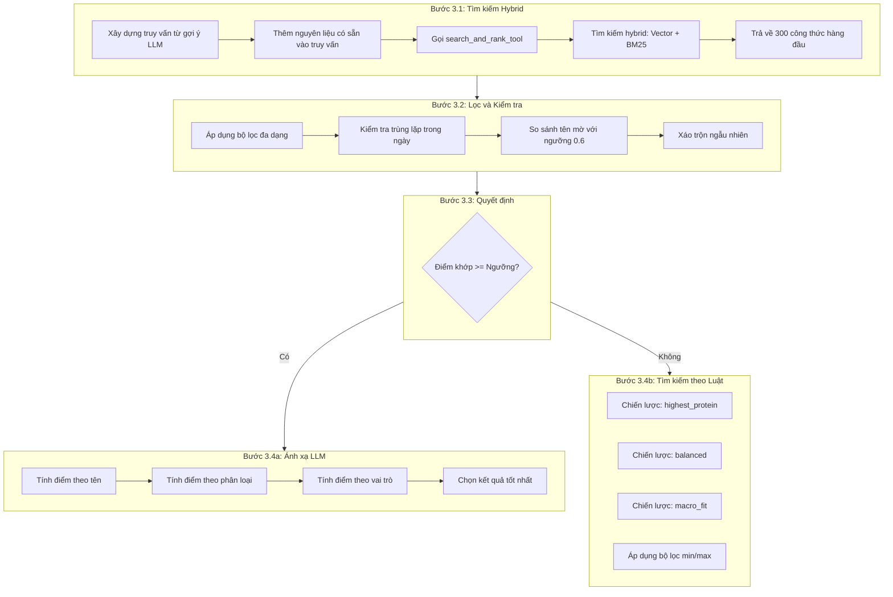
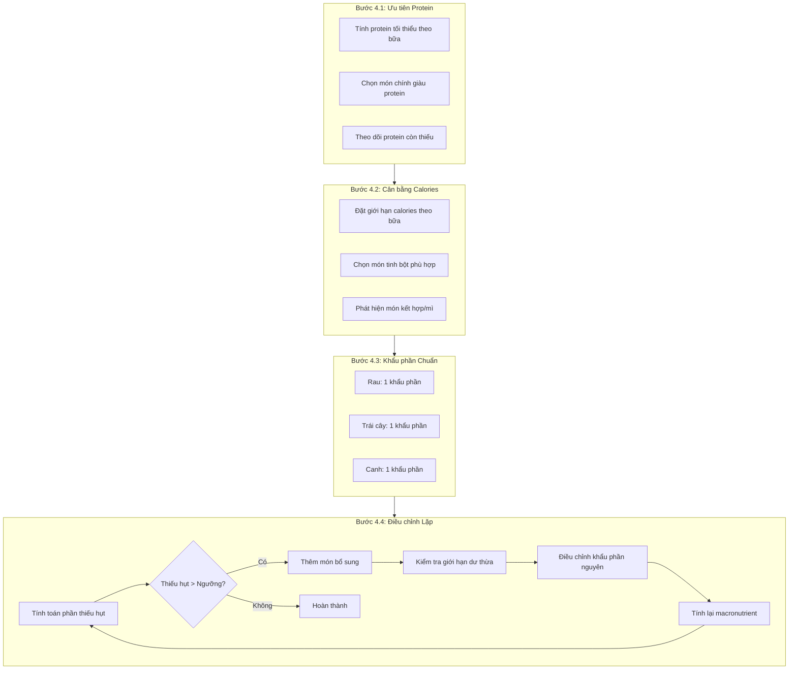
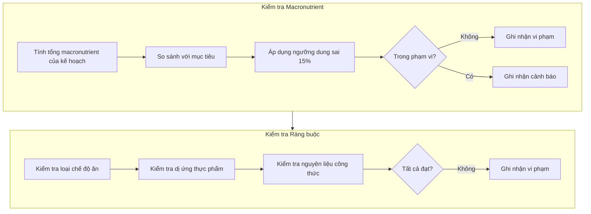
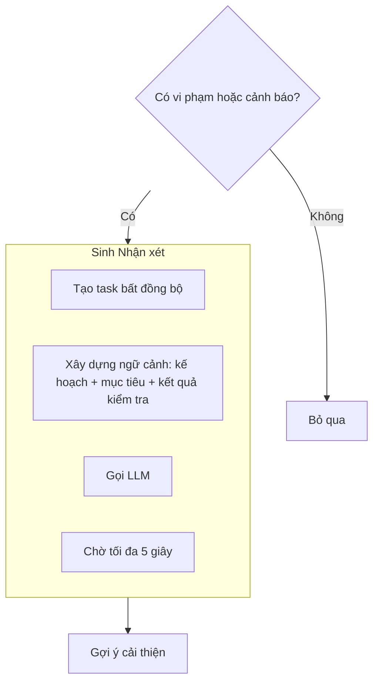
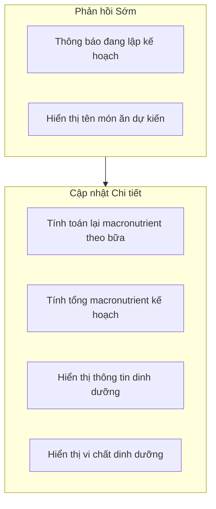
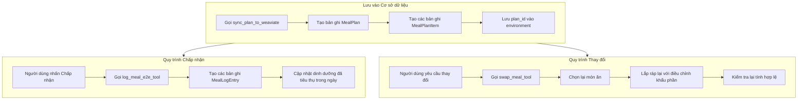
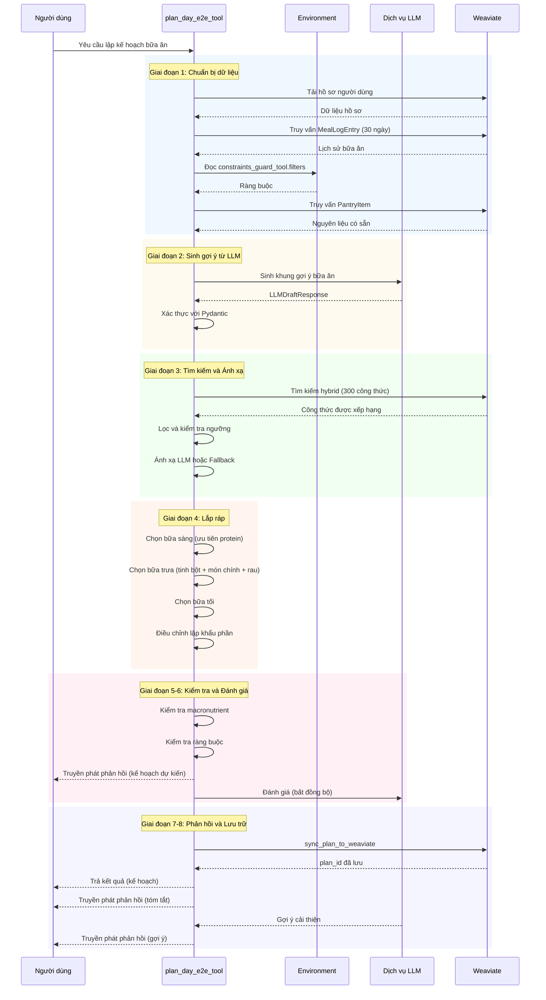

# Quy trình Lập kế hoạch Bữa ăn trong Ngày (Plan Day Workflow)

## 1. Giới thiệu

Chức năng lập kế hoạch bữa ăn trong ngày (Plan Day) là thành phần cốt lõi của hệ thống MealAgent, cho phép tự động tạo kế hoạch ba bữa ăn (sáng, trưa, tối) được cá nhân hóa theo nhu cầu dinh dưỡng của người dùng. Quy trình này kết hợp ba công nghệ chính: Mô hình ngôn ngữ lớn (LLM) để sinh gợi ý thông minh, cơ sở dữ liệu vector Weaviate để truy xuất công thức nấu ăn, và thuật toán tối ưu hóa dinh dưỡng để cân bằng macronutrient.

Quy trình lập kế hoạch bữa ăn được thiết kế dựa trên các nguyên tắc sau:

- **Cá nhân hóa**: Mỗi kế hoạch được điều chỉnh theo hồ sơ dinh dưỡng cá nhân bao gồm tuổi, giới tính, cân nặng, chiều cao, mức độ hoạt động và mục tiêu sức khỏe.
- **Đa dạng hóa**: Hệ thống theo dõi lịch sử bữa ăn để tránh lặp lại món ăn trong khoảng thời gian 7 ngày.
- **Tuân thủ ràng buộc**: Kế hoạch tự động loại trừ các thực phẩm gây dị ứng hoặc không phù hợp với chế độ ăn kiêng của người dùng.
- **Tối ưu hóa dinh dưỡng**: Thuật toán điều chỉnh khẩu phần để đạt mục tiêu về calories, protein, carbohydrate và chất béo.

## 2. Kiến trúc Tổng thể

Quy trình lập kế hoạch bữa ăn được chia thành tám giai đoạn (phase) được thực hiện tuần tự, như minh họa trong Hình 1.

**Hình 1:** Kiến trúc tổng thể của quy trình lập kế hoạch bữa ăn trong ngày

## 3. Chi tiết các Giai đoạn

### 3.1. Giai đoạn 1: Chuẩn bị Dữ liệu (Data Preparation)

Giai đoạn này thu thập tất cả thông tin cần thiết từ hệ thống trước khi bắt đầu quá trình lập kế hoạch. Quá trình này được thực hiện qua bốn bước như minh họa trong Hình 2.

**Hình 2:** Quy trình chi tiết của Giai đoạn 1 - Chuẩn bị dữ liệu

#### 3.1.1. Tải Hồ sơ và Mục tiêu Dinh dưỡng

Hệ thống truy xuất hồ sơ người dùng từ collection `UserProfile` trong Weaviate, bao gồm các thông tin nhân trắc học (tuổi, giới tính, cân nặng, chiều cao), mức độ hoạt động thể chất, và mục tiêu sức khỏe (giảm cân, tăng cơ, duy trì). Từ các thông tin này, hệ thống tính toán mục tiêu dinh dưỡng theo công thức Mifflin-St Jeor:

- **TDEE (Total Daily Energy Expenditure)**: Nhu cầu năng lượng hàng ngày
- **Protein (g)**: Dựa trên cân nặng và mục tiêu (0.8-2.2g/kg)
- **Carbohydrate (g)**: Phần còn lại sau khi trừ protein và chất béo
- **Fat (g)**: 20-35% tổng năng lượng

Trong trường hợp không có hồ sơ người dùng, hệ thống sử dụng giá trị mặc định: TDEE = 2000 kcal, Protein = 150g, Fat = 65g, Carb = 200g.

#### 3.1.2. Đọc Lịch sử Bữa ăn

Để đảm bảo tính đa dạng, hệ thống truy vấn collection `MealLogEntry` để lấy danh sách các bữa ăn đã được tiêu thụ trong 30 ngày gần nhất. Lưu ý rằng `MealLogEntry` lưu trữ các bữa ăn đã được người dùng chấp nhận hoặc ăn thực tế, khác với `MealPlan` chỉ lưu trữ các kế hoạch được gợi ý.

Từ lịch sử này, hệ thống xây dựng hai tập hợp loại trừ:
- Tập hợp ID công thức (`meal_history_recipe_ids`)
- Tập hợp tên món ăn (`meal_history_dish_names`)

#### 3.1.3. Tải Ràng buộc Ăn kiêng

Các ràng buộc ăn kiêng được tải từ hai nguồn và hợp nhất:
- **Từ công cụ constraints_guard_tool**: Các bộ lọc đã được phân tích từ yêu cầu người dùng
- **Từ hồ sơ người dùng**: Các thiết lập cố định như chế độ ăn chay, dị ứng thực phẩm

Kết quả là một cấu trúc dữ liệu chứa: loại chế độ ăn (`diet_types`), danh sách dị ứng (`exclude_allergens`), và mục tiêu sức khỏe (`goal`).

#### 3.1.4. Tải Nguyên liệu Có sẵn

Hệ thống thu thập thông tin về nguyên liệu có sẵn từ hai nguồn:
- **Collection PantryItem**: Danh sách nguyên liệu trong tủ lạnh/kho của người dùng
- **Phân tích câu hỏi**: Trích xuất nguyên liệu được đề cập trong yêu cầu (ví dụ: "tôi có thịt gà và rau cải")

Thông tin này được sử dụng để ưu tiên các công thức sử dụng nguyên liệu có sẵn trong giai đoạn tìm kiếm.

### 3.2. Giai đoạn 2: Sinh Gợi ý từ LLM (LLM Draft Generation)

Giai đoạn này sử dụng mô hình ngôn ngữ lớn để sinh khung gợi ý món ăn dựa trên ngữ cảnh đã thu thập. Quy trình được minh họa trong Hình 3.

**Hình 3:** Quy trình sinh gợi ý từ LLM

#### 3.2.1. Sinh Khung Gợi ý Bữa ăn

Hàm `generate_llm_draft()` xây dựng prompt bao gồm:
- Danh sách món ăn gần đây (để tránh lặp lại)
- Các ràng buộc về chế độ ăn và dị ứng
- Sở thích ẩm thực của người dùng
- Danh sách nguyên liệu có sẵn

LLM được yêu cầu đề xuất nhiều lựa chọn cho mỗi bữa ăn, với thông tin về:
- Tên món ăn cụ thể (`dish_name`)
- Thuật ngữ chung (`general_term`)
- Vai trò trong bữa ăn (`role`: breakfast, main, vegetable, fruit)
- Phân loại (`category`: noodle, rice, main_dish, vegetable)

#### 3.2.2. Xác thực Cấu trúc Dữ liệu

Đầu ra từ LLM được xác thực bằng schema Pydantic `LLMDraftResponse`, đảm bảo cấu trúc dữ liệu nhất quán cho các giai đoạn tiếp theo. Schema bao gồm ba slot bữa ăn (breakfast, lunch, dinner), mỗi slot chứa danh sách các gợi ý với đầy đủ metadata.

### 3.3. Giai đoạn 3: Ánh xạ và Tìm kiếm Công thức (Recipe Mapping and Search)

Giai đoạn này chuyển đổi các gợi ý từ LLM thành công thức nấu ăn thực tế từ cơ sở dữ liệu, với cơ chế fallback khi không tìm thấy kết quả phù hợp. Quy trình được minh họa trong Hình 4.

**Hình 4:** Quy trình ánh xạ và tìm kiếm công thức

#### 3.3.1. Tìm kiếm Hybrid trên Weaviate

Hệ thống xây dựng truy vấn tìm kiếm bằng cách nối các tên món ăn từ gợi ý LLM và nguyên liệu có sẵn. Công cụ `search_and_rank_tool` thực hiện tìm kiếm hybrid trên Weaviate, kết hợp:
- **Tìm kiếm vector**: Sử dụng embedding để tìm công thức có ngữ nghĩa tương tự
- **Tìm kiếm BM25**: Khớp từ khóa trực tiếp trong tên và mô tả

Kết quả trả về tối đa 300 công thức được xếp hạng theo độ phù hợp.

#### 3.3.2. Lọc và Kiểm tra Ngưỡng

Danh sách công thức được lọc qua nhiều bước:
- **Bộ lọc đa dạng**: Loại bỏ công thức đã sử dụng trong 7 ngày gần nhất
- **Kiểm tra trùng lặp**: Loại bỏ công thức đã chọn trong kế hoạch hiện tại
- **So sánh tên mờ**: Sử dụng thuật toán similarity với ngưỡng 0.6 để phát hiện món ăn tương tự
- **Xáo trộn ngẫu nhiên**: Thực hiện 3 lần để tăng tính đa dạng

#### 3.3.3. Hệ thống Tính điểm Ánh xạ

Hàm `_map_llm_suggestion_to_recipe()` tính điểm cho từng công thức dựa trên:

| Tiêu chí | Điểm số |
|----------|---------|
| Khớp tên chính xác | +200 |
| Khớp chuỗi con | +100 |
| Khớp từ khóa | Lên đến +60 (tỷ lệ thuận) |
| Khớp thuật ngữ chung | +80-90 |
| Khớp phân loại | +50 |
| Khớp vai trò | +30 |

Một kết quả được chấp nhận khi đạt một trong các điều kiện:
- Khớp tên chính xác (200 điểm)
- Khớp chuỗi con (100 điểm)
- Khớp từ khóa ≥ 50% VÀ tổng điểm ≥ 70
- Khớp thuật ngữ chung VÀ tổng điểm ≥ 90

#### 3.3.4. Cơ chế Fallback theo Luật

Khi ánh xạ LLM thất bại, hệ thống sử dụng hàm `select_meal_by_strategy()` với ba chiến lược:

| Chiến lược | Mô tả | Trường hợp sử dụng |
|------------|-------|-------------------|
| `highest_protein` | Ưu tiên công thức có protein cao nhất | Bữa sáng, món chính khi thiếu protein |
| `balanced` | Cân bằng các macronutrient | Khi nhu cầu protein đã đủ |
| `macro_fit` | Phù hợp nhất với mục tiêu còn lại | Chọn món phù hợp với phần còn thiếu |

Các bộ lọc được áp dụng bao gồm: giới hạn calories tối thiểu/tối đa, protein tối thiểu, chất béo tối đa, và phân loại món ăn.

### 3.4. Giai đoạn 4: Lắp ráp và Điều chỉnh Khẩu phần (Assembly and Portion Scaling)

Giai đoạn này xây dựng cấu trúc bữa ăn theo mô hình bữa ăn Việt Nam và điều chỉnh khẩu phần để đạt mục tiêu dinh dưỡng. Quy trình được minh họa trong Hình 5.

**Hình 5:** Quy trình lắp ráp và điều chỉnh khẩu phần

#### 3.4.1. Ưu tiên Protein cho Món chính

Protein được ưu tiên cao nhất vì khó bù đắp nếu thiếu. Hệ thống tính toán protein tối thiểu cho mỗi bữa dựa trên mục tiêu hàng ngày:

| Bữa ăn | Mục tiêu Protein | Chiến lược |
|--------|------------------|------------|
| Bữa sáng | 20-30g (tùy mục tiêu ngày) | `highest_protein` |
| Bữa trưa (món chính) | 35-45g | `highest_protein` |
| Bữa tối (món chính) | 40-50g | `highest_protein` |

Giá trị protein tối thiểu được điều chỉnh động dựa trên phần còn thiếu:
- Nếu còn thiếu > 50% protein ngày: tăng yêu cầu tối thiểu lên 30g cho bữa sáng
- Nếu còn thiếu 30-50%: yêu cầu tối thiểu 25g
- Nếu đã đủ < 20%: chuyển sang chiến lược `balanced`

#### 3.4.2. Cân bằng Calories cho Tinh bột

Calories được phân bổ theo mô hình bữa ăn Việt Nam:

| Bữa ăn | Tỷ lệ TDEE | Giới hạn tối đa |
|--------|------------|-----------------|
| Bữa sáng | ~25% | 550 kcal |
| Bữa trưa | ~30% | 700 kcal |
| Bữa tối | ~40% | 950 kcal |

Hàm `_select_carb_with_validation()` phân loại món tinh bột thành ba loại:
- **Món kết hợp** (cơm chiên, mì trộn): Chứa cả tinh bột và protein, không cần món chính riêng
- **Món mì** (phở, bún): Bữa ăn độc lập, không cần món ăn kèm
- **Cơm trắng**: Cần món chính, rau, và canh ăn kèm

#### 3.4.3. Chuẩn hóa Khẩu phần Rau và Trái cây

Theo mô hình bữa ăn Việt Nam truyền thống:

**Bữa cơm:**
- Cơm: 1-4 khẩu phần (số nguyên)
- Món mặn: 1-2 khẩu phần
- Rau/Canh: 1 khẩu phần
- Trái cây: 1 khẩu phần (tùy chọn)

**Bữa mì/phở:**
- Món mì: 1 khẩu phần (bữa ăn độc lập)
- Trái cây: 1 khẩu phần (tùy chọn)

**Món kết hợp:**
- Món chính: 1 khẩu phần (bữa ăn độc lập)
- Trái cây: 1 khẩu phần (tùy chọn)

#### 3.4.4. Điều chỉnh Lặp để Đạt Mục tiêu

Thuật toán điều chỉnh lặp (tối đa 3-20 vòng) thực hiện:

1. **Tính toán thiếu hụt**: So sánh tổng macronutrient hiện tại với mục tiêu
2. **Kiểm tra điều kiện dừng**:
   - Thiếu hụt < 5%: Hoàn thành
   - Dư thừa chất béo > 15%: Dừng để tránh ăn quá nhiều
   - Dư thừa carbohydrate > 20%: Dừng
3. **Thêm món bổ sung**: Ưu tiên món giàu protein, ít chất béo, sử dụng nguyên liệu có sẵn
4. **Điều chỉnh khẩu phần nguyên**:
   - Cơm: +1 khẩu phần (tối đa 4)
   - Món chính: +1 khẩu phần (tối đa 2)

### 3.5. Giai đoạn 5: Kiểm tra Tính hợp lệ (Validation)

Giai đoạn này đảm bảo kế hoạch đáp ứng cả mục tiêu dinh dưỡng và ràng buộc ăn kiêng.

**Hình 6:** Quy trình kiểm tra tính hợp lệ

#### 3.5.1. Kiểm tra Macronutrient

Hàm `_validate_macro_targets()` kiểm tra từng macronutrient với ngưỡng dung sai 15%:

| Macronutrient | Mục tiêu (VD) | Dung sai 15% | Phạm vi hợp lệ |
|---------------|---------------|--------------|----------------|
| Calories | 2400 kcal | ±360 | 2040 - 2760 kcal |
| Protein | 192g | ±28.8g | 163 - 221g |
| Fat | 64g | ±9.6g | 54 - 74g |
| Carbohydrate | 219g | ±32.9g | 186 - 252g |

Kết quả bao gồm:
- `valid`: Boolean cho biết tất cả đạt
- `violations`: Danh sách vi phạm ngoài phạm vi
- `warnings`: Danh sách cảnh báo gần biên

#### 3.5.2. Kiểm tra Ràng buộc Ăn kiêng

Hàm `_validate_constraints()` kiểm tra:
- **Tuân thủ chế độ ăn**: Ví dụ chế độ ăn chay không được chứa thịt
- **Không có dị ứng**: Ví dụ không có hải sản nếu người dùng dị ứng

Kết quả bao gồm danh sách vi phạm với thông tin chi tiết về món ăn và bữa ăn vi phạm.

### 3.6. Giai đoạn 6: Đánh giá bằng LLM (LLM Critic)

Giai đoạn này sử dụng mô hình ngôn ngữ để đánh giá kế hoạch và đưa ra gợi ý cải thiện khi có vi phạm hoặc cảnh báo.

**Hình 7:** Quy trình đánh giá bằng LLM

Hàm `create_critic_task()` tạo một task bất đồng bộ gọi LLM với ngữ cảnh đầy đủ về kế hoạch, mục tiêu dinh dưỡng, và kết quả kiểm tra. LLM được yêu cầu đưa ra gợi ý cụ thể để cải thiện kế hoạch.

Ví dụ output: "Kế hoạch thiếu 15% protein. Gợi ý: Thêm 1 khẩu phần thịt gà vào bữa tối hoặc thay đổi món sáng sang phở bò."

**Lưu ý quan trọng**: LLM Critic được gọi bất đồng bộ và sau khi đã trả kết quả cho người dùng, không làm chậm luồng chính.

### 3.7. Giai đoạn 7: Phản hồi Người dùng (Response Streaming)

Giai đoạn này cung cấp phản hồi nhanh cho người dùng trong khi vẫn đang tính toán các phần còn lại.

**Hình 8:** Quy trình truyền phát phản hồi

Mô hình streaming cho phép:
1. **Phản hồi sớm**: Người dùng thấy tên món ăn ngay lập tức
2. **Cập nhật dần**: Thông tin dinh dưỡng chi tiết được bổ sung sau
3. **Trải nghiệm mượt mà**: Không cần chờ đợi toàn bộ quá trình tính toán

Chuỗi phản hồi điển hình:
1. "Đang lập kế hoạch bữa ăn..."
2. "Đã tải hồ sơ người dùng"
3. "Đang tìm kiếm công thức..."
4. "Kế hoạch dự kiến: Bữa sáng: Phở bò | Bữa trưa: Cơm tấm, Sườn nướng | Bữa tối: ..."
5. "Macronutrient: 2380 kcal | 185g protein | 62g fat | 215g carbs"
6. "Tất cả các macronutrient đạt mục tiêu (Độ chính xác: 95.2%)"

### 3.8. Giai đoạn 8: Lưu trữ và Điều chỉnh (Storage and Modification)

Giai đoạn này lưu kế hoạch vào cơ sở dữ liệu và hỗ trợ người dùng điều chỉnh nếu cần.

**Hình 9:** Quy trình lưu trữ và điều chỉnh

#### 3.8.1. Cấu trúc Lưu trữ Dữ liệu

Hệ thống sử dụng ba collection trong Weaviate với mục đích khác nhau:

| Collection | Mục đích | Thời điểm tạo |
|------------|----------|---------------|
| `MealPlan` | Metadata của kế hoạch (plan_id, user_id, ngày) | Ngay sau khi sinh kế hoạch |
| `MealPlanItem` | Chi tiết từng bữa trong kế hoạch | Ngay sau khi sinh kế hoạch |
| `MealLogEntry` | Bữa ăn đã được tiêu thụ thực tế | Khi người dùng chấp nhận kế hoạch |

Sự phân tách này cho phép:
- Theo dõi tất cả kế hoạch đã gợi ý (cho phân tích và cải thiện hệ thống)
- Chỉ tính bữa ăn thực tế vào lịch sử (cho bộ lọc đa dạng)
- Hỗ trợ người dùng xem lại và chấp nhận kế hoạch sau

#### 3.8.2. Quy trình Chấp nhận Kế hoạch

Khi người dùng chấp nhận kế hoạch:
1. Hệ thống gọi `log_meal_e2e_tool` với `plan_id`
2. Tải kế hoạch từ `MealPlan` và `MealPlanItem`
3. Tạo các bản ghi `MealLogEntry` cho mỗi bữa ăn
4. Cập nhật tổng dinh dưỡng đã tiêu thụ trong ngày

#### 3.8.3. Quy trình Thay đổi Món ăn

Khi người dùng yêu cầu thay đổi một món ăn:
1. Công cụ `swap_meal_tool` nhận yêu cầu với thông tin món cần thay
2. Tìm kiếm món thay thế phù hợp với cùng vai trò và ràng buộc
3. Lắp ráp lại kế hoạch với món mới
4. Điều chỉnh khẩu phần để duy trì cân bằng dinh dưỡng
5. Kiểm tra lại tính hợp lệ của kế hoạch mới

## 4. Sơ đồ Tuần tự (Sequence Diagram)

Hình 10 minh họa luồng tương tác giữa các thành phần trong toàn bộ quy trình.

**Hình 10:** Sơ đồ tuần tự của quy trình lập kế hoạch bữa ăn trong ngày

## 5. Giao diện với Các Thành phần Khác

### 5.1. Đọc từ Environment

| Khóa | Nguồn | Mô tả |
|------|-------|-------|
| `macro_calc_tool.targets` | macro_calc_tool | Mục tiêu dinh dưỡng dựa trên TDEE |
| `constraints_guard_tool.filters` | constraints_guard_tool | Loại chế độ ăn, dị ứng |
| `search_and_rank_tool.topk` | search_and_rank_tool | Công thức đã cache (dự phòng) |

### 5.2. Ghi vào Environment

| Khóa | Đích | Mô tả |
|------|------|-------|
| `plan_day_e2e_tool.plan` | Result | Kế hoạch ngày hoàn chỉnh |
| `plan_day_e2e_tool.plan_id` | Environment | ID kế hoạch để tham chiếu |
| `plan_day_e2e_tool.missing_macros` | Result | Công thức thiếu dữ liệu macro |

## 6. Xử lý Lỗi

Hệ thống xử lý các tình huống lỗi như sau:

| Tình huống | Xử lý |
|------------|-------|
| Không tìm thấy công thức | Trả lỗi: "Vui lòng tìm kiếm công thức trước" |
| Không có món sáng phù hợp | Trả lỗi: "Vui lòng tìm kiếm công thức bữa sáng" |
| Tải hồ sơ thất bại | Sử dụng giá trị mặc định, tiếp tục |
| Sinh gợi ý LLM thất bại | Chuyển sang tìm kiếm theo luật |
| Lưu Weaviate thất bại | Ghi log cảnh báo, tiếp tục (kế hoạch vẫn hiển thị) |
| Kiểm tra macro thất bại | Trả kế hoạch kèm cảnh báo |

## 8. Tham số Cấu hình

| Tham số | Mặc định | Mô tả |
|---------|----------|-------|
| `macro_tolerance_percent` | 0.15 | Ngưỡng dung sai 15% cho kiểm tra macro |
| `recent_plan_window_minutes` | 10080 | Cửa sổ đa dạng 7 ngày (phút) |
| `collection_name` | "Recipe" | Tên collection Weaviate cho công thức |

## 9. Kết luận

Quy trình lập kế hoạch bữa ăn trong ngày của MealAgent kết hợp hiệu quả ba công nghệ then chốt: mô hình ngôn ngữ lớn cho sinh gợi ý thông minh, cơ sở dữ liệu vector cho truy xuất ngữ nghĩa, và thuật toán tối ưu hóa cho cân bằng dinh dưỡng. Thiết kế theo mô-đun với tám giai đoạn rõ ràng cho phép bảo trì và mở rộng dễ dàng, trong khi cơ chế fallback đảm bảo độ tin cậy cao trong nhiều tình huống khác nhau.
