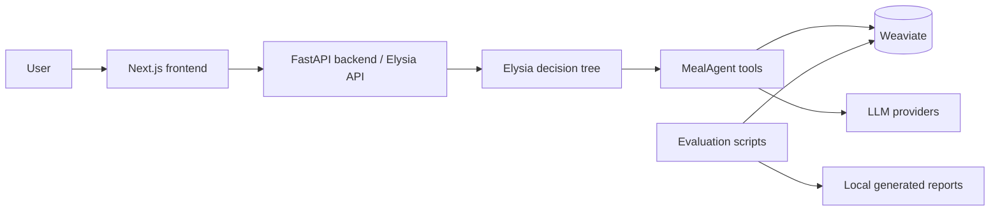

# MealAgent

MealAgent is an open-source meal-planning assistant built on top of the Elysia decision-tree agent framework. It combines a FastAPI backend, a Next.js frontend, Weaviate vector storage, and domain-specific MealAgent tools for nutrition targets, pantry-aware planning, recipe search, meal logging, and evaluation.

This repository is also the implementation artifact for the thesis **"AI-Assisted Platform for Personalized Meal Planning and Nutrition Guidance"**. The thesis studies how Agentic RAG, hybrid recipe retrieval, structured nutrition data, and tool orchestration can produce personalized and explainable meal plans for healthy users.

## What is in this repository?

| Path | Purpose |
| --- | --- |
| `MealAgent/` | Meal-planning tools, schemas, migrations, and domain workflows. |
| `elysia/` | Python backend, FastAPI app, Elysia tree framework, API routes, and static hosting. |
| `elysia-frontend/` | Next.js 14 frontend used in dev mode or exported into the backend static app. |
| `Docker/` | Local Weaviate + transformer inference compose stack. |
| `evaluation/` | Nutrition error, LLM-as-a-judge, and semantic evaluation tooling. |
| `docs/` | Public docs plus internal AI-devkit design/testing/deployment notes. |
| `scripts/` | Windows PowerShell setup/start/status/stop helpers. |

## Thesis-derived highlights

- **Problem:** users need daily/weekly meal plans that satisfy nutrition targets while respecting diet type, allergies, preferences, and pantry inventory.
- **Approach:** Agentic RAG coordinates an Elysia decision tree, MealAgent tools, Weaviate hybrid search, and configurable LLM providers.
- **Knowledge base:** USDA FoodData Central (~8,200 food items) plus a Vietnamese recipe dataset (~4,000 recipes).
- **Evaluation:** thesis results report 100% Excellent/Good nutritional compliance on 58 evaluated meal outputs, with mean overall nutritional error of 6.94%.
- **User study:** 20 non-clinical participants rated overall user experience at 4.44/5.0.

See [Thesis overview](docs/thesis/README.md) for the Markdown summary extracted from the local thesis materials.

## Architecture



## Demo videos

GitHub renders the MP4 files below directly from `docs/assets/videos/`. If a preview does not load in your browser, open the linked file.

### Full system demo

<video src="docs/assets/videos/demo-full.mp4" controls width="100%"></video>

[Open full demo video](docs/assets/videos/demo-full.mp4)

### Workflow videos

| Workflow | Video |
| --- | --- |
| Initial setup/profile/configuration | [phase-1.mp4](docs/assets/videos/phase-1.mp4) |
| Daily meal planning | [meal-day.mp4](docs/assets/videos/meal-day.mp4) |
| Weekly meal planning | [week-plan.mp4](docs/assets/videos/week-plan.mp4) |
| Intermediate MealAgent feature flow | [phase-3.mp4](docs/assets/videos/phase-3.mp4) |
| Final integration/evaluation flow | [phase-4.mp4](docs/assets/videos/phase-4.mp4) |
| Admin/review workflow | [admin-flow.mp4](docs/assets/videos/admin-flow.mp4) |

## Prerequisites

- Windows PowerShell 5.1+ or PowerShell 7+
- Python 3.12.x
- Node.js 18+
- Docker Desktop
- NVIDIA GPU support is recommended for the transformer inference container in `Docker/docker-compose.yml`; adapt the compose file if you run CPU-only.

## Quick start on Windows

1. Copy environment examples and add your real local secrets:

   ```powershell
   Copy-Item .env.example .env
   Copy-Item elysia-frontend\.env.example elysia-frontend\.env.local
   ```

2. Install backend and frontend dependencies:

   ```powershell
   powershell -ExecutionPolicy Bypass -File scripts/setup-dev.ps1
   ```

3. Start Weaviate, backend, and frontend:

   ```powershell
   powershell -ExecutionPolicy Bypass -File scripts/start-system.ps1
   ```

4. Check status:

   ```powershell
   powershell -ExecutionPolicy Bypass -File scripts/status-system.ps1
   ```

5. Open the app:

   - Frontend dev app: <http://127.0.0.1:3000>
   - Backend health: <http://127.0.0.1:8000/api/health>
   - Weaviate readiness: <http://localhost:8078/v1/.well-known/ready>

6. Stop all local services:

   ```powershell
   powershell -ExecutionPolicy Bypass -File scripts/stop-system.ps1
   ```

## Manual commands

```powershell
# Python environment
py -3.12 -m venv .venv
.\.venv\Scripts\python.exe -m pip install -e ".\elysia[dev]" -e ".\MealAgent"

# Docker services
docker compose -f Docker\docker-compose.yml up -d

# Backend
.\.venv\Scripts\python.exe -m uvicorn elysia.api.app:app --host 127.0.0.1 --port 8000

# Frontend
cd elysia-frontend
npm ci
npm run dev -- --hostname 127.0.0.1 --port 3000
```

## Configuration

Use `.env.example`, `elysia/.env.example`, and `elysia-frontend/.env.example` as templates. Important variables:

| Variable | Description |
| --- | --- |
| `OPENROUTER_API_KEY`, `GEMINI_API_KEY`, `OPENAI_API_KEY` | LLM provider credentials. |
| `BASE_MODEL`, `BASE_PROVIDER`, `COMPLEX_MODEL`, `COMPLEX_PROVIDER` | Default model routing. |
| `WEAVIATE_IS_LOCAL`, `LOCAL_WEAVIATE_PORT`, `LOCAL_WEAVIATE_GRPC_PORT` | Local Weaviate connection. |
| `WCD_URL`, `WCD_API_KEY` | Weaviate Cloud connection, if not using local Docker. |
| `CORS_ALLOW_ORIGINS` | Comma-separated frontend origins allowed by the backend. |
| `NEXT_PUBLIC_BACKEND_URL` | Browser-visible backend URL for frontend dev mode. |

Never commit real `.env` files or API keys. Rotate any credentials that were ever shared or committed accidentally.

## Testing and verification

```powershell
# Backend / MealAgent tests
.\.venv\Scripts\python.exe -m pytest tests/meal_agent/unit

# Frontend lint, typecheck, and static export build
cd elysia-frontend
npm run lint
npm run typecheck
npm run build

# Evaluation examples
.\.venv\Scripts\python.exe -m evaluation.scripts.run_single_method nutrition_error --use-mock
```

Generated evaluation outputs are ignored under `evaluation/results/`.

## Documentation

- [Getting started](docs/getting-started/local-development.md)
- [Configuration](docs/getting-started/configuration.md)
- [Demo and thesis materials](docs/demo/README.md)
- [Thesis overview](docs/thesis/README.md)
- [MealAgent data pipeline](MealAgent/docs/DATA_PIPELINE.md)
- [Plan-day workflow](MealAgent/docs/PLAN_DAY_WORKFLOW.md)
- [Evaluation framework](evaluation/README.md)
- [Deployment notes](docs/ai/deployment/README.md)

## Demo and thesis assets

Demo videos are tracked under `docs/assets/videos/` so they render on GitHub. Large thesis Office files remain intentionally untracked; use [docs/thesis/README.md](docs/thesis/README.md) for the Markdown thesis summary.

## Security

Please see [SECURITY.md](SECURITY.md). Do not open issues containing private API keys, meal data, or personal health information.

## Contributing

Please see [CONTRIBUTING.md](CONTRIBUTING.md). Before opening a pull request, run the relevant backend/frontend verification commands above.

## License

This repository is released under the MIT License. See [LICENSE](LICENSE).
