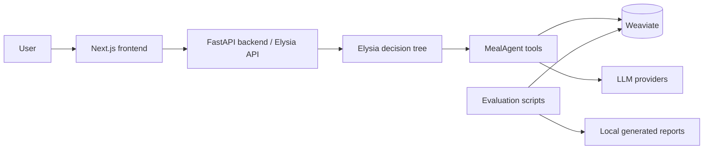

# MealAgent

MealAgent is an open-source meal-planning assistant built on top of the Elysia decision-tree agent framework. It combines a FastAPI backend, a Next.js frontend, Weaviate vector storage, and domain-specific MealAgent tools for nutrition targets, pantry-aware planning, recipe search, meal logging, and evaluation.

## What is in this repository?

| Path | Purpose |
| --- | --- |
| `MealAgent/` | Meal-planning tools, schemas, migrations, and domain workflows. |
| `elysia/` | Python backend, FastAPI app, Elysia tree framework, API routes, and static hosting. |
| `elysia-frontend/` | Next.js 14 frontend used in dev mode or exported into the backend static app. |
| `Docker/` | Local Weaviate + transformer inference compose stack. |
| `evaluation/` | Nutrition error, LLM-as-a-judge, and semantic evaluation tooling. |
| `docs/` | Public docs plus internal AI-devkit design/testing/deployment notes. |
| `scripts/` | Windows PowerShell setup/start/status/stop helpers. |

## Architecture



## Prerequisites

- Windows PowerShell 5.1+ or PowerShell 7+
- Python 3.12.x
- Node.js 18+
- Docker Desktop
- NVIDIA GPU support is recommended for the transformer inference container in `Docker/docker-compose.yml`; adapt the compose file if you run CPU-only.

## Quick start on Windows

1. Copy environment examples and add your real local secrets:

   ```powershell
   Copy-Item .env.example .env
   Copy-Item elysia-frontend\.env.example elysia-frontend\.env.local
   ```

2. Install backend and frontend dependencies:

   ```powershell
   powershell -ExecutionPolicy Bypass -File scripts/setup-dev.ps1
   ```

3. Start Weaviate, backend, and frontend:

   ```powershell
   powershell -ExecutionPolicy Bypass -File scripts/start-system.ps1
   ```

4. Check status:

   ```powershell
   powershell -ExecutionPolicy Bypass -File scripts/status-system.ps1
   ```

5. Open the app:

   - Frontend dev app: <http://127.0.0.1:3000>
   - Backend health: <http://127.0.0.1:8000/api/health>
   - Weaviate readiness: <http://localhost:8078/v1/.well-known/ready>

6. Stop all local services:

   ```powershell
   powershell -ExecutionPolicy Bypass -File scripts/stop-system.ps1
   ```

## Manual commands

```powershell
# Python environment
py -3.12 -m venv .venv
.\.venv\Scripts\python.exe -m pip install -e ".\elysia[dev]" -e ".\MealAgent"

# Docker services
docker compose -f Docker\docker-compose.yml up -d

# Backend
.\.venv\Scripts\python.exe -m uvicorn elysia.api.app:app --host 127.0.0.1 --port 8000

# Frontend
cd elysia-frontend
npm ci
npm run dev -- --hostname 127.0.0.1 --port 3000
```

## Configuration

Use `.env.example`, `elysia/.env.example`, and `elysia-frontend/.env.example` as templates. Important variables:

| Variable | Description |
| --- | --- |
| `OPENROUTER_API_KEY`, `GEMINI_API_KEY`, `OPENAI_API_KEY` | LLM provider credentials. |
| `BASE_MODEL`, `BASE_PROVIDER`, `COMPLEX_MODEL`, `COMPLEX_PROVIDER` | Default model routing. |
| `WEAVIATE_IS_LOCAL`, `LOCAL_WEAVIATE_PORT`, `LOCAL_WEAVIATE_GRPC_PORT` | Local Weaviate connection. |
| `WCD_URL`, `WCD_API_KEY` | Weaviate Cloud connection, if not using local Docker. |
| `CORS_ALLOW_ORIGINS` | Comma-separated frontend origins allowed by the backend. |
| `NEXT_PUBLIC_BACKEND_URL` | Browser-visible backend URL for frontend dev mode. |

Never commit real `.env` files or API keys. Rotate any credentials that were ever shared or committed accidentally.

## Testing and verification

```powershell
# Backend / MealAgent tests
.\.venv\Scripts\python.exe -m pytest tests/meal_agent/unit

# Frontend lint, typecheck, and static export build
cd elysia-frontend
npm run lint
npm run typecheck
npm run build

# Evaluation examples
.\.venv\Scripts\python.exe -m evaluation.scripts.run_single_method nutrition_error --use-mock
```

Generated evaluation outputs are ignored under `evaluation/results/`.

## Documentation

- [Getting started](docs/getting-started/local-development.md)
- [Configuration](docs/getting-started/configuration.md)
- [Demo and thesis materials](docs/demo/README.md)
- [MealAgent data pipeline](MealAgent/docs/DATA_PIPELINE.md)
- [Plan-day workflow](MealAgent/docs/PLAN_DAY_WORKFLOW.md)
- [Evaluation framework](evaluation/README.md)
- [Deployment notes](docs/ai/deployment/README.md)

## Demo and thesis assets

Large thesis files and demo videos are intentionally not tracked in the Git repository. Publish them as GitHub Release assets or external video links, then add the URLs to `docs/demo/README.md`.

## Security

Please see [SECURITY.md](SECURITY.md). Do not open issues containing private API keys, meal data, or personal health information.

## Contributing

Please see [CONTRIBUTING.md](CONTRIBUTING.md). Before opening a pull request, run the relevant backend/frontend verification commands above.

## License

This repository is released under the MIT License. See [LICENSE](LICENSE).
