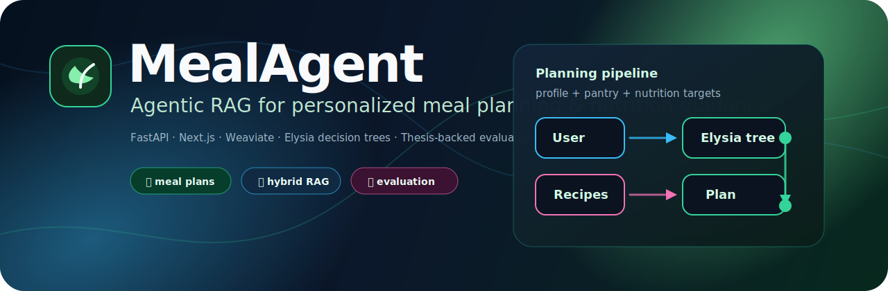
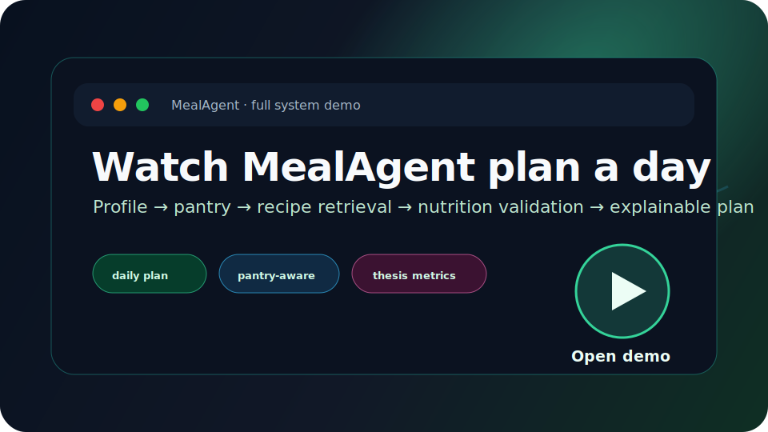
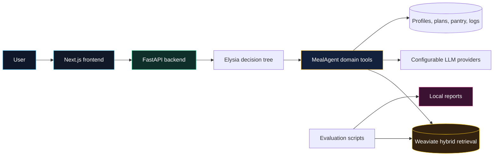
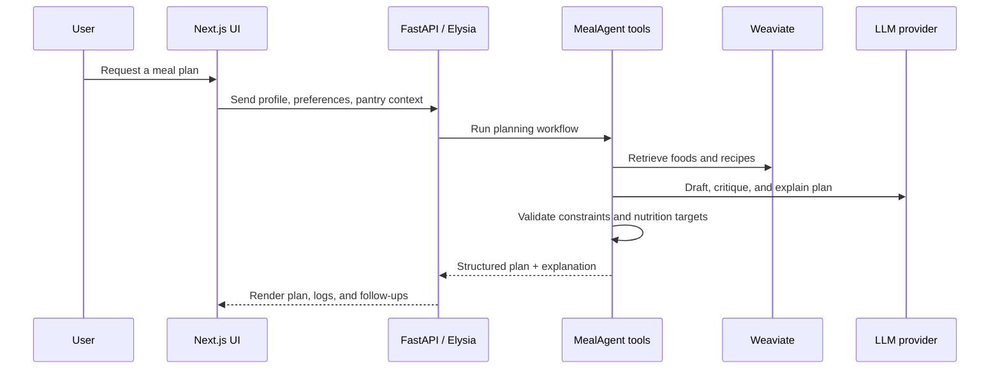

<p align="center">
  
</p>

<h1 align="center">MealAgent</h1>

<p align="center">
  <b>Agentic RAG for personalized meal planning, pantry-aware recommendations, and nutrition evaluation.</b>
</p>

<p align="center">
  <a href="#demo-showcase">Demo</a> ·
  <a href="#what-makes-it-interesting">Why it matters</a> ·
  <a href="#architecture">Architecture</a> ·
  <a href="#quick-start">Quick start</a> ·
  <a href="docs/thesis/README.md">Thesis</a>
</p>

<p align="center">
  
  
  
  
  <a href="LICENSE"></a>
</p>

<p align="center">
  &nbsp;&nbsp;
  &nbsp;&nbsp;
  &nbsp;&nbsp;
  &nbsp;&nbsp;
  &nbsp;&nbsp;
  
</p>

---

## At a glance

<table>
  <tr>
    <td align="center"><b>58</b><br/>thesis eval outputs</td>
    <td align="center"><b>6.94%</b><br/>mean nutrition error</td>
    <td align="center"><b>100%</b><br/>Excellent / Good in thesis eval</td>
    <td align="center"><b>4.44 / 5</b><br/>20-person UX study</td>
  </tr>
</table>

MealAgent is an open-source research prototype for healthy users. It combines a **FastAPI + Elysia backend**, a **Next.js frontend**, **Weaviate hybrid retrieval**, and domain-specific MealAgent tools for planning, constraints, recipes, pantry state, meal logs, shopping lists, and evaluation.

> MealAgent is not a clinical diagnosis tool or medical diet prescription system. The metrics above are thesis-derived prototype evaluation results.

## Demo showcase

<p align="center">
  <a href="docs/assets/videos/demo-full.mp4">
    
  </a>
</p>

<p align="center">
  <b>Click the preview above to open the full system demo.</b><br/>
  GitHub may also render the embedded MP4 below, depending on browser and repository rendering behavior.
</p>

<video src="docs/assets/videos/demo-full.mp4" controls width="100%"></video>

<table>
  <tr>
    <td><b>Profile setup</b><br/><a href="docs/assets/videos/phase-1.mp4">phase-1.mp4</a></td>
    <td><b>Daily planning</b><br/><a href="docs/assets/videos/meal-day.mp4">meal-day.mp4</a></td>
    <td><b>Weekly planning</b><br/><a href="docs/assets/videos/week-plan.mp4">week-plan.mp4</a></td>
  </tr>
  <tr>
    <td><b>Feature flow</b><br/><a href="docs/assets/videos/phase-3.mp4">phase-3.mp4</a></td>
    <td><b>Evaluation flow</b><br/><a href="docs/assets/videos/phase-4.mp4">phase-4.mp4</a></td>
    <td><b>Admin review</b><br/><a href="docs/assets/videos/admin-flow.mp4">admin-flow.mp4</a></td>
  </tr>
</table>

## What makes it interesting

| Area | What MealAgent does | Why it matters |
| --- | --- | --- |
| Personalized planning | Builds daily and weekly meal plans around profile, calories, macros, preferences, allergies, and diet constraints. | Moves beyond static recipes toward contextual planning. |
| Pantry-aware flow | Uses pantry state and missing ingredients to support practical recommendations and shopping-list follow-ups. | Helps plans feel usable in real kitchens. |
| Hybrid recipe retrieval | Combines structured USDA nutrition references with a Vietnamese recipe knowledge base through Weaviate. | Grounds generation in searchable food and recipe data. |
| Agentic orchestration | Uses Elysia decision trees and MealAgent tools rather than one-shot text generation. | Makes the workflow easier to inspect, validate, and extend. |
| Evaluation loop | Includes nutrition error, semantic evaluation, and LLM-as-a-judge tooling. | Treats meal planning as an evaluable system, not just a chat demo. |

## Product map

<table>
  <tr>
    <td width="50%">
      <h3>App experience</h3>
      <ul>
        <li><a href="elysia-frontend/">Next.js 14 frontend</a></li>
        <li>Chat, profile/configuration, planning workflows, data views, and evaluation UI</li>
        <li>React, TypeScript, Tailwind, Radix UI, Framer Motion, Recharts, XYFlow</li>
      </ul>
    </td>
    <td width="50%">
      <h3>Agent backend</h3>
      <ul>
        <li><a href="elysia/">FastAPI + Elysia backend</a></li>
        <li>Decision-tree tool orchestration and static app hosting</li>
        <li>Configurable LLM providers and Weaviate connections</li>
      </ul>
    </td>
  </tr>
  <tr>
    <td width="50%">
      <h3>MealAgent domain</h3>
      <ul>
        <li><a href="MealAgent/">Planning tools, schemas, migrations, scripts</a></li>
        <li>Targets, constraints, recipe search, pantry, meal logs, shopping lists</li>
        <li><a href="MealAgent/docs/PLAN_DAY_WORKFLOW.md">Daily planning workflow</a></li>
      </ul>
    </td>
    <td width="50%">
      <h3>Evaluation & docs</h3>
      <ul>
        <li><a href="evaluation/">Nutrition and LLM-as-a-judge evaluation</a></li>
        <li><a href="docs/thesis/README.md">Thesis overview</a></li>
        <li><a href="docs/ai/deployment/README.md">Deployment notes</a></li>
      </ul>
    </td>
  </tr>
</table>

## Architecture

The system is intentionally split into an interactive UI, an agentic API layer, domain-specific tools, vector retrieval, and evaluation scripts.



<details>
<summary><b>View planning sequence</b></summary>



</details>

## Quick start

### Prerequisites

| Requirement | Notes |
| --- | --- |
| Windows PowerShell 5.1+ or PowerShell 7+ | Helper scripts are PowerShell-first. |
| Python 3.12.x | Backend and MealAgent editable packages target Python 3.12. |
| Node.js 18+ | Required for the Next.js frontend. |
| Docker Desktop | Runs the local Weaviate stack. |
| NVIDIA GPU support | Required by the default transformer inference service in [`Docker/docker-compose.yml`](Docker/docker-compose.yml). For CPU-only machines, remove the NVIDIA device reservation and CUDA environment variables before starting the stack. |

```powershell
# 1) Copy environment templates and add your local secrets
Copy-Item .env.example .env
Copy-Item elysia-frontend\.env.example elysia-frontend\.env.local

# 2) Install backend + frontend dependencies
powershell -ExecutionPolicy Bypass -File scripts/setup-dev.ps1

# 3) Start Weaviate, backend, and frontend
powershell -ExecutionPolicy Bypass -File scripts/start-system.ps1
```

| Service | URL |
| --- | --- |
| Frontend dev app | <http://127.0.0.1:3000> |
| Backend health | <http://127.0.0.1:8000/api/health> |
| Weaviate readiness | <http://localhost:8078/v1/.well-known/ready> |

```powershell
# Check status
powershell -ExecutionPolicy Bypass -File scripts/status-system.ps1

# Stop all services
powershell -ExecutionPolicy Bypass -File scripts/stop-system.ps1
```

<details>
<summary><b>Manual start commands</b></summary>

```powershell
# Python environment
py -3.12 -m venv .venv
.\.venv\Scripts\python.exe -m pip install -e ".\elysia[dev]" -e ".\MealAgent"

# Docker services
docker compose -f Docker\docker-compose.yml up -d

# Backend
.\.venv\Scripts\python.exe -m uvicorn elysia.api.app:app --host 127.0.0.1 --port 8000

# Frontend
cd elysia-frontend
npm ci
npm run dev -- --hostname 127.0.0.1 --port 3000
```

</details>

<details>
<summary><b>Configuration variables</b></summary>

Use [`.env.example`](.env.example), [`elysia/.env.example`](elysia/.env.example), and [`elysia-frontend/.env.example`](elysia-frontend/.env.example) as templates.

| Variable | Description |
| --- | --- |
| `OPENROUTER_API_KEY`, `GEMINI_API_KEY`, `OPENAI_API_KEY` | LLM provider credentials. |
| `BASE_MODEL`, `BASE_PROVIDER`, `COMPLEX_MODEL`, `COMPLEX_PROVIDER` | Default model routing. |
| `WEAVIATE_IS_LOCAL`, `LOCAL_WEAVIATE_PORT`, `LOCAL_WEAVIATE_GRPC_PORT` | Local Weaviate connection. |
| `WCD_URL`, `WCD_API_KEY` | Weaviate Cloud connection, if not using local Docker. |
| `CORS_ALLOW_ORIGINS` | Comma-separated frontend origins allowed by the backend. |
| `NEXT_PUBLIC_BACKEND_URL` | Browser-visible backend URL for frontend dev mode. |

Never commit real `.env` files or API keys. Rotate any credentials that were ever shared or committed accidentally.

</details>

## Testing and verification

```powershell
# Backend / MealAgent tests
.\.venv\Scripts\python.exe -m pytest tests/meal_agent/unit

# Frontend lint, typecheck, and static export build
cd elysia-frontend
npm run lint
npm run typecheck
npm run build
cd ..

# Evaluation smoke test
.\.venv\Scripts\python.exe -m evaluation.scripts.run_single_method nutrition_error --use-mock
```

Generated evaluation outputs are ignored under `evaluation/results/`.

## Thesis notes

This repository is the implementation artifact for **"AI-Assisted Platform for Personalized Meal Planning and Nutrition Guidance"**.

| Thesis item | Summary |
| --- | --- |
| Research gap | Planning needs personalization, reasoning, cultural food adaptation, constraint handling, and explainability. |
| Knowledge base | USDA FoodData Central (~8,200 food items) plus a Vietnamese recipe dataset (~4,000 recipes). |
| Evaluation setup | Nutrition compliance over 58 meal-related outputs; user-experience feedback from 20 non-clinical participants. |
| Scope | Healthy-user meal planning prototype; not clinical diagnosis or disease-specific diet treatment. |

Read the full thesis summary in [docs/thesis/README.md](docs/thesis/README.md).

## Documentation map

| I want to... | Start here |
| --- | --- |
| Run the project locally | [Getting started](docs/getting-started/local-development.md) |
| Configure providers and URLs | [Configuration](docs/getting-started/configuration.md) |
| Understand demo assets | [Demo and thesis materials](docs/demo/README.md) |
| Read the thesis summary | [Thesis overview](docs/thesis/README.md) |
| Inspect the MealAgent data pipeline | [MealAgent data pipeline](MealAgent/docs/DATA_PIPELINE.md) |
| Understand daily planning | [Plan-day workflow](MealAgent/docs/PLAN_DAY_WORKFLOW.md) |
| Run evaluation tooling | [Evaluation README](evaluation/README.md) |
| Deploy the system | [Deployment notes](docs/ai/deployment/README.md) |

## Security, contributing, and license

- **Security:** see [SECURITY.md](SECURITY.md). Do not open issues containing private API keys, meal data, or personal health information.
- **Contributing:** see [CONTRIBUTING.md](CONTRIBUTING.md). Before opening a pull request, run the relevant backend/frontend verification commands above.
- **License:** this repository is released under the MIT License. See [LICENSE](LICENSE).

---

<p align="center">
  <b>MealAgent turns retrieval, nutrition constraints, and agentic planning into explainable meal plans.</b>
</p>
