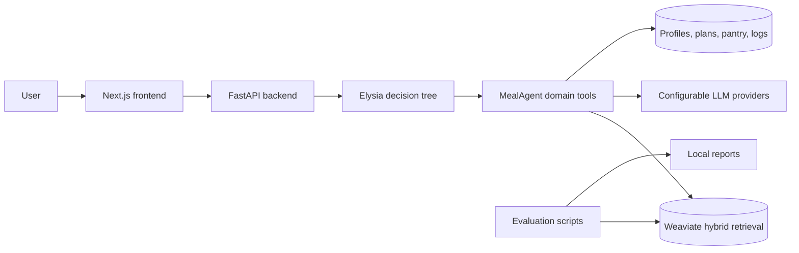
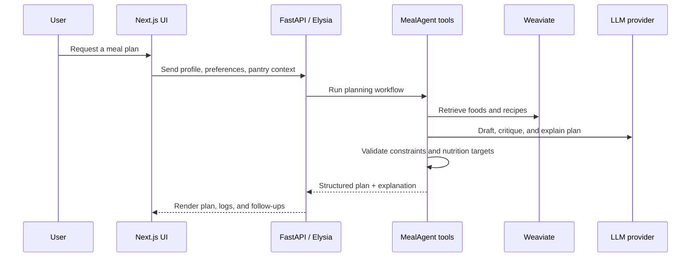

<div align="center">

# MealAgent

### An Agentic RAG meal-planning assistant for personalized nutrition guidance

MealAgent turns nutrition targets, dietary constraints, pantry inventory, recipe knowledge, and meal history into explainable daily and weekly meal plans.

[](https://www.python.org/)
[](https://fastapi.tiangolo.com/)
[](https://nextjs.org/)
[](https://weaviate.io/)
[](https://www.docker.com/)
[](LICENSE)

[Watch demo](#demo-videos) • [Quick start](#quick-start-on-windows) • [Architecture](#architecture) • [Docs](#documentation-map) • [Thesis](docs/thesis/README.md)

</div>

---

## Table of contents

- [Why MealAgent?](#why-mealagent)
- [What it can do](#what-it-can-do)
- [Repository map](#repository-map)
- [Architecture](#architecture)
- [Demo videos](#demo-videos)
- [Quick start on Windows](#quick-start-on-windows)
- [Manual commands](#manual-commands)
- [Configuration](#configuration)
- [Testing and verification](#testing-and-verification)
- [Thesis-derived highlights](#thesis-derived-highlights)
- [Documentation map](#documentation-map)
- [Security, contributing, and license](#security-contributing-and-license)

## Why MealAgent?

Many meal-planning apps can track calories or store recipes, but personalized planning needs more than a static list. MealAgent explores how an **Agentic RAG** system can coordinate retrieval, tool execution, nutrition validation, and user-facing explanations to produce practical meal plans for healthy users.

This repository is also the implementation artifact for the thesis **"AI-Assisted Platform for Personalized Meal Planning and Nutrition Guidance"**. The project combines:

- **Reasoning:** an Elysia decision-tree agent framework for structured tool orchestration.
- **Retrieval:** Weaviate-backed hybrid semantic and keyword search over food and recipe data.
- **Nutrition logic:** MealAgent tools for targets, constraints, portions, pantry state, meal logs, and shopping lists.
- **Experience:** a Next.js frontend for chat, profile/configuration, planning workflows, data views, and evaluation.
- **Evaluation:** nutrition error, semantic evaluation, and LLM-as-a-judge tooling.

> MealAgent is a research/prototype system for healthy users. It is **not** a clinical diagnosis tool or medical diet prescription system.

## What it can do

| Capability | What it means |
| --- | --- |
| Personalized daily plans | Generate breakfast, lunch, and dinner around profile data, calories, macros, preferences, and constraints. |
| Weekly planning | Extend daily planning across multiple days while balancing variety and reuse. |
| Pantry-aware recommendations | Include available ingredients and generate shopping-list style follow-ups when items are missing. |
| Recipe + nutrition retrieval | Combine USDA FoodData Central nutrition references with a Vietnamese recipe knowledge base. |
| Meal logging | Persist accepted/consumed meals so future planning can account for history. |
| Explainable outputs | Return user-facing explanations instead of only raw generated text. |
| Evaluation workflows | Run nutrition-target compliance checks and LLM-as-a-judge experiments. |

## Repository map

| Path | Purpose |
| --- | --- |
| [`MealAgent/`](MealAgent/) | Meal-planning tools, schemas, migrations, scripts, and domain workflows. |
| [`elysia/`](elysia/) | FastAPI backend, Elysia framework integration, API routes, CLI, and static hosting. |
| [`elysia-frontend/`](elysia-frontend/) | Next.js 14 frontend with React, TypeScript, Tailwind, Radix UI, and static export support. |
| [`Docker/`](Docker/) | Local Weaviate + transformer inference compose stack. |
| [`evaluation/`](evaluation/) | Nutrition error, semantic evaluation, and LLM-as-a-judge tooling. |
| [`docs/`](docs/) | Public docs plus AI-devkit design, testing, deployment, and thesis notes. |
| [`scripts/`](scripts/) | Windows PowerShell helpers for setup, start, status, and shutdown. |

## Architecture



### Planning flow at a glance



## Demo videos

GitHub may render the MP4 files below directly from [`docs/assets/videos/`](docs/assets/videos/). If an embedded preview does not load in your browser, open the linked file instead.

### Full system demo

<video src="docs/assets/videos/demo-full.mp4" controls width="100%"></video>

[Open full demo video](docs/assets/videos/demo-full.mp4)

### Workflow gallery

| Workflow | Video |
| --- | --- |
| Initial setup, profile, and configuration | [phase-1.mp4](docs/assets/videos/phase-1.mp4) |
| Daily meal planning | [meal-day.mp4](docs/assets/videos/meal-day.mp4) |
| Weekly meal planning | [week-plan.mp4](docs/assets/videos/week-plan.mp4) |
| Intermediate MealAgent feature flow | [phase-3.mp4](docs/assets/videos/phase-3.mp4) |
| Final integration and evaluation flow | [phase-4.mp4](docs/assets/videos/phase-4.mp4) |
| Admin / review workflow | [admin-flow.mp4](docs/assets/videos/admin-flow.mp4) |

## Quick start on Windows

### Prerequisites

- Windows PowerShell 5.1+ or PowerShell 7+
- Python 3.12.x
- Node.js 18+
- Docker Desktop
- NVIDIA GPU support is required by the default transformer inference service in [`Docker/docker-compose.yml`](Docker/docker-compose.yml). For CPU-only machines, remove the NVIDIA device reservation and CUDA environment variables from the compose file before starting the stack.

### Run the local stack

1. Copy environment examples and add your real local secrets:

   ```powershell
   Copy-Item .env.example .env
   Copy-Item elysia-frontend\.env.example elysia-frontend\.env.local
   ```

2. Install backend and frontend dependencies:

   ```powershell
   powershell -ExecutionPolicy Bypass -File scripts/setup-dev.ps1
   ```

3. Start Weaviate, backend, and frontend:

   ```powershell
   powershell -ExecutionPolicy Bypass -File scripts/start-system.ps1
   ```

4. Check status:

   ```powershell
   powershell -ExecutionPolicy Bypass -File scripts/status-system.ps1
   ```

5. Open the app:

   | Service | URL |
   | --- | --- |
   | Frontend dev app | <http://127.0.0.1:3000> |
   | Backend health | <http://127.0.0.1:8000/api/health> |
   | Weaviate readiness | <http://localhost:8078/v1/.well-known/ready> |

6. Stop all local services:

   ```powershell
   powershell -ExecutionPolicy Bypass -File scripts/stop-system.ps1
   ```

## Manual commands

Use these commands if you want to start each layer yourself instead of using the helper scripts.

```powershell
# Python environment
py -3.12 -m venv .venv
.\.venv\Scripts\python.exe -m pip install -e ".\elysia[dev]" -e ".\MealAgent"

# Docker services
docker compose -f Docker\docker-compose.yml up -d

# Backend
.\.venv\Scripts\python.exe -m uvicorn elysia.api.app:app --host 127.0.0.1 --port 8000

# Frontend
cd elysia-frontend
npm ci
npm run dev -- --hostname 127.0.0.1 --port 3000
```

## Configuration

Use [`.env.example`](.env.example), [`elysia/.env.example`](elysia/.env.example), and [`elysia-frontend/.env.example`](elysia-frontend/.env.example) as templates.

| Variable | Description |
| --- | --- |
| `OPENROUTER_API_KEY`, `GEMINI_API_KEY`, `OPENAI_API_KEY` | LLM provider credentials. |
| `BASE_MODEL`, `BASE_PROVIDER`, `COMPLEX_MODEL`, `COMPLEX_PROVIDER` | Default model routing. |
| `WEAVIATE_IS_LOCAL`, `LOCAL_WEAVIATE_PORT`, `LOCAL_WEAVIATE_GRPC_PORT` | Local Weaviate connection. |
| `WCD_URL`, `WCD_API_KEY` | Weaviate Cloud connection, if not using local Docker. |
| `CORS_ALLOW_ORIGINS` | Comma-separated frontend origins allowed by the backend. |
| `NEXT_PUBLIC_BACKEND_URL` | Browser-visible backend URL for frontend dev mode. |

Never commit real `.env` files or API keys. Rotate any credentials that were ever shared or committed accidentally.

## Testing and verification

```powershell
# Backend / MealAgent tests
.\.venv\Scripts\python.exe -m pytest tests/meal_agent/unit

# Frontend lint, typecheck, and static export build
cd elysia-frontend
npm run lint
npm run typecheck
npm run build
cd ..

# Evaluation smoke test
.\.venv\Scripts\python.exe -m evaluation.scripts.run_single_method nutrition_error --use-mock
```

Generated evaluation outputs are ignored under `evaluation/results/`.

## Thesis-derived highlights

These figures summarize the thesis materials and should be read as research/prototype evaluation results, not clinical guarantees.

| Area | Summary |
| --- | --- |
| Problem | Users need daily/weekly meal plans that satisfy nutrition targets while respecting diet type, allergies, preferences, and pantry inventory. |
| Approach | Agentic RAG coordinates an Elysia decision tree, MealAgent tools, Weaviate hybrid search, and configurable LLM providers. |
| Knowledge base | USDA FoodData Central (~8,200 food items) plus a Vietnamese recipe dataset (~4,000 recipes). |
| Nutritional compliance | 58 evaluated meal outputs achieved 100% Excellent/Good classification, with mean overall nutritional error of 6.94%. |
| User study | 20 non-clinical participants rated overall user experience at 4.44/5.0. |

Read the full Markdown summary in [Thesis overview](docs/thesis/README.md).

## Documentation map

| Topic | Link |
| --- | --- |
| Local development | [Getting started](docs/getting-started/local-development.md) |
| Environment variables | [Configuration](docs/getting-started/configuration.md) |
| Demo and thesis assets | [Demo and thesis materials](docs/demo/README.md) |
| Thesis summary | [Thesis overview](docs/thesis/README.md) |
| MealAgent data pipeline | [MealAgent data pipeline](MealAgent/docs/DATA_PIPELINE.md) |
| Daily planning workflow | [Plan-day workflow](MealAgent/docs/PLAN_DAY_WORKFLOW.md) |
| Evaluation framework | [Evaluation README](evaluation/README.md) |
| Deployment | [Deployment notes](docs/ai/deployment/README.md) |

## Security, contributing, and license

- **Security:** see [SECURITY.md](SECURITY.md). Do not open issues containing private API keys, meal data, or personal health information.
- **Contributing:** see [CONTRIBUTING.md](CONTRIBUTING.md). Before opening a pull request, run the relevant backend/frontend verification commands above.
- **License:** this repository is released under the MIT License. See [LICENSE](LICENSE).

---

<div align="center">

Built as a research prototype for explainable, personalized meal planning.

</div>
