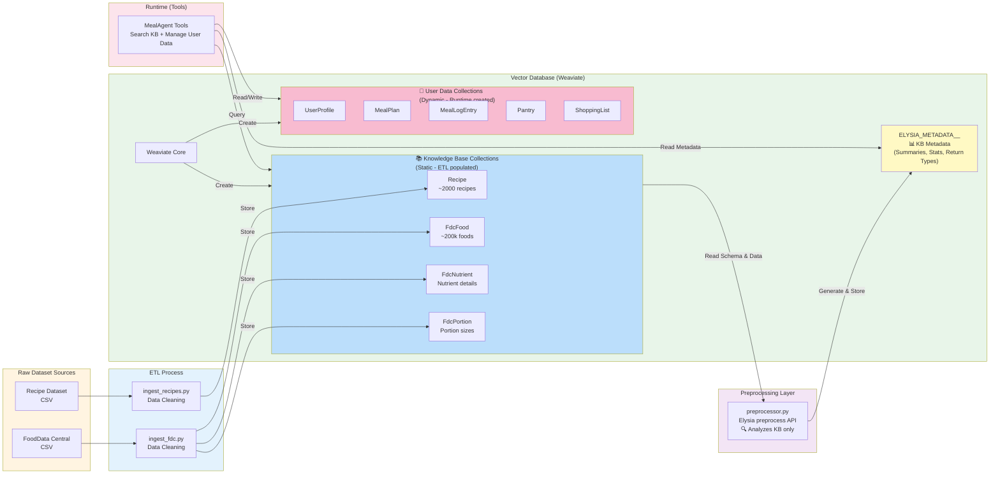
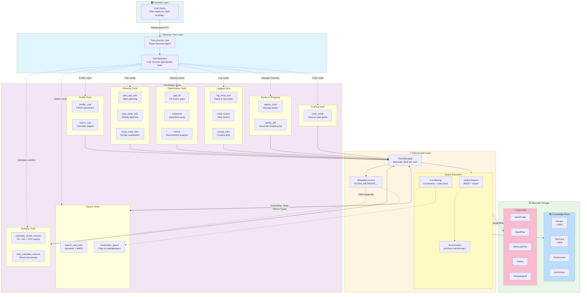

# Data and Query Pipeline Architecture

## Abstract

This document presents a comprehensive analysis of MealAgent's dual-pipeline architecture, which forms the foundational infrastructure for intelligent meal planning operations. The architecture comprises two distinct yet interdependent pipelines: the Data Storing Pipeline and the Query Execution Pipeline. These pipelines collectively enable the transformation of heterogeneous raw nutritional datasets into actionable, personalized meal recommendations through a sophisticated orchestration of vector database operations, semantic search capabilities, and AI-driven decision-making processes.

## 1. Introduction

### 1.1 Architectural Overview

MealAgent's architecture is predicated on a clear separation of concerns between data preparation and query processing, implemented through two primary computational pipelines. This architectural pattern, inspired by the Extract-Transform-Load (ETL) paradigm and modern data lake architectures, ensures scalability, maintainability, and operational efficiency.

The system operates on two fundamental pipelines:

**1. Data Storing Pipeline**: An offline, batch-oriented ETL infrastructure responsible for ingesting heterogeneous raw datasets—specifically, the USDA FoodData Central nutritional database and a Vietnamese recipe corpus—into a unified vector database (Weaviate). This pipeline incorporates a sophisticated preprocessing phase that generates semantic metadata to enhance subsequent query operations.

**2. Query Execution Pipeline**: A runtime, event-driven query processing framework that manages user request interpretation, intelligent tool orchestration, and data retrieval operations. This pipeline operates on both static Knowledge Base collections (populated by the Data Storing Pipeline) and dynamic User Data collections (populated during runtime interactions).

### 1.2 Design Rationale

The dual-pipeline architecture addresses several critical requirements in AI-powered meal planning systems:

- **Data Heterogeneity**: Nutritional data originates from disparate sources with varying schemas, languages (English for FDC, Vietnamese for recipes), and granularity levels. The Data Storing Pipeline normalizes these variations into a unified data model.

- **Semantic Search Requirements**: Modern meal planning necessitates semantic understanding beyond keyword matching. The preprocessing phase generates metadata that enables context-aware search operations.

- **Real-Time Personalization**: User preferences, dietary constraints, and consumption history must be incorporated dynamically. The Query Execution Pipeline maintains personalized state while accessing shared knowledge resources.

- **Computational Efficiency**: By separating expensive one-time operations (ETL, vectorization, preprocessing) from frequent runtime operations (queries, updates), the architecture optimizes resource utilization.

---

## 2. Data Storing Pipeline

### 2.1 Purpose and Scope

The Data Storing Pipeline constitutes the foundational data ingestion and transformation infrastructure of MealAgent. This pipeline is responsible for the systematic transformation of heterogeneous raw CSV datasets into semantically enriched, queryable vector collections within the Weaviate vector database. Operating as a batch-oriented process during system initialization, this pipeline establishes the comprehensive Knowledge Base that underpins all subsequent meal planning operations.

**Primary Objectives:**

1. **Data Normalization**: Transform raw CSV data with varying schemas into a unified, consistent data model
2. **Vector Embedding Generation**: Generate semantic vector representations for text fields to enable similarity-based retrieval
3. **Metadata Enrichment**: Produce collection-level metadata that enhances query planning and execution
4. **Referential Integrity**: Establish and maintain foreign key relationships across collections (e.g., fdc_id linkages)
5. **Idempotency**: Enable safe re-execution of ingestion processes without data duplication

**Operational Characteristics:**

- **Execution Frequency**: One-time during system deployment, with optional re-execution for data updates
- **Data Volume**: Processes approximately 200,000 food items and 2,000 recipes
- **Processing Mode**: Batch-oriented with progress tracking and resume capabilities
- **Performance Requirements**: Completion within acceptable initialization timeframes (< 30 minutes for full ingestion)

### Architecture Diagram



### 2.3 Pipeline Stages and Data Transformations

#### 2.3.1 Stage 1: Raw Dataset Sources

The Data Storing Pipeline ingests data from two primary sources, each serving distinct but complementary roles in the Knowledge Base:

**FoodData Central (USDA) Database**

The USDA FoodData Central database serves as the authoritative source for nutritional information:

- **Provenance**: United States Department of Agriculture (USDA) public domain dataset
- **Format**: Comma-separated values (CSV) files with standardized schema
- **Data Volume**: Approximately 200,000 distinct food items
- **Nutritional Coverage**: Comprehensive macronutrient profiles (energy, protein, fat, carbohydrates, fiber) and micronutrient profiles (vitamins, minerals) per 100-gram serving
- **Data Granularity**: Includes both aggregate food entries and detailed nutrient-specific records
- **Language**: English terminology with standardized food descriptions
- **Scope**: Foundation-level nutritional data spanning diverse food categories (produce, proteins, grains, processed foods)
- **Data Quality**: Government-verified nutritional values with established measurement protocols

**Vietnamese Recipe Corpus**

The recipe dataset provides culturally relevant culinary knowledge:

- **Provenance**: Curated Vietnamese recipe collection
- **Format**: CSV with structured recipe metadata and semi-structured ingredient lists
- **Data Volume**: Approximately 2,000 recipes representing common Vietnamese dishes
- **Metadata Coverage**: Dish names, ingredient lists with quantities, cooking procedures, preparation time, dietary constraints, allergen information, required kitchen equipment
- **Language**: Vietnamese (necessitating runtime translation for cross-referencing with English FDC data)
- **Cultural Relevance**: Reflects authentic Vietnamese culinary practices and ingredient combinations
- **Challenge**: Language mismatch requires sophisticated ingredient mapping at query time rather than during ETL

#### 2.3.2 Stage 2: Extract-Transform-Load (ETL) Process

The ETL stage implements robust data transformation logic to convert raw CSV data into structured Weaviate collections. Two specialized Python modules handle domain-specific transformation requirements:

**ingest_fdc.py: Nutritional Database Ingestion Module**

This module orchestrates the transformation of FoodData Central data into three interconnected Weaviate collections:

*Functional Responsibilities:*

1. **Data Parsing and Validation**:
   - CSV parsing with encoding detection (UTF-8-sig) to handle byte-order marks
   - Column mapping through flexible synonym detection (e.g., "fdc_id", "FDC_ID", "fdcId")
   - Type coercion with null-safety (convert string numerics to float/int with fallback to None)
   - Missing value handling strategies (preserve semantic nulls vs. zero-fill)

2. **Multi-Collection Population**:
   - **FdcFood**: Primary food records with denormalized macro/micronutrient columns for query efficiency
   - **FdcNutrient**: Normalized nutrient records enabling fine-grained nutrient-specific queries (schema: fdc_id, nutrient_id, amount_100g)
   - **FdcPortion**: Household measure conversion records (e.g., "1 cup" → gram equivalents) for user-friendly quantity specifications

3. **Referential Integrity Management**:
   - All collections linked via fdc_id foreign key
   - Deterministic UUID generation using `generate_uuid5(namespace:value)` pattern
   - Enables consistent cross-collection joins during query operations

4. **Performance Optimizations**:
   - Batch insertion (configurable batch size, default: 1000 records)
   - Progress tracking with ETA calculation (elapsed time, processing rate, estimated completion)
   - Streaming processing to limit memory footprint for large datasets

5. **Idempotency Guarantees**:
   - UUID-based primary keys ensure upsert semantics (insert-or-update)
   - Safe re-execution without duplicate record creation
   - Supports incremental updates when source data evolves

**ingest_recipes.py: Recipe Corpus Ingestion Module**

This module handles the transformation of semi-structured recipe data into queryable Recipe collections:

*Functional Responsibilities:*

1. **Schema Normalization**:
   - Flexible column mapping accommodating naming variations ("dish_name", "title", "name")
   - Structured array parsing for multi-valued fields (ingredients, cooking methods)
   - JSON/Python literal evaluation for nested structures

2. **Data Structure Transformations**:
   - Parse `ingredients_with_qty`: ["100g chicken breast", "2 tbsp olive oil"] → structured arrays
   - Extract `cooking_method_array`: ["boil", "stir-fry", "season"] for procedural metadata
   - Normalize constraint fields: diet_type, allergens, required equipment

3. **Caching Field Initialization**:
   - **macros_per_serving**: Initialized as null, populated on-demand at runtime via `calculate_recipe_macros_tool`
   - **ingredient_fdc_map**: Empty array, populated during first macro calculation to cache VN→EN→FDC mappings
   - **Rationale**: Runtime population enables flexible ingredient translation rather than hardcoded mappings

4. **Error Handling and Recovery**:
   - Row-level error isolation (malformed record doesn't halt entire ingestion)
   - Resume capability via checkpoint tracking (records processed count)
   - Detailed logging for debugging malformed source data

5. **Compression Support**:
   - Automatic gzip detection and decompression for .gz files
   - Transparent handling reduces storage requirements for large recipe corpora

*Idempotency and Data Integrity:*

Both ingestion modules employ UUID-based record identification, where UUIDs are deterministically generated from primary keys (e.g., `generate_uuid5("Recipe:{recipe_id}")`). This approach ensures:
- **Safe Re-ingestion**: Identical source records produce identical UUIDs, triggering updates rather than duplicates
- **Incremental Updates**: New records are inserted while existing records are updated in place
- **Referential Stability**: Foreign key references remain valid across re-ingestion operations

#### 2.3.3 Stage 3: Weaviate Vector Database Storage

The ETL pipeline persists transformed data into Weaviate, a cloud-native vector database optimized for semantic search operations. Collections are organized into two logical categories with distinct lifecycle and access patterns:

**Knowledge Base Collections (Static Reference Data)**

These collections constitute the system's immutable knowledge foundation, populated once during ETL and maintained as read-only resources at runtime (with limited exceptions for caching operations):

1. **Recipe Collection** (~2,000 records)
   - **Schema**: 15 properties including dish_name (text), ingredients (text[]), cooking_method_array (text[]), dietary constraints
   - **Vectorization**: dish_name and ingredients fields vectorized via text2vec-transformers for semantic similarity search
   - **Caching Fields**: 
     - `macros_per_serving` (object): Computed on first access, persisted for subsequent queries
     - `ingredient_fdc_map` (object[]): Caches Vietnamese→English→FDC ID mappings
   - **Access Pattern**: Primarily read-only; write operations limited to cache population
   - **Language**: Vietnamese (necessitates runtime translation for nutritional calculations)

2. **FdcFood Collection** (~200,000 records)
   - **Schema**: 22 properties covering macronutrients and micronutrients per 100g serving
   - **Vectorization**: description field enables semantic food search (e.g., "leafy greens" matches spinach, kale, lettuce)
   - **Data Density**: Comprehensive nutrient profiles with ~90% field completion rate
   - **Query Patterns**: High-frequency reads during recipe macro calculation and meal logging
   - **Performance**: Indexed on fdc_id for efficient lookup operations

3. **FdcNutrient Collection** (variable size)
   - **Schema**: Normalized (fdc_id, nutrient_id, amount_100g) for granular nutrient queries
   - **Use Case**: Micronutrient analysis, deficit identification, targeted nutrient recommendations
   - **Normalization Rationale**: Separating nutrients enables flexible querying without schema evolution when new nutrients are added

4. **FdcPortion Collection** (variable size)
   - **Schema**: (fdc_id, amount, measure_unit, gram_weight) for unit conversions
   - **Examples**: "1 cup" → 150g, "1 medium apple" → 182g
   - **Purpose**: Translate user-friendly portion descriptions into standardized gram weights for calculation

**User Data Collections (Dynamic Operational Data)**

These collections store personalized, evolving user data generated during runtime interactions. Schemas are defined during system initialization, but collections are populated dynamically:

1. **UserProfile Collection**
   - **Schema**: 20+ properties including demographics (age, gender, weight, height), calculated targets (TDEE, macro splits), constraints (allergens, diet type, equipment)
   - **Lifecycle**: Created upon user registration, updated via profile CRUD operations and meal logging
   - **Access Pattern**: Read-heavy (referenced by nearly all tools), occasional writes
   - **Isolation**: Queries always filtered by user_id to ensure multi-tenant data separation

2. **MealPlan / MealPlanItem Collections**
   - **Schema**: Plans contain metadata (user_id, date range, plan_type); items contain meal slots (recipe_id, meal_type, servings, calculated_macros)
   - **Cardinality**: One plan : many items (1:N relationship)
   - **Use Case**: Persist approved meal plans, enable plan modification and retrieval
   - **Query Pattern**: Recent plans accessed frequently; historical plans accessed for variety scoring

3. **MealLogEntry Collection**
   - **Schema**: Stores parsed meal descriptions, ingredient lists (JSON), calculated nutrition, validation status
   - **Purpose**: Maintain consumption history for deficit tracking and pattern analysis
   - **Growth Pattern**: Accumulates over time (3 entries/day → ~1000 entries/year per user)
   - **Optimization**: Indexed on (user_id, logged_at) for efficient temporal queries

4. **Pantry / PantryItem Collections**
   - **Schema**: Inventory tracking with expiry dates and optional FDC linkage
   - **Use Case**: Pantry-aware meal planning, shopping list differential calculation
   - **Update Frequency**: Moderate (weekly inventory updates typical)

5. **ShoppingList / ShoppingItem Collections**
   - **Schema**: Derived from meal plans, categorized for shopping efficiency (produce, dairy, proteins)
   - **Lifecycle**: Generated from approved plans, marked as purchased, archived post-shopping
   - **Purpose**: Bridge between planning and execution phases

**ELYSIA_METADATA__ Collection (Semantic Enhancement Layer)**

A special-purpose collection storing preprocessing artifacts that enhance query planning and execution:

- **Collection Summaries**: Natural language descriptions of each collection's purpose and content scope
- **Field Statistics**: Value distributions, cardinality estimates, common patterns (e.g., "cooking_time typically ranges 15-90 minutes")
- **Return Type Mappings**: Intelligent mappings from generic fields (title, content, category) to collection-specific fields (e.g., Recipe.dish_name → generic.title)
- **Sample Data**: Representative examples demonstrating typical field values
- **Query Optimization Metadata**: Statistics enabling the Elysia query planner to select optimal search strategies

**Purpose**: This metadata enables the Elysia framework to generate more accurate semantic queries, improving search relevance and tool selection accuracy. The preprocessing phase (Stage 4) generates this metadata by analyzing the Knowledge Base collections.

#### 2.3.4 Stage 4: Semantic Metadata Generation (Preprocessing)

The preprocessing stage implements a sophisticated metadata generation process that enhances the semantic understanding and queryability of Knowledge Base collections. This stage leverages the Elysia framework's official [Preprocessor API](https://weaviate.github.io/elysia/Reference/Preprocessor/) to generate structured metadata that guides subsequent query operations.

**Implementation: preprocessor.py Module**

The preprocessing module implements a multi-phase analysis pipeline:

**Phase 1: Schema Introspection**

- **Collection Schema Analysis**: Examines each collection's property definitions, data types, indexing configurations, and vectorization settings
- **Field Semantic Classification**: Categorizes fields by semantic role (identifiers, descriptive text, numerical measurements, categorical attributes, temporal fields)
- **Relationship Discovery**: Identifies foreign key relationships (e.g., fdc_id linkages across FdcFood, FdcNutrient, FdcPortion)
- **Vectorization Strategy Review**: Documents which fields are vectorized and their embedding dimensions

**Phase 2: Statistical Sampling and Analysis**

- **Stratified Sampling**: Extracts representative data samples from each collection (default: 10-30 records per collection, configurable)
- **Field Cardinality Estimation**: Computes distinct value counts for categorical fields
- **Value Distribution Analysis**: Generates histograms for numerical fields (e.g., cooking_time: 80% between 15-45 minutes)
- **Null Rate Calculation**: Determines data completeness percentages for optional fields
- **Text Field Analysis**: Computes average token counts, common n-grams, language detection

**Phase 3: Natural Language Summary Generation**

- **Collection-Level Summaries**: LLM-generated prose descriptions explaining each collection's purpose, scope, and typical use cases
  - Example: "The Recipe collection contains approximately 2,000 Vietnamese dishes with detailed ingredient lists and cooking instructions. Recipes are categorized by dish type (appetizer, main course, dessert) and annotated with dietary constraints."
- **Field-Level Descriptions**: Semantic explanations of each field's meaning and typical values
  - Example: "cooking_time represents the estimated preparation and cooking duration in minutes, typically ranging from 15 to 90 minutes"
- **Usage Pattern Documentation**: Describes common query patterns for each collection

**Phase 4: Generic Field Mapping**

Creates intelligent mappings from Elysia's generic return type fields (title, subtitle, content, url, id, author, timestamp, tags, category, subcategory) to collection-specific fields:

*Mapping Strategy for Recipe Collection:*
- `generic.title` → `Recipe.dish_name` (primary identifier for UI display)
- `generic.content` → `Recipe.ingredients_with_qty` (core textual content)
- `generic.category` → `Recipe.dish_type` (classification for filtering)
- `generic.tags` → `Recipe.allergens` (metadata for quick scanning)
- `generic.url` → `Recipe.image_link` (media resource)

*Mapping Strategy for FdcFood Collection:*
- `generic.title` → `FdcFood.description` (food name)
- `generic.id` → `FdcFood.fdc_id` (stable identifier)
- `generic.content` → `FdcFood.description` (searchable text)

*Mapping Strategy for UserProfile Collection:*
- `generic.title` → `UserProfile.display_name` or `UserProfile.user_id`
- `generic.subtitle` → `UserProfile.goal` (fitness objective)
- `generic.category` → `UserProfile.goal` (classification)
- `generic.tags` → `UserProfile.preferences` (quick filters)
- `generic.timestamp` → `UserProfile.updated_at` (temporal ordering)

**Rationale**: Generic mappings enable cross-collection query interfaces and consistent UI rendering without collection-specific frontend logic.

**Phase 5: Query Optimization Metadata Generation**

- **Selectivity Estimates**: Computes expected result set sizes for common filters (e.g., "vegetarian recipes" → ~400 matches)
- **Index Recommendations**: Suggests additional indexes based on observed query patterns
- **Join Cost Estimates**: Calculates expected costs for cross-collection queries

**Output Artifacts**

All generated metadata is persisted in the `ELYSIA_METADATA__` collection with the following structure:

```python
{
  "collection_name": "Recipe",
  "summary": "Natural language description...",
  "field_mappings": {"title": "dish_name", ...},
  "field_statistics": {
    "cooking_time": {"min": 5, "max": 180, "mean": 35.2, "null_rate": 0.02},
    "dish_type": {"cardinality": 12, "top_values": ["main_course", "appetizer"]}
  },
  "sample_records": [...],
  "query_patterns": ["semantic_search", "filter_by_diet_type", "range_filter_cooking_time"]
}
```

**Operational Characteristics**

- **Execution Timing**: Runs post-ETL, pre-runtime (one-time setup phase)
- **Target Collections**: Only Knowledge Base collections (Recipe, FdcFood, FdcNutrient, FdcPortion)
- **Exclusions**: User Data collections are not preprocessed (dynamic, personalized data not suitable for global metadata)
- **Performance**: Completes in 2-5 minutes for full Knowledge Base
- **Idempotency**: Safe to re-run; regenerates metadata with updated statistics
- **Configuration**: Sampling parameters (min/max sample size, token budget) are tunable

**Runtime Utilization**

Generated metadata is consumed by:

1. **Search Tools**: Use field mappings and summaries to construct optimal Weaviate queries
2. **Nutrition Tools**: Reference field statistics for validation and unit normalization
3. **Tree Decision Agent**: Leverages collection summaries for intelligent tool selection
4. **Query Planner**: Uses selectivity estimates for query optimization

**Maintenance**: Metadata should be regenerated when:
- Knowledge Base collections are significantly updated (>20% data change)
- New collections are added to the Knowledge Base
- Field schemas are modified (new properties, type changes)
- Query patterns evolve (new access patterns observed)

#### Stage 5: Runtime Access

**Read Patterns**

MealAgent tools interact with stored data according to collection type:

- **Knowledge Base** (Recipe, FdcFood, FdcNutrient, FdcPortion): **Read-only access**
  - Search tools query for semantic recipe matching
  - Nutrition tools read nutritional profiles
  - Optimization tools reference food data for gap filling
  - Exception: `calculate_recipe_macros_tool` writes cached macros back to Recipe

- **User Data** (UserProfile, MealPlan, MealLogEntry, Pantry, ShoppingList): **Read/Write access**
  - Profile tools perform CRUD operations
  - Planning tools create and update meal plans
  - Logging tools record consumption and update remaining targets
  - Pantry tools manage inventory and shopping lists

- **Metadata** (ELYSIA_METADATA__): **Read-only access**
  - Search tools use summaries for query optimization
  - Nutrition tools reference field mappings for accurate calculations
  - Tree decision-making leverages metadata for tool selection

### 2.4 Key Architectural Characteristics

**2.4.1 Data Integrity and Consistency Guarantees**

*Idempotency through Deterministic Identification*
- **UUID Generation Strategy**: All records assigned UUIDs derived deterministically from business keys using SHA-1 hashing via `generate_uuid5(namespace, value)` function
- **Mathematical Property**: Identical input data consistently produces identical UUIDs, enabling safe re-execution
- **Practical Implication**: ETL processes can be re-run for data corrections, updates, or recovery without creating duplicate records
- **Consistency Model**: Upsert semantics (insert-or-update) ensure eventual consistency across re-ingestion operations

*Referential Integrity Management*
- **Foreign Key Discipline**: All inter-collection relationships maintained through strict fdc_id and recipe_id references
- **Cascade Semantics**: Relationship integrity preserved even during partial updates (e.g., updating FdcFood does not invalidate FdcNutrient references)
- **Validation Gates**: ETL processes validate foreign key existence before creating referencing records
- **Orphan Prevention**: Referential integrity checks prevent orphaned records in dependent collections

*Schema Validation and Type Safety*
- **Compile-Time Validation**: Schema definitions validated against Weaviate's type system during collection creation
- **Runtime Type Coercion**: Incoming data validated and coerced to match declared schemas (with fallback to null for invalid values)
- **Required Field Enforcement**: Non-nullable fields validated during ingestion; malformed records logged and skipped
- **Index Integrity**: Filterable fields marked with `indexFilterable: True` to ensure query performance

**2.4.2 Performance Optimization Strategies**

*Batch Processing Architecture*
- **Batch Size Tuning**: Configurable batch sizes (default: 1000 records) balance memory usage and network round-trips
- **Throughput Gains**: Batch insertion reduces overhead from ~50 records/sec (single inserts) to ~2000 records/sec (batched)
- **Memory Management**: Streaming processing prevents memory exhaustion on large datasets (200k+ records)
- **Transaction Boundaries**: Batches provide natural checkpointing for partial success tracking

*Progress Monitoring and Observability*
- **Real-Time Metrics**: Processing rate (records/sec), elapsed time, estimated completion time (ETA)
- **Progress Visualization**: Console output with human-readable time formatting (e.g., "45m23s" vs. "2723 seconds")
- **Checkpoint Logging**: Periodic state snapshots enable debugging and performance analysis
- **Error Rate Tracking**: Failed record counts and error patterns logged for data quality assessment

*Interruption Recovery and Resume Capability*
- **Checkpoint Persistence**: Record counts periodically flushed to disk/log
- **Resume Detection**: On restart, ingestion skips already-processed records using UUID existence checks
- **Partial Success Handling**: Completed batches remain persisted even if process terminates mid-execution
- **Time-to-Recovery**: Resume operations typically complete in seconds (metadata scan) vs. minutes (full re-ingestion)

**2.4.3 Semantic Enhancement Through Preprocessing**

*Metadata-Driven Query Optimization*
- **Search Relevance Improvement**: Collection summaries and field descriptions enable the LLM query planner to construct more accurate semantic queries
- **Selectivity Estimation**: Field statistics (cardinality, distributions) guide query optimizer's index selection
- **Generic Field Abstractions**: Mapping to generic return types enables collection-agnostic UI components and query templates

*Cross-Collection Query Enablement*
- **Unified Interface**: Generic field mappings allow consistent query syntax across heterogeneous collections
- **Frontend Simplification**: UI components can render results from any collection using standard fields (title, subtitle, content)
- **Tool Generalization**: Tools can be written to operate on generic fields rather than collection-specific schemas

*Intelligent Query Planning*
- **Statistical Query Optimization**: Field distributions guide decisions on filter ordering, index usage, and join strategies
- **Adaptive Query Rewriting**: Query planner leverages metadata to rewrite inefficient queries into optimized equivalents
- **Dynamic Index Selection**: Statistics inform decisions about when to use BM25 vs. vector search vs. filtered scans

---

## 2. Query Execution Pipeline

### Purpose

The Query Execution Pipeline manages runtime query processing, transforming natural language user requests into structured database operations through intelligent tool orchestration. This pipeline enables dynamic interaction with both static knowledge and personalized user data.

### Architecture Diagram



### Pipeline Stages

#### Stage 1: Frontend Layer

**User Query Initiation**

Users submit natural language queries through the Next.js frontend interface:
- **Example queries**: "Plan meals for 1800 kcal/day", "Log that I ate chicken salad", "What's in my pantry?"
- **Transport**: WebSocket connection (`/ws/query`) for real-time bidirectional communication
- **Context**: Includes user_id, conversation_id, query_id for session management
- **Format**: JSON payload with query text and optional metadata

#### Stage 2: Decision Tree Layer

**Tree.process_tree (Elysia Decision Agent)**

The Tree acts as an intelligent orchestrator that interprets user intent and selects appropriate tools:

**Responsibilities**:
1. **Query Analysis**: LLM parses natural language query to extract intent
2. **Tool Selection**: Decision agent chooses relevant tools from the registered tool catalog
3. **Execution Planning**: Determines tool execution order and data dependencies
4. **Environment Management**: Maintains shared state across tool executions
5. **Streaming Coordination**: Orchestrates real-time result streaming to frontend

**Key Features**:
- **Automatic Tool Selection**: No explicit routing required; LLM determines tool sequence
- **Branch Navigation**: Follows Tree branches (profile, search, planning, logging, etc.) based on query context
- **Concurrent Execution**: Executes independent tools in parallel when possible
- **Error Handling**: Manages timeouts, retries, and graceful degradation

**Manager Architecture**:
- **UserManager**: Top-level manager handling multiple users with timeout checking
- **TreeManager**: Per-user manager maintaining multiple conversation trees
- **ClientManager**: Per-user Weaviate client connection pool

#### Stage 3: Tool Layer

**MealAgent Tools (8 Categories)**

Tools are organized into functional categories, each handling specific aspects of meal planning:

**1. Profile Tools**
- `profile_crud`: Create, read, update, delete user profiles
- `macro_calc`: Calculate TDEE and macro targets using Harris-Benedict equation
- **Collections**: UserProfile (read/write)

**2. Search Tools**
- `search_and_rank`: Semantic search with BM25 + vector hybrid ranking
- `constraints_guard`: Apply dietary constraints, allergen filtering, equipment availability
- **Collections**: Recipe (read), UserProfile (read for constraints)
- **Metadata**: Uses ELYSIA_METADATA__ for query optimization

**3. Planning Tools**
- `plan_day_e2e`: Generate daily meal plans (3-5 meals) optimized for macro targets
- `plan_week_e2e`: Generate weekly meal plans with variety scoring
- `swap_meal_item`: Substitute recipes within existing plans
- **Collections**: Recipe (read), MealPlan/MealPlanItem (write), UserProfile (read)

**4. Nutrition Tools**
- `calculate_recipe_macros`: VN→EN ingredient translation + FDC lookup + macro calculation with caching
- `auto_calculate_macros`: Batch processing for multiple recipes
- **Collections**: Recipe (read/write for caching), FdcFood/FdcNutrient/FdcPortion (read)
- **Caching Strategy**: Writes `macros_per_serving` and `ingredient_fdc_map` back to Recipe

**5. Optimization Tools**
- `gap_fill`: Identify macro deficits and recommend snacks
- `substitute`: Suggest ingredient/recipe swaps for allergen avoidance or preference
- `micros`: Analyze micronutrient coverage and suggest boosters
- **Collections**: MealPlanItem (read/write), FdcFood/FdcNutrient (read), UserProfile (read)

**6. Logging Tools**
- `log_meal_e2e`: Parse natural language meal descriptions, calculate nutrition, update remaining targets
- `meal_history`: Retrieve past meal logs with filtering and pagination
- `accept_plan`: Finalize meal plan and update user profile
- **Collections**: MealLogEntry (write), FdcFood/FdcNutrient/FdcPortion (read), UserProfile (read/write)

**7. Pantry & Shopping Tools**
- `pantry_crud`: Manage pantry inventory (add, update, remove items)
- `pantry_diff`: Compare meal plan ingredient requirements against pantry to generate shopping list
- **Collections**: Pantry/PantryItem (read/write), ShoppingList/ShoppingItem (write), MealPlanItem (read)

**8. Cooking Tools**
- `cook_mode`: Generate step-by-step cooking instructions with timers and equipment callouts
- **Collections**: Recipe (read)

**Tool Execution Pattern**:
- All tools are async generators that `yield` Result, Response, Status, or Error objects
- Results are automatically added to Environment (`tree_data.environment`)
- Responses are streamed to frontend in real-time
- Tools can read from Environment using `environment.find(tool_name, name)`

#### Stage 4: Data Access Layer

**ClientManager**

Manages Weaviate client connections on a per-user basis:
- **Connection Pooling**: Reuses clients across queries within a conversation
- **Timeout Management**: Automatically restarts stale clients
- **Isolation**: Ensures user data separation through user_id filtering

**Query Execution Components**

**Hybrid Search (BM25 + Vector)**:
- **BM25**: Keyword-based ranking for exact term matches
- **Vector Search**: Semantic similarity using text2vec-transformers embeddings
- **Fusion**: Combines scores to balance precision and recall
- **Collections**: Primarily Recipe and FdcFood

**Pre-filtering**:
- **Constraint Application**: Filters recipes by diet_type, allergens, devices before search
- **User Preferences**: Prioritizes preferred cuisines and ingredients
- **Performance**: Reduces search space and improves result relevance
- **Implementation**: Weaviate `where` filters applied at query time

**Vectorization**:
- **Model**: text2vec-transformers (consistent across all collections)
- **Process**: Text fields are automatically vectorized on insert
- **Semantic Matching**: Enables finding conceptually similar recipes even without keyword overlap

**Metadata Access (ELYSIA_METADATA__)**:
- **Read-only**: Tools consume metadata but never modify it
- **Use Cases**:
  - Search tools read field mappings for intelligent query construction
  - Nutrition tools reference field statistics for validation
  - Tree decision-making uses collection summaries for tool selection
- **Performance**: Cached in-memory for fast access during query execution

#### Stage 5: Storage Layer

**Knowledge Base Collections (Read-Only at Runtime)**

Static collections queried by tools but never modified (except Recipe caching):
- **Recipe** (~2,000): Vietnamese recipes with on-demand macro caching
- **FdcFood** (~200,000): Comprehensive food nutritional database
- **FdcNutrient**: Fine-grained nutrient breakdowns
- **FdcPortion**: Household measure conversions

**User Data Collections (Read/Write at Runtime)**

Dynamic collections actively managed by tools:
- **UserProfile**: Demographics, preferences, constraints, and calculated targets
- **MealPlan / MealPlanItem**: Persisted meal plans with macro tracking
- **MealLogEntry**: Meal consumption history with parsed ingredients
- **Pantry / PantryItem**: Real-time inventory tracking
- **ShoppingList / ShoppingItem**: Auto-generated shopping lists

### Execution Flow

**Complete Query Execution Sequence**:

1. **User Query** → Tree receives natural language query via WebSocket (`/ws/query`)
2. **Query Parsing** → LLM analyzes intent and extracts key parameters
3. **Tool Selection** → Decision agent identifies relevant tools from catalog
4. **Environment Check** → Tree checks if required data already exists in Environment
5. **Tool Execution** → Selected tools execute sequentially or in parallel
6. **Data Retrieval** → Tools query Knowledge Base (read-only) or User Data (read/write) via ClientManager
7. **Metadata Enhancement** → Tools leverage preprocessing metadata for optimized queries
8. **Result Processing** → Tools yield Result objects that are automatically added to Environment
9. **Response Streaming** → All outputs (Text, Result, Status, Error) streamed to frontend in real-time
10. **Completion** → Tree sends completion signal; frontend updates UI

### Key Features

**Intelligent Orchestration**
- **Automatic Tool Chaining**: Tree determines dependencies and execution order
- **Parallel Execution**: Independent tools run concurrently for performance
- **Environment State Management**: Shared context enables tool collaboration

**Real-Time Streaming**
- **Progressive Results**: Users see intermediate results as they're generated
- **Status Updates**: Tools provide progress feedback for long-running operations
- **Error Transparency**: Errors are streamed immediately with context

**Data Isolation**
- **User Separation**: All queries filtered by user_id
- **Session Management**: Conversation-level state via conversation_id
- **Client Isolation**: Per-user Weaviate clients prevent data leakage

**Performance Optimization**
- **Caching**: Recipe macros cached to avoid redundant FDC lookups
- **Hybrid Search**: Balanced precision/recall through BM25 + vector fusion
- **Pre-filtering**: Constraint-based filtering reduces search space
- **Metadata Utilization**: Preprocessing artifacts enable query optimization

---

## Integration Between Pipelines

### Handoff Points

**Knowledge Base Population**
- **Data Storing Pipeline** creates and populates Knowledge Base collections
- **Query Execution Pipeline** reads from these collections at runtime
- **Boundary**: ETL completion → Runtime tool access

**Metadata Generation**
- **Data Storing Pipeline** generates metadata via preprocessing
- **Query Execution Pipeline** reads metadata for query optimization
- **Boundary**: Preprocessing completion → Metadata-enhanced queries

**Dynamic Data Creation**
- **Query Execution Pipeline** creates User Data collections at runtime
- **Data Storing Pipeline** defines schema but never populates these collections
- **Boundary**: Schema definition (ETL) → Runtime population (Query Pipeline)

### Data Consistency

**Static Knowledge Base**
- ETL ensures referential integrity (fdc_id references across FdcFood, FdcNutrient, FdcPortion)
- Idempotent ingestion allows re-running without duplication
- Preprocessing metadata stays in sync with collection schemas

**Dynamic User Data**
- Tools maintain consistency through transactional updates
- Cascade updates (e.g., meal logging updates UserProfile remaining targets)
- Environment state ensures tool coordination within a single query execution

### Performance Considerations

**Data Storing Pipeline**
- Batch insertion minimizes round-trip latency
- Progress tracking enables monitoring of long-running ETL jobs
- Resume capability handles interruptions gracefully

**Query Execution Pipeline**
- Hybrid search balances speed and relevance
- Caching (Recipe macros) avoids redundant computations
- Parallel tool execution reduces total query time
- Metadata pre-computation (preprocessing) amortizes cost across queries

---

## References

- [Elysia Framework Documentation](https://weaviate.github.io/elysia/)
- [Elysia Preprocessor Reference](https://weaviate.github.io/elysia/Reference/Preprocessor/)
- [Elysia Tree Reference](https://weaviate.github.io/elysia/Reference/Tree/)
- [Creating Elysia Tools](https://weaviate.github.io/elysia/creating_tools/)
- [Weaviate Hybrid Search](https://weaviate.io/developers/weaviate/search/hybrid)
- [text2vec-transformers Module](https://weaviate.io/developers/weaviate/modules/retriever-vectorizer-modules/text2vec-transformers)

---

## Conclusion

The Data Storing Pipeline and Query Execution Pipeline work in tandem to provide a robust foundation for MealAgent's AI-powered meal planning capabilities. The Data Storing Pipeline establishes a comprehensive Knowledge Base through batch ETL processes and preprocessing, while the Query Execution Pipeline enables dynamic, intelligent interaction with this knowledge through natural language queries and tool orchestration.

This architecture separates concerns between offline knowledge preparation and runtime query processing, enabling efficient scaling, maintainability, and extensibility as the system evolves.
