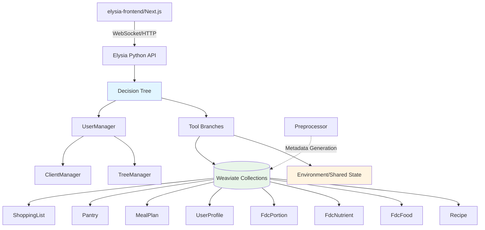
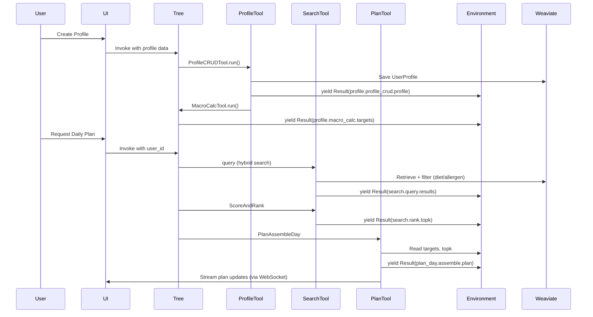
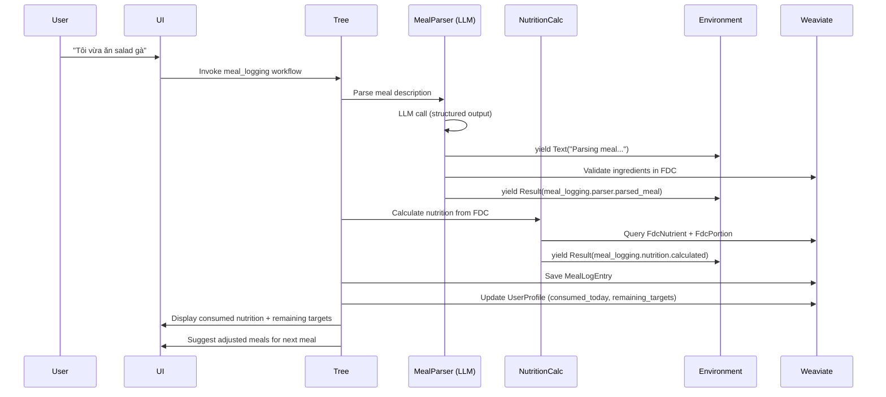

# System Design & Architecture - Meal Planning Agent

## Architecture Overview
**What is the high-level system structure?**

### System Diagram



### Component Responsibilities

- **elysia-frontend (Next.js)**: User interface for profile management, meal browsing, plan viewing, cooking mode
- **Elysia API**: FastAPI-based backend exposing WebSocket (streaming) and REST endpoints
- **Decision Tree**: Orchestrates tool execution based on Environment state and user prompts
- **Tools (async generators)**: Implement specific functionality (search, plan, validate, etc.); yield Result/Text objects
- **Environment**: Shared state container where all Result objects are stored with namespaced keys (`branch.tool.key`)
- **Managers**: 
  - **UserManager**: Per-user isolation of TreeManager and ClientManager
  - **TreeManager**: Manages decision tree instances and execution context
  - **ClientManager**: Manages Weaviate client connections and query execution
- **Preprocessor**: Runs before serving to generate metadata, embeddings, and mappings for collections
- **Weaviate**: Vector database storing recipes, nutritional data, user profiles, plans, pantry, and shopping lists

### Technology Stack

| Layer | Technology | Rationale |
|-------|-----------|-----------|
| Frontend | Next.js 14, TypeScript, Tailwind CSS, shadcn/ui | Modern React framework with SSR, strong typing, rapid UI development |
| Backend | Python 3.11+, FastAPI, Elysia framework | Async support, Elysia decision tree orchestration, strong ML ecosystem |
| Database | Weaviate 1.25+ | Vector search for semantic retrieval, hybrid search (BM25 + vector), schema enforcement |
| Data Source | USDA FoodData Central | Public domain nutritional data with comprehensive macro/micro coverage |
| Streaming | WebSockets | Real-time streaming of tool results (cooking steps, plan generation progress) |
| Auth (v1) | Session-based (user_id in memory) | Simplified MVP auth; migrate to JWT/OAuth in v2 |
| Deployment | Docker Compose (dev), K8s (prod) | Containerized services for portability and scalability |

## Data Models
**What data do we need to manage?**

### Core Collections (Weaviate Schema)

#### Recipe
```python
{
    "class": "Recipe",
    "properties": [
        {"name": "recipe_id", "dataType": ["text"], "indexFilterable": True},
        {"name": "title", "dataType": ["text"]},
        {"name": "description", "dataType": ["text"]},
        {"name": "ingredients", "dataType": ["object[]"]},  # [{"name": str, "amount": float, "unit": str, "fdc_id": int?}]
        {"name": "directions", "dataType": ["text[]"]},  # Step-by-step instructions
        {"name": "servings", "dataType": ["number"]},
        {"name": "time_min", "dataType": ["int"], "indexFilterable": True},  # Total cooking time
        {"name": "tags", "dataType": ["text[]"], "indexFilterable": True},  # ["vegetarian", "quick", "italian"]
        {"name": "diet_type", "dataType": ["text"], "indexFilterable": True},  # "vegetarian", "vegan", "keto", etc.
        {"name": "allergens", "dataType": ["text[]"], "indexFilterable": True},  # ["dairy", "nuts", "gluten"]
        {"name": "image_url", "dataType": ["text"]},
        {"name": "macros_per_serving", "dataType": ["object"]},  # {"kcal": float, "protein_g": float, "fat_g": float, "carb_g": float}
        {"name": "equipment", "dataType": ["text[]"]},  # ["oven", "blender", "stovetop"]
    ],
    "vectorizer": "text2vec-openai"  # Or local model via text2vec-transformers
}
```

#### FdcFood
```python
{
    "class": "FdcFood",
    "properties": [
        {"name": "fdc_id", "dataType": ["int"], "indexFilterable": True},
        {"name": "description", "dataType": ["text"]},
        {"name": "data_type", "dataType": ["text"]},  # "sr_legacy_food", "survey_food", etc.
        {"name": "food_category", "dataType": ["text"]},
        {"name": "scientific_name", "dataType": ["text"]},
    ],
    "vectorizer": "text2vec-openai"
}
```

#### FdcNutrient
```python
{
    "class": "FdcNutrient",
    "properties": [
        {"name": "fdc_id", "dataType": ["int"], "indexFilterable": True},  # Links to FdcFood
        {"name": "nutrient_id", "dataType": ["int"]},  # FDC nutrient ID (e.g., 1008 = Energy)
        {"name": "nutrient_name", "dataType": ["text"]},  # "Protein", "Vitamin C", etc.
        {"name": "amount_per_100g", "dataType": ["number"]},
        {"name": "unit", "dataType": ["text"]},  # "g", "mg", "mcg", "IU"
    ]
}
```

#### FdcPortion (NEW - Required)
```python
{
    "class": "FdcPortion",
    "properties": [
        {"name": "id", "dataType": ["int"], "indexFilterable": True},  # Unique portion ID
        {"name": "fdc_id", "dataType": ["int"], "indexFilterable": True},  # Links to FdcFood
        {"name": "seq_num", "dataType": ["int"]},
        {"name": "amount", "dataType": ["number"]},
        {"name": "measure_unit", "dataType": ["text"]},  # "cup", "oz", "tbsp", etc.
        {"name": "gram_weight", "dataType": ["number"]},  # Conversion to grams
        {"name": "modifier", "dataType": ["text"]},
        {"name": "portion_description", "dataType": ["text"]},
    ]
}
```

#### UserProfile
```python
{
    "class": "UserProfile",
    "properties": [
        {"name": "user_id", "dataType": ["text"], "indexFilterable": True},
        {"name": "age", "dataType": ["int"]},
        {"name": "gender", "dataType": ["text"]},  # "male", "female", "other"
        {"name": "weight_kg", "dataType": ["number"]},
        {"name": "height_cm", "dataType": ["number"]},
        {"name": "activity_level", "dataType": ["text"]},  # "sedentary", "light", "moderate", "very_active", "extra_active"
        {"name": "diet_type", "dataType": ["text"]},
        {"name": "allergens", "dataType": ["text[]"]},
        {"name": "preferences", "dataType": ["text[]"]},  # Liked cuisines/ingredients
        {"name": "max_cooking_time_min", "dataType": ["int"]},  # Optional constraint
        {"name": "available_equipment", "dataType": ["text[]"]},  # Optional constraint
        {"name": "created_at", "dataType": ["date"]},
        {"name": "updated_at", "dataType": ["date"]},
    ]
}
```

#### NutrientTarget (embedded in UserProfile or separate collection)
```python
{
    "class": "NutrientTarget",
    "properties": [
        {"name": "user_id", "dataType": ["text"], "indexFilterable": True},
        {"name": "tdee_kcal", "dataType": ["number"]},  # Harris-Benedict calculated
        {"name": "protein_g", "dataType": ["number"]},
        {"name": "fat_g", "dataType": ["number"]},
        {"name": "carb_g", "dataType": ["number"]},
        {"name": "micronutrient_targets", "dataType": ["object"]},  # {"vitamin_c_mg": 90, "iron_mg": 18, ...}
    ]
}
```

#### MealPlan / MealPlanItem
```python
{
    "class": "MealPlan",
    "properties": [
        {"name": "plan_id", "dataType": ["text"], "indexFilterable": True},
        {"name": "user_id", "dataType": ["text"], "indexFilterable": True},
        {"name": "plan_type", "dataType": ["text"]},  # "day", "week"
        {"name": "start_date", "dataType": ["date"]},
        {"name": "created_at", "dataType": ["date"]},
    ]
}

{
    "class": "MealPlanItem",
    "properties": [
        {"name": "plan_id", "dataType": ["text"], "indexFilterable": True},
        {"name": "day_index", "dataType": ["int"]},  # 0-6 for weekly
        {"name": "meal_type", "dataType": ["text"]},  # "breakfast", "lunch", "dinner", "snack"
        {"name": "recipe_id", "dataType": ["text"]},
        {"name": "servings", "dataType": ["number"]},  # Portion multiplier
        {"name": "actual_macros", "dataType": ["object"]},  # Calculated for this portion
    ]
}
```

#### Pantry / PantryItem
```python
{
    "class": "Pantry",
    "properties": [
        {"name": "user_id", "dataType": ["text"], "indexFilterable": True},
        {"name": "updated_at", "dataType": ["date"]},
    ]
}

{
    "class": "PantryItem",
    "properties": [
        {"name": "user_id", "dataType": ["text"], "indexFilterable": True},
        {"name": "ingredient_name", "dataType": ["text"]},
        {"name": "quantity", "dataType": ["number"]},
        {"name": "unit", "dataType": ["text"]},
        {"name": "fdc_id", "dataType": ["int"]},  # Optional link to FdcFood
        {"name": "expiry_date", "dataType": ["date"]},  # Optional
    ]
}
```

#### ShoppingList / ShoppingItem
```python
{
    "class": "ShoppingList",
    "properties": [
        {"name": "list_id", "dataType": ["text"], "indexFilterable": True},
        {"name": "user_id", "dataType": ["text"], "indexFilterable": True},
        {"name": "plan_id", "dataType": ["text"]},  # Links to MealPlan
        {"name": "created_at", "dataType": ["date"]},
    ]
}

{
    "class": "ShoppingItem",
    "properties": [
        {"name": "list_id", "dataType": ["text"], "indexFilterable": True},
        {"name": "ingredient_name", "dataType": ["text"]},
        {"name": "quantity", "dataType": ["number"]},
        {"name": "unit", "dataType": ["text"]},
        {"name": "category", "dataType": ["text"]},  # "produce", "dairy", "meat", etc. for grouping
        {"name": "purchased", "dataType": ["boolean"]},
    ]
}
```

#### MealLogEntry (NEW - For Meal Logging Feature)
```python
{
    "class": "MealLogEntry",
    "properties": [
        {"name": "log_id", "dataType": ["text"], "indexFilterable": True},
        {"name": "user_id", "dataType": ["text"], "indexFilterable": True},
        {"name": "logged_at", "dataType": ["date"]},
        {"name": "meal_description", "dataType": ["text"]},  # Original user input (e.g., "I ate chicken salad")
        {"name": "parsed_dish", "dataType": ["text"]},  # LLM-parsed dish name
        {"name": "ingredients", "dataType": ["object[]"]},  # Parsed ingredients with FDC links
        {"name": "portion_size", "dataType": ["number"]},  # Portion multiplier
        {"name": "calculated_macros", "dataType": ["object"]},  # {kcal, protein_g, fat_g, carb_g}
        {"name": "calculated_micros", "dataType": ["object"]},  # Micronutrients if available
        {"name": "validation_status", "dataType": ["text"]},  # "complete", "partial", "failed"
        {"name": "parsing_method", "dataType": ["text"]},  # "llm", "manual_fallback"
    ]
}
```

### Data Flow



### Meal Logging Data Flow (NEW)



## API Design
**How do components communicate?**

### External API Endpoints

#### REST Endpoints
```
POST   /api/v1/user/profile           # Create/update user profile
GET    /api/v1/user/profile/{user_id} # Retrieve profile
POST   /api/v1/user/targets/{user_id} # Calculate/update nutritional targets

GET    /api/v1/recipes                # Search recipes (hybrid query)
GET    /api/v1/recipes/{recipe_id}    # Get recipe details

POST   /api/v1/plans/day              # Generate daily meal plan
POST   /api/v1/plans/week             # Generate weekly meal plan
GET    /api/v1/plans/{plan_id}        # Retrieve plan
DELETE /api/v1/plans/{plan_id}        # Delete plan

GET    /api/v1/pantry/{user_id}       # Get pantry inventory
POST   /api/v1/pantry/{user_id}       # Update pantry items

GET    /api/v1/shopping/{plan_id}     # Get shopping list for plan
POST   /api/v1/shopping/{plan_id}/generate  # Generate shopping list from plan

POST   /api/v1/meals/log              # Log consumed meal via natural language
GET    /api/v1/meals/history/{user_id}  # Get meal log history
GET    /api/v1/meals/consumed-today/{user_id}  # Get today's consumed nutrition

POST   /api/v1/explain/{plan_id}      # Get explanation for plan decisions
```

#### WebSocket Endpoints
```
WS     /ws/tree/{user_id}             # Main Tree execution stream (tool results)
WS     /ws/cook/{recipe_id}           # Cooking mode step-by-step stream
WS     /ws/meals/log/{user_id}        # Real-time meal parsing and nutrition calculation
```

### Internal Interfaces (Tool Contracts)

All tools follow the Elysia async generator pattern:

```python
from typing import AsyncGenerator
from elysia.util.return_types import Result, Text, Error

async def tool_name(
    environment: dict,
    user_manager: UserManager,
    **kwargs
) -> AsyncGenerator[Result | Text | Error, None]:
    """
    Tool description.
    
    Reads:
        - environment["branch.tool.key"]
    
    Writes:
        - environment["this_branch.this_tool.output_key"]
    
    Yields:
        - Text: User-facing progress messages
        - Result: Data to store in Environment and display in UI
        - Error: Recoverable errors for Tree to handle
    """
    # Implementation
    yield Text("Starting operation...")
    result_data = perform_operation()
    yield Result(
        key="this_branch.this_tool.output_key",
        value=result_data,
        display_type="table"  # or "text", "chart", etc.
    )
```

### Authentication/Authorization (v1 Simplified)

- **Session-based**: User logs in → receives session token → token stored in cookie
- **user_id** passed to all endpoints and used for data isolation in UserManager
- **No role-based access control** in v1 (all users have same permissions)
- **Future (v2)**: Migrate to JWT with OAuth2 providers (Google, Apple, etc.)

## Component Breakdown
**What are the major building blocks?**

### Frontend Components (elysia-frontend)

1. **ProfilePage**: User profile creation/editing form with TDEE calculation preview
2. **RecipeExplorer**: Browse/search recipes with filters (diet, allergens, time, tags)
3. **PlannerPage**: Daily/weekly plan generation with live streaming of tool results
4. **PlanView**: Display generated plan with macros per meal/day/week
5. **MealLoggingChat**: Chat interface for natural language meal input with real-time nutrition preview and confirmation
6. **MealHistoryView**: Display logged meals with nutrition breakdown and daily progress tracking
7. **CookingMode**: Step-by-step instructions with timer and progress tracking
8. **PantryManager**: CRUD interface for pantry items with expiry tracking
9. **ShoppingListView**: Checklist interface with category grouping and print/export
10. **ExplainDialog**: Modal showing decision explanation with data references

### Backend Services (Elysia Python)

#### Tool Branches (elysia/tools/)

1. **profile/** (ProfileCRUDTool, MacroCalcTool)
2. **constraints/** (DietAllergenGuard, TimeDeviceGuard)
3. **search/** (query, query_postprocessing, ScoreAndRank)
4. **plan_day/** (TargetResolver, PlanAssembleDay, PlanValidate, BuildShoppingList)
5. **plan_week/** (PlanAssembleWeekly, VarietyGuard)
6. **meal_logging/** (MealParser, NutritionCalc, ProfileUpdate, MealHistoryRetrieval)
7. **pantry/** (PantryCRUDTool, PantryDiff)
8. **gap_fill/** (GapCalc, SuggestSnack, ApplySnack)
9. **substitution/** (SuggestSubstitutes, ApplySubstitute)
10. **family/** (MergeConstraints, PlanFamily)
11. **micros/** (MicronutrientCheck, SuggestMicrosFoods)
12. **cook_mode/** (CookMode - parse/stream cooking steps)
13. **explain/** (Explain - generate decision explanations)

#### Core Modules (elysia/)

- **objects.py**: Custom Result/Error types for MealAgent domain
- **preprocessing/**: Preprocessor implementations for each collection
- **tree/tree.py**: Main decision tree logic and tool orchestration
- **util/client.py**: Weaviate client wrapper with retry logic
- **config.py**: Settings and environment variable management

### Database Layer (Weaviate)

- **Collections**: 11 primary collections (Recipe, FdcFood, FdcNutrient, FdcPortion, UserProfile, NutrientTarget, MealPlan, MealPlanItem, MealLogEntry, Pantry/PantryItem, ShoppingList/ShoppingItem)
- **Indexing**: Filterable properties on user_id, fdc_id, diet_type, allergens, tags, time_min, logged_at
- **Vectorization**: text2vec-openai (or local transformers) for Recipe descriptions, FdcFood descriptions
- **Hybrid Search**: BM25 + vector similarity with alpha=0.5 default

### Third-Party Integrations (v1)

- **USDA FoodData Central**: Offline batch import of CSV files into FdcFood/FdcNutrient/FdcPortion collections
- **OpenAI (optional)**: Embeddings for recipe vectorization, optional LLM for explanations/substitutions

## Design Decisions
**Why did we choose this approach?**

### 1. Elysia Framework for Orchestration
**Decision**: Use Elysia's decision tree + async generator pattern for all business logic
**Rationale**:
- **Transparency**: Environment automatically tracks all intermediate results (key for explanations)
- **Streaming**: Async generators natively support progressive UI updates
- **Composability**: Tools are isolated, testable units that read/write to shared Environment
- **Trace-ability**: Full execution history available for debugging and user explanations

**Alternatives Considered**:
- **LangChain/LlamaIndex**: More LLM-centric; less transparent intermediate state
- **Custom state machine**: More implementation overhead; Elysia provides battle-tested patterns

### 2. Code-Based (Deterministic) Core Logic
**Decision**: Macro calculations, constraint validation, and retrieval filtering are pure Python (no LLM)
**Rationale**:
- **Reliability**: Nutritional calculations must be deterministic and auditable
- **Cost**: LLM calls for every calculation would be expensive and slow
- **Trust**: Users need confidence that allergen filtering is 100% accurate (no hallucination risk)

**LLM-Enhanced Components** (from Requirements):
- **Meal Logging**: Parse natural language meal descriptions → structured data
- **Query Enhancement**: Expand user search queries for better recipe retrieval
- **Recipe Ranking**: Semantic scoring of recipe fit to user preferences
- **Ingredient Substitution**: Suggest alternatives with nutritional equivalence
- **Cooking Instructions**: Parse unstructured recipe text into structured steps
- **Explanations**: Generate natural language explanations from Environment data
- **Variety Optimization**: Classify cuisine/flavor profiles for diversity scoring

**Pattern**: All LLM tools follow 5-step validation:
1. Yield Text (streaming progress)
2. LLM Call (structured JSON output)
3. Code Validation (verify constraints)
4. Yield Result (to Environment)
5. Error Handling (fallback to code-based approach)

### 3. Weaviate for All Persistence
**Decision**: Use Weaviate for both vector search (recipes) and structured data (profiles, plans, pantry)
**Rationale**:
- **Unified Stack**: Single database reduces operational complexity
- **Hybrid Search**: Recipes need semantic + keyword search; Weaviate excels at this
- **Schema Enforcement**: Strong typing prevents data corruption
- **Scalability**: Horizontally scalable for future growth

**Alternatives Considered**:
- **PostgreSQL + Pinecone**: Split structured data vs vectors; more moving parts
- **Elasticsearch**: Good full-text search but weaker vector support

### 4. FdcPortion Collection (NEW)
**Decision**: Create dedicated FdcPortion collection from FDC's food_portion table
**Rationale**:
- **Unit Conversion**: Recipes use "1 cup onion" but FDC nutrients are per 100g; FdcPortion bridges this gap
- **Accuracy**: Direct gram_weight conversions avoid manual approximations
- **Micronutrient Precision**: Essential for accurate vitamin/mineral aggregation

### 5. Environment Key Namespacing
**Decision**: Enforce `branch.tool.key` pattern for all Result keys
**Rationale**:
- **No Collisions**: Different tools can't overwrite each other's data
- **Auditability**: Easy to trace which tool produced which data
- **Scoping**: Tools only write to their own namespace (read from anywhere)

### 6. Session-Based Auth (v1)
**Decision**: Simple session cookies for MVP
**Rationale**:
- **Speed to Market**: Faster implementation than OAuth
- **Sufficient for Beta**: MVP has limited users; migrate to JWT in v2

## Non-Functional Requirements
**How should the system perform?**

### Performance Targets
- **Retrieval Latency**: Hybrid search returns top 100 candidates in <2 seconds (4k demo corpus), <3 seconds (10k+ production)
- **Plan Generation**: Daily plan end-to-end <5 seconds; weekly plan <15 seconds
- **Meal Logging**: Parse + calculate + save completes in <5 seconds (dependent on LLM response time)
- **Streaming Responsiveness**: First tool result streamed to UI within 500ms of request
- **Micronutrient Aggregation**: 21-meal plan micro totals calculated in <3 seconds

**Note:** Performance benchmarks for LLM-dependent features (meal logging, query enhancement, explanations) may vary based on LLM provider latency. System focuses on delivering results reliably rather than strict time constraints for AI-enhanced features.

### Scalability Considerations
- **Horizontal Scaling**: Stateless FastAPI workers (suitable for graduation project scale)
- **Weaviate**: Single-node deployment sufficient for demo (4k recipes, <100 users)
- **Caching**: Optional Redis for frequently accessed data (not required for MVP)

**Note:** System designed for graduation project demonstration. Production scaling (load balancers, Weaviate sharding, Redis cluster) can be added later if needed.

### Security Requirements
- **Input Validation**: All user inputs sanitized (prevent injection attacks)
- **Rate Limiting**: 100 requests/minute per user_id (prevent abuse)
- **Data Encryption**: At rest (Weaviate encryption) and in transit (HTTPS/WSS)
- **Secrets Management**: API keys in environment variables (AWS Secrets Manager in prod)

### Reliability/Availability Needs
- **Uptime**: Best-effort availability (suitable for demo/presentation)
- **Error Handling**: All tools return Error objects (not exceptions) for graceful degradation
- **Retry Logic**: Weaviate queries retry 3x with exponential backoff
- **Fallback**: If vector search fails, fall back to BM25-only retrieval; if LLM fails, use manual input forms

### Data Retention Policy (From Requirements)
- **User profiles**: Retained indefinitely (or until user requests deletion)
- **Meal plans**: 360 days (configurable)
- **Meal log entries**: 360 days (for trend analysis)
- **Shopping lists**: 30 days
- **Activity logs**: 360 days

---

**Status**: ✅ **Updated - Ready for Implementation**
**Last Updated**: 2025-10-29
**Owner**: MealAgent Development Team

**Changelog v0.2:**
- ✅ Added MealLogEntry collection schema
- ✅ Added meal logging API endpoints (REST + WebSocket)
- ✅ Added meal_logging tool branch
- ✅ Added MealLoggingChat and MealHistoryView components
- ✅ Added meal logging sequence diagram
- ✅ Fixed recipe corpus size (100k → 4k demo, 10k+ production)
- ✅ Added LLM usage strategy expansion
- ✅ Added data retention policy
- ✅ Simplified scalability/deployment for graduation project context

