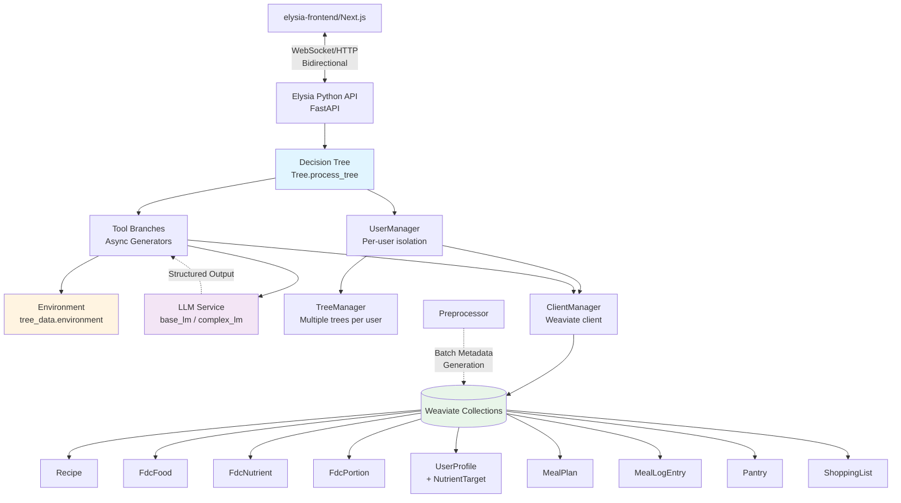
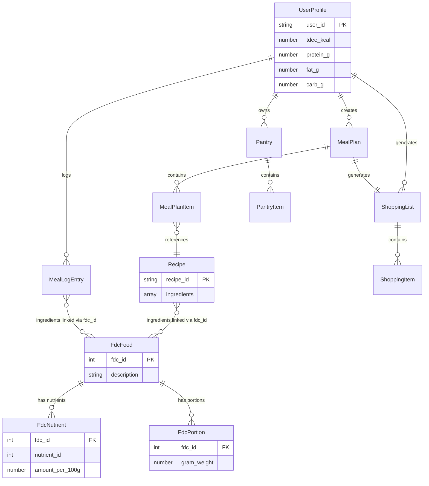
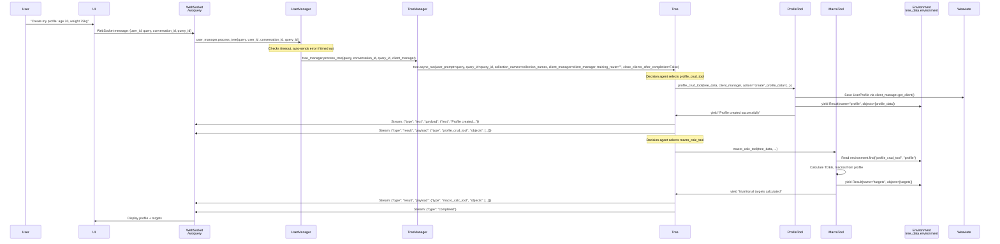
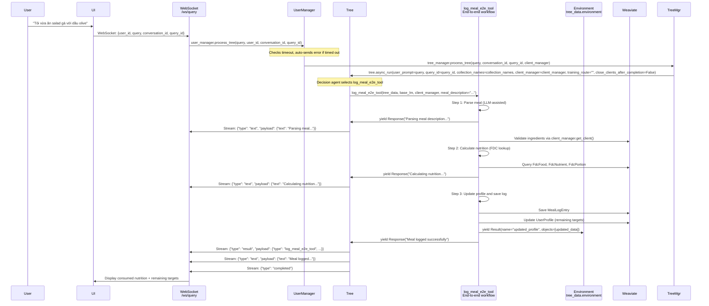

# System Design & Architecture - Meal Planning Agent

## Architecture Overview
**What is the high-level system structure?**

### System Diagram



### Component Responsibilities

- **elysia-frontend (Next.js)**: User interface for profile management, meal browsing, plan viewing, cooking mode
- **Elysia API**: FastAPI service that mounts Elysia's built-in routers (see `elysia/api/routes/`) and primarily serves `/ws/query` WebSocket endpoint for Tree execution
- **Decision Tree**: Orchestrates tool execution based on Environment state and user prompts
- **Tools (async functions/generators)**: Implement specific functionality (search, plan, validate, etc.). Tools can be simple async functions that return values, or async generators that yield Result/Text objects. See [Creating a Tool](https://weaviate.github.io/elysia/creating_tools/) for details.
- **Environment**: Shared state container (accessed via `tree_data.environment`) where all Result objects are automatically stored when yielded. Structure: `environment[tool_name][name]` where `tool_name` is the tool's function/class name and `name` is the Result's `name` parameter. Each object automatically gets a `_REF_ID` for unique identification. Tools can read via `environment.find(tool_name, name)` and manually manipulate via `.add()`, `.replace()`, `.remove()` if needed.
- **Managers** (see [User and Tree Managers](https://weaviate.github.io/elysia/API/user_and_tree_managers/)): 
  - **UserManager**: Manages multiple users, each with their own TreeManager and ClientManager. Key methods:
    - `process_tree(query, user_id, conversation_id, query_id, ...)` - Processes query for a user's conversation, automatically sends timeout error payloads if user/tree timed out
    - `check_all_users_timeout()` - Removes inactive users (configurable via `user_timeout`)
    - `check_all_trees_timeout()` - Removes inactive trees for all users (configurable via `tree_timeout`)
    - `check_restart_clients()` - Restarts Weaviate clients that exceeded `client_timeout`
  - **TreeManager**: Manages multiple decision tree instances per user (keyed by `conversation_id`). Each TreeManager is initialized with default configs (`style`, `agent_description`, `end_goal`, `branch_initialisation`, `settings`) shared across all trees for that user.
  - **ClientManager**: Manages Weaviate client connections and query execution per user
- **Preprocessor**: Runs during setup (batch process) via Elysia's official `preprocess` API to generate collection summaries, field statistics, return type mappings, and save to `ELYSIA_METADATA__` (one-time per collection) [Preprocessor]
- **Weaviate**: Vector database storing recipes, nutritional data, user profiles, plans, pantry, and shopping lists

### Tree Integration (Elysia)

**Critical Architecture Point**: All business workflows still run through the Elysia tree on `/ws/query`, but a **narrow REST surface** now exists for user onboarding:
1. `/auth/signup` + `/auth/login` (FastAPI) provision `UserAccount` documents and hydrate `UserManager`.
2. `/mealagent/profile/{user_id}` lets the frontend collect the initial `UserProfile` via REST; once the profile exists, every follow-up change flows through the tree tools (per [Creating Tools](https://weaviate.github.io/elysia/creating_tools/) and [Advanced Tool Construction](https://weaviate.github.io/elysia/Advanced/advanced_tool_construction/)).

- A dedicated MealAgent Tree is created and populated with branches matching feature areas.
- Tools are registered into branches so Elysia's decision agent (LLM) can automatically select and orchestrate execution based on natural language queries.
- **Tree Creation** (see [Tree Reference](https://weaviate.github.io/elysia/Reference/Tree/)):
  - Factory function: `build_meal_agent_tree(settings: Settings | None = None, user_id: str | None = None, conversation_id: str | None = None) -> Tree`
  - Location: `MealAgent/tree/meal_tree.py`
  - Creates Tree with `branch_initialisation="empty"` and registers all MealAgent tools
- **Alternative Registration** (when Tree already exists via Managers):
  - `get_meal_agent_tools()` - Returns dict of all MealAgent tools
  - `try_register_meal_agent_tools(tree_or_manager)` - Registers tools to existing Tree or TreeManager
  - Location: `MealAgent/tree/config.py`

Branch layout (optimized - 8 branches):
- `profile` - Profile management and macro calculation
- `planning` - Daily/weekly meal planning (merged from plan_day + plan_week)
- `search` - Recipe/food search and ranking
- `logging` - Meal logging and history
- `pantry` - Pantry and shopping list management
- `optimization` - Gap fill, substitution, micros (merged from 3 branches)
- `cooking` - Cooking mode
- `explain` - Explanations (using Elysia `cited_summarize`)

Registration rules (align with [Elysia Tree Reference](https://weaviate.github.io/elysia/Reference/Tree/)):
- **Tree Initialization**: `Tree(branch_initialisation="empty", style="...", agent_description="...", end_goal="...", user_id="...", conversation_id="...", low_memory=False, use_elysia_collections=True, settings=Settings())`
  - `branch_initialisation`: `"default"`, `"one_branch"`, `"multi_branch"`, or `"empty"` (use `"empty"` for custom setup)
- **Branch Creation**: `tree.add_branch(branch_id, instruction, description="", root=False, from_branch_id="", from_tool_ids=[], status="")`
  - `instruction`: What tools/actions are in this branch (shown to decision maker when branch is chosen)
  - `description`: How the model knows to choose this branch (required for non-root branches)
  - `root=True`: Creates root branch (beginning of tree)
  - `from_branch_id`: Parent branch ID (required for non-root branches)
  - `from_tool_ids`: Tools that precede this branch (optional)
  - `status`: Status message when branch is chosen (default: "Running {branch_id}...")
- **Tool Registration**: `tree.add_tool(tool, branch_id=None, from_tool_ids=[], root=False, **kwargs)`
  - `tool`: Tool instance (from `@tool` decorator) or Tool class
  - `branch_id`: Branch to add tool to (None = root branch)
  - `from_tool_ids`: Add tool after these tools (optional)
  - `root=True`: Add to root branch (ignores `branch_id`)
  - **kwargs**: Additional arguments for tool initialization
- **Environment Key Convention**: `environment[tool_name][result_name]` where `tool_name` is the tool's `name` attribute
- **Tool Requirements**: Tools can be simple async functions (return values) or async generators (yield values). MealAgent tools use async generators for better control. Tools can yield `Result`, `Response`, `Status`, `Error` objects, or plain strings/dictionaries (automatically converted). See [Creating a Tool](https://weaviate.github.io/elysia/creating_tools/) for details.
- **Automatic Tool Selection**: The Tree's decision agent (LLM) automatically selects which tools to run based on the user's natural language query - no explicit routing or action parameters needed

### Technology Stack

| Layer | Technology | Rationale |
|-------|-----------|-----------|
| Frontend | Next.js 14, TypeScript, Tailwind CSS, shadcn/ui | Modern React framework with SSR, strong typing, rapid UI development |
| Backend | Python 3.11+, FastAPI, Elysia framework | Async support, Elysia decision tree orchestration, strong ML ecosystem |
| Database | Weaviate 1.25+ | Vector search for semantic retrieval, hybrid search (BM25 + vector), schema enforcement |
| Data Source | USDA FoodData Central | Public domain nutritional data with comprehensive macro/micro coverage |
| Streaming | WebSockets | Real-time streaming of tool results (cooking steps, plan generation progress) |
| Auth (v1) | Session-based (user_id in memory) | Simplified MVP auth; migrate to JWT/OAuth in v2 |
| Deployment | Docker Compose (dev), K8s (prod) | Containerized services for portability and scalability |

## Data Models
**What data do we need to manage?**

### Core Collections (Weaviate Schema)

#### Recipe (CSV-aligned minimal schema + cached macros)
```python
{
    "class": "Recipe",
    "properties": [
        {"name": "food_id", "dataType": ["text"], "indexFilterable": True},
        {"name": "dish_name", "dataType": ["text"]},
        {"name": "dish_type", "dataType": ["text"], "indexFilterable": True},
        {"name": "serving_size", "dataType": ["int"]},
        {"name": "cooking_time", "dataType": ["int"], "indexFilterable": True},
        {"name": "ingredients_with_qty", "dataType": ["text[]"]},
        {"name": "ingredients", "dataType": ["text[]"]},
        {"name": "cooking_method_array", "dataType": ["text[]"]},
        {"name": "image_link", "dataType": ["text"]},
        # Cached field, computed on-demand by tool (VN→EN translation + FDC lookup)
        {"name": "macros_per_serving", "dataType": ["object"],
         "nestedProperties": [
            {"name": "kcal", "dataType": ["number"]},
            {"name": "protein_g", "dataType": ["number"]},
            {"name": "fat_g", "dataType": ["number"]},
            {"name": "carb_g", "dataType": ["number"]}
         ]
        },
        # Cached ingredient mapping to FDC for faster subsequent queries
        {"name": "ingredient_fdc_map", "dataType": ["object[]"],
         "nestedProperties": [
            {"name": "ingredient_vn", "dataType": ["text"]},
            {"name": "ingredient_en", "dataType": ["text"]},
            {"name": "fdc_id", "dataType": ["int"]},
            {"name": "quantity_g", "dataType": ["number"]},
            {"name": "confidence", "dataType": ["number"]}
         ]
        },
        # Constraint filtering fields (required for constraints_guard_tool)
        {"name": "diet_type", "dataType": ["text[]"], "indexFilterable": True,
         "description": "Diet types this recipe supports (e.g., 'vegetarian', 'vegan', 'keto', 'paleo')"},
        {"name": "allergens", "dataType": ["text[]"], "indexFilterable": True,
         "description": "Allergens present in this recipe (e.g., 'peanuts', 'dairy', 'gluten')"},
        {"name": "devices", "dataType": ["text[]"], "indexFilterable": True,
         "description": "Required cooking equipment (e.g., 'oven', 'stovetop', 'microwave', 'blender')"}
    ],
    "vectorizer": "text2vec-transformers"
}
```

Note: We intentionally keep only the CSV fields to reduce redundancy and simplify ingestion.

##### Macros-per-serving strategy (VN→EN tool-only)
- Recipes are Vietnamese; FDC is English. We do NOT precompute mappings during ETL.
- A runtime tool (`calculate_recipe_macros_tool`) translates ingredients (VN→EN), searches `FdcFood`, computes macros, and caches to `Recipe.macros_per_serving`.
- Subsequent calls read the cached value; no re-computation.
- **Caching**: `Recipe.macros_per_serving` is a cached, optional field; may be absent on first read. When absent, the tool computes and persists it automatically.

##### Ingredient-to-FDC mapping cache
- To speed up subsequent calculations and queries, each Recipe also stores `ingredient_fdc_map` (object[]):
  - `ingredient_vn` (text), `ingredient_en` (text), `fdc_id` (int), `quantity_g` (number), `confidence` (number)
- The VN→EN macro tool writes/updates this array when it resolves ingredients.
- **Caching**: `Recipe.ingredient_fdc_map` may also be populated on-demand by the same tool and persisted for subsequent requests.

#### FdcFood 
```python
{
    "class": "FdcFood",
    "properties": [
        {"name": "fdc_id", "dataType": ["int"], "indexFilterable": True},
        {"name": "description", "dataType": ["text"]},

        # Macronutrients (per 100g)
        {"name": "energy_kcal_100g", "dataType": ["number"]},
        {"name": "protein_g_100g", "dataType": ["number"]},
        {"name": "fat_g_100g", "dataType": ["number"]},
        {"name": "carbohydrate_g_100g", "dataType": ["number"]},
        {"name": "sugars_g_100g", "dataType": ["number"]},
        {"name": "fiber_g_100g", "dataType": ["number"]},
        {"name": "sodium_mg_100g", "dataType": ["number"]},
        {"name": "sat_fat_g_100g", "dataType": ["number"]},

        # Micronutrients (per 100g)
        {"name": "calcium_mg_100g", "dataType": ["number"]},
        {"name": "iron_mg_100g", "dataType": ["number"]},
        {"name": "potassium_mg_100g", "dataType": ["number"]},
        {"name": "magnesium_mg_100g", "dataType": ["number"]},
        {"name": "zinc_mg_100g", "dataType": ["number"]},
        {"name": "vitamin_a_rae_ug_100g", "dataType": ["number"]},
        {"name": "vitamin_b6_mg_100g", "dataType": ["number"]},
        {"name": "vitamin_b12_ug_100g", "dataType": ["number"]},
        {"name": "thiamin_b1_mg_100g", "dataType": ["number"]},
        {"name": "riboflavin_b2_mg_100g", "dataType": ["number"]},
        {"name": "niacin_b3_mg_100g", "dataType": ["number"]},
        {"name": "vitamin_c_mg_100g", "dataType": ["number"]},
        {"name": "vitamin_d_ug_100g", "dataType": ["number"]},
        {"name": "vitamin_e_mg_100g", "dataType": ["number"]}
    ],
    "vectorizer": "text2vec-transformers"
}
```

#### FdcNutrient (derived via ETL from source data)
```python
{
    "class": "FdcNutrient",
    "properties": [
        {"name": "fdc_id", "dataType": ["int"], "indexFilterable": True},  # Links to FdcFood
        {"name": "nutrient_id", "dataType": ["int"], "indexFilterable": True},
        {"name": "amount_100g", "dataType": ["number"]}
        # Optional enrichments during ETL: nutrient_name, unit (filled from mapping)
    ]
}
```

#### FdcPortion (derived via ETL from source data)
```python
{
    "class": "FdcPortion",
    "properties": [
        {"name": "fdc_id", "dataType": ["int"], "indexFilterable": True},  # Links to FdcFood
        {"name": "amount", "dataType": ["number"]},
        {"name": "measure_unit", "dataType": ["text"]},  # "waffle, square", "cup", "oz", etc.
        {"name": "gram_weight", "dataType": ["number"]}
    ]
}
```

#### UserProfile (includes NutrientTarget)
```python
{
    "class": "UserProfile",
    "properties": [
        # Basic Profile Info
        {"name": "user_id", "dataType": ["text"], "indexFilterable": True},
        {"name": "age", "dataType": ["int"]},
        {"name": "gender", "dataType": ["text"]},  # "male", "female", "other"
        {"name": "weight_kg", "dataType": ["number"]},
        {"name": "height_cm", "dataType": ["number"]},
        {"name": "activity_level", "dataType": ["text"]},  # "sedentary", "light", "moderate", "very_active", "extra_active"
        
        # Dietary Constraints
        {"name": "diet_type", "dataType": ["text"]},
        {"name": "allergens", "dataType": ["text[]"]},
        {"name": "preferences", "dataType": ["text[]"]},  # Liked cuisines/ingredients
        {"name": "max_cooking_time_min", "dataType": ["int"]},  # Optional constraint
        {"name": "available_equipment", "dataType": ["text[]"]},  # Optional constraint
        
        # Nutritional Targets (calculated from profile)
        {"name": "tdee_kcal", "dataType": ["number"]},  # Harris-Benedict calculated TDEE
        {"name": "protein_g", "dataType": ["number"]},  # Daily protein target
        {"name": "fat_g", "dataType": ["number"]},  # Daily fat target
        {"name": "carb_g", "dataType": ["number"]},  # Daily carb target
        {"name": "micronutrient_targets", "dataType": ["object"]},  # {"vitamin_c_mg": 90, "iron_mg": 18, ...}
        
        # Metadata
        {"name": "created_at", "dataType": ["date"]},
        {"name": "updated_at", "dataType": ["date"]},
    ]
}
```

#### UserAccount (Auth Credentials)
```python
{
    "class": "UserAccount",
    "properties": [
        {"name": "user_id", "dataType": ["text"], "indexFilterable": True},
        {"name": "email", "dataType": ["text"], "indexFilterable": True},
        {"name": "password_hash", "dataType": ["text"]},
        {"name": "created_at", "dataType": ["date"]},
        {"name": "last_login_at", "dataType": ["date"]}
    ],
    "vectorizer": "none"
}
```

Stores account-level credentials so that signup/login can happen over REST (hashed passwords with bcrypt). `user_id` links to `UserProfile`/MealAgent data.

**Note**: NutrientTarget properties are embedded directly in UserProfile for simplicity. This avoids the need for separate collection queries and maintains data locality.

#### Data Availability & Tool Ownership
- **Source CSV coverage**: Only `Recipe`, `FdcFood`, `FdcNutrient`, and `FdcPortion` are populated during ETL (ingests `recipe.csv` + `FDC_data.csv`). These collections are immutable except for cached fields (`macros_per_serving`, `ingredient_fdc_map`).
- **Runtime-owned collections**: `UserProfile`, `UserAccount`, `MealPlan`, `MealPlanItem`, `MealLogEntry`, `Pantry`, `PantryItem`, `ShoppingList`, `ShoppingItem` start empty and are **entirely created/updated/deleted by tools or REST onboarding**. This keeps the schema lean while letting tools persist state as prescribed in [Environment](https://weaviate.github.io/elysia/Advanced/environment/) and [Custom Objects](https://weaviate.github.io/elysia/Advanced/custom_objects/).
- **CRUD responsibilities**: Every tool that mutates a collection is documented below. All property names listed here are validated against the corresponding schema modules under `MealAgent/schemas/*.py`, ensuring parity between documentation and code.

### Data Relationships



### ETL Mapping Notes (FDC)

- FdcFood stores base macro/micro values per 100g as columns; no JSON payloads are persisted in FdcFood.
- FdcNutrient rows are created via ETL from the source dataset for each (fdc_id, nutrient_id, amount_100g).
- FdcPortion rows are created via ETL for each (fdc_id, amount, measure_unit, gram_weight) available in the source.
- Optional enrichment: a nutrient-id lookup table can be used during ETL to add `nutrient_name` and `unit`; schema supports these as optional properties.

### Runtime Tool: CalculateRecipeMacrosTool (VN→EN)
Purpose: On-demand calculation of `macros_per_serving` for a recipe whose ingredients are Vietnamese.

Flow:
1) Check `Recipe.macros_per_serving`. If present → return cached.
2) For each item in `ingredients_with_qty`:
   - Translate/normalize to English (LLM or local model)
   - Hybrid search on `FdcFood.description`
   - Take best match above threshold
3) Accumulate macros using per-100g fields on `FdcFood`; scale by quantity; divide by `serving_size`.
4) Write back `macros_per_serving` to the Recipe object.

Notes:
- No ETL-side Vietnamese→English mapping is maintained; translation occurs at runtime for flexibility.
- Implemented as an async tool and invoked by scoring/plan tools when macros are missing.

### Non-Functional Requirements (Design Summary)
- Hybrid search latency: < 2s for 4k corpus; < 3s for 10k+
- Daily plan generation: < 5s end-to-end
- Weekly plan generation: < 15s
- Macro aggregation for 21 meals: < 3s
- Meal logging (parse + calc + save): < 2s
- Vectorizer: `text2vec-transformers`; consistent across collections

**Cross-references:**
- Implementation patterns and route integration: `docs/ai/implementation/feature-meal-planning-agent.md`
- Elysia Preprocessor reference: [Preprocessor]

### Environment Keys Reference

**Convention**: `environment[tool_name][name]` where `tool_name` is the tool's function name and `name` is the Result's `name` parameter.

**Important Notes**:
- **Automatic Adding**: When tools `yield Result(...)`, the Tree automatically calls `environment.add(tool_name, result)`. No manual `.add()` needed.
- **Reading Data**: Use `tree_data.environment.find(tool_name, name)` to read data from environment.
- **Automatic _REF_ID**: Each object in environment automatically gets a unique `_REF_ID` attribute.
- **Hidden Environment**: Use `tree_data.environment.hidden_environment` (dict) for storing data not shown to LLM.

**Environment Keys by Tool** (Optimized Tool List):

| Tool | Reads | Writes |
|------|-------|--------|
| profile_crud_tool | - | profile |
| macro_calc_tool | profile | targets |
| constraints_guard_tool | profile | filters |
| search_and_rank_tool | filters, targets | topk |
| calculate_recipe_macros_tool | Recipe by id | macros (and updates Recipe.macros_per_serving, ingredient_fdc_map) |
| plan_day_e2e_tool | topk, targets, filters | plan |
| plan_week_e2e_tool | topk, targets, filters | plan |
| log_meal_e2e_tool | meal_description | updated_profile |
| meal_history_tool | user_id | history |
| pantry_crud_tool | - | state |
| pantry_diff_tool | plan_day_e2e_tool.plan (shopping list items extracted from plan), pantry_crud_tool.state | diff |
| cook_mode_tool | recipe_id (or from plan/search results) | steps |
| gap_fill_tool | plan/weekly_plan, targets | updated_plan, deficits |
| substitute_tool | plan or recipe | updated_plan, substitutes |
| micros_tool | plan/weekly_plan | totals, suggestions |

**Elysia Built-in Tools**:
- `query` - Writes to environment based on collection type (e.g., `query.results` for Recipe)
- `query_postprocessing` - Reads from `query.results`, writes processed results
- `cited_summarize` - Reads from entire environment, writes summary with citations

**Notes**:
- **Automatic Storage**: Tools write to environment by yielding `Result(name="key", objects=[...], ...)`. The Tree automatically stores it at `environment[tool_name]["key"]`.
- **Reading**: Tools read from environment using `tree_data.environment.find(tool_name, name)` which returns a list of `{metadata: {...}, objects: [...]}` or `None` if not found.
- **Payload Size**: Tools should keep payloads small; store identifiers or summaries when possible.
- **Caching**: The VN→EN macros tool persists `macros_per_serving` and `ingredient_fdc_map` on `Recipe` for caching.
- **Tool Names**: Tool names match function names (e.g., `profile_crud_tool` function → `environment["profile_crud_tool"]`).

**Key Relationships:**
- **UserProfile → MealPlan**: One user can create multiple meal plans (one-to-many)
- **MealPlan → MealPlanItem**: One plan contains multiple meal items (one-to-many)
- **MealPlanItem → Recipe**: Each meal item references one recipe (many-to-one)
- **Recipe → FdcFood**: Recipe ingredients link to FDC foods via `ingredients[].fdc_id` (many-to-many)
- **FdcFood → FdcNutrient**: One food has multiple nutrients (one-to-many, linked by `fdc_id`)
- **FdcFood → FdcPortion**: One food has multiple portion options (one-to-many, linked by `fdc_id`)
- **UserProfile → MealLogEntry**: User logs multiple meals (one-to-many)
- **MealLogEntry → FdcFood**: Logged meals link ingredients to FDC foods (many-to-many via `ingredients[].fdc_id`)

#### MealPlan / MealPlanItem
```python
{
    "class": "MealPlan",
    "properties": [
        {"name": "plan_id", "dataType": ["text"], "indexFilterable": True},
        {"name": "user_id", "dataType": ["text"], "indexFilterable": True},
        {"name": "plan_type", "dataType": ["text"]},  # "day", "week"
        {"name": "start_date", "dataType": ["date"]},
        {"name": "created_at", "dataType": ["date"]},
    ]
}

{
    "class": "MealPlanItem",
    "properties": [
        {"name": "plan_id", "dataType": ["text"], "indexFilterable": True},
        {"name": "day_index", "dataType": ["int"]},  # 0-6 for weekly
        {"name": "meal_type", "dataType": ["text"]},  # "breakfast", "lunch", "dinner", "snack"
        {"name": "recipe_id", "dataType": ["text"]},
        {"name": "servings", "dataType": ["number"]},  # Portion multiplier
        {"name": "actual_macros", "dataType": ["object"]},  # Calculated for this portion
    ]
}
```

#### Pantry / PantryItem
```python
{
    "class": "Pantry",
    "properties": [
        {"name": "user_id", "dataType": ["text"], "indexFilterable": True},
        {"name": "updated_at", "dataType": ["date"]},
    ]
}

{
    "class": "PantryItem",
    "properties": [
        {"name": "user_id", "dataType": ["text"], "indexFilterable": True},
        {"name": "ingredient_name", "dataType": ["text"]},
        {"name": "quantity", "dataType": ["number"]},
        {"name": "unit", "dataType": ["text"]},
        {"name": "fdc_id", "dataType": ["int"]},  # Optional link to FdcFood
        {"name": "expiry_date", "dataType": ["date"]},  # Optional
    ]
}
```

#### ShoppingList / ShoppingItem
```python
{
    "class": "ShoppingList",
    "properties": [
        {"name": "list_id", "dataType": ["text"], "indexFilterable": True},
        {"name": "user_id", "dataType": ["text"], "indexFilterable": True},
        {"name": "plan_id", "dataType": ["text"]},  # Links to MealPlan
        {"name": "created_at", "dataType": ["date"]},
    ]
}

{
    "class": "ShoppingItem",
    "properties": [
        {"name": "list_id", "dataType": ["text"], "indexFilterable": True},
        {"name": "ingredient_name", "dataType": ["text"]},
        {"name": "quantity", "dataType": ["number"]},
        {"name": "unit", "dataType": ["text"]},
        {"name": "category", "dataType": ["text"]},  # "produce", "dairy", "meat", etc. for grouping
        {"name": "purchased", "dataType": ["boolean"]},
    ]
}
```

#### MealLogEntry (NEW - For Meal Logging Feature)
```python
{
    "class": "MealLogEntry",
    "properties": [
        {"name": "log_id", "dataType": ["text"], "indexFilterable": True},
        {"name": "user_id", "dataType": ["text"], "indexFilterable": True},
        {"name": "logged_at", "dataType": ["date"]},
        {"name": "meal_description", "dataType": ["text"]},  # Original user input (e.g., "I ate chicken salad")
        {"name": "parsed_dish", "dataType": ["text"]},  # LLM-parsed dish name
        {"name": "ingredients", "dataType": ["text"]},  # JSON string: [{"name": str, "amount": float, "unit": str, "fdc_id": int?}]
        {"name": "portion_size", "dataType": ["number"]},  # Portion multiplier
        {"name": "calculated_macros", "dataType": ["text"]},  # JSON string: {"kcal": float, "protein_g": float, "fat_g": float, "carb_g": float}
        {"name": "calculated_micros", "dataType": ["text"]},  # JSON string: micronutrients if available
        {"name": "validation_status", "dataType": ["text"]},  # "complete", "partial", "failed"
        {"name": "parsing_method", "dataType": ["text"]},  # "llm", "manual_fallback"
    ]
}
```

Note: `ingredients`, `calculated_macros`, and `calculated_micros` are stored as TEXT (JSON strings) in Weaviate. Tools must serialize/deserialize these fields when reading/writing.

### Collection Usage & Tool Integration
**Làm rõ mỗi collection được dùng như thế nào và tool nào tương tác với chúng**

| Collection | Primary Purpose In System | Key Tools / Services | Notes |
|------------|--------------------------|-----------------------|-------|
| `Recipe` | Source of dish metadata, cached macros, ingredient → FDC mappings used for planning, search, cooking | `search_and_rank_tool`, `plan_day_e2e_tool`, `plan_week_e2e_tool`, `calculate_recipe_macros_tool`, `cook_mode_tool`, `substitute_tool`, `micros_tool` | Planning tools ensure every recipe in a plan has `macros_per_serving`; when missing they invoke `calculate_recipe_macros_tool` which updates the same recipe record. Cooking and substitution tools read `ingredients_with_qty`, `cooking_method_array`, and cached macros for rendering step-by-step instructions or validating swaps. |
| `FdcFood` | Canonical macro/micro values per ingredient (per 100g) | `calculate_recipe_macros_tool`, `log_meal_e2e_tool`, `micros_tool`, `gap_fill_tool` | `calculate_recipe_macros_tool` and meal logging read `energy_kcal_100g`, macro/micro columns to compute totals. Optimization tools query FdcFood to recommend deficit-filling ingredients with factual nutrient profiles. |
| `FdcNutrient` | Fine-grained nutrient entries keyed by `(fdc_id, nutrient_id)` | `log_meal_e2e_tool`, `micros_tool`, `gap_fill_tool` | Used when micronutrient-level accuracy is required (e.g., vitamin C deficit). Tools deserialize the rows into structured micronutrient objects before writing back to the environment. |
| `FdcPortion` | Portion → gram conversions to translate user-friendly units into gram weights | `calculate_recipe_macros_tool`, `log_meal_e2e_tool`, `plan_day_e2e_tool` | Whenever a user says “1 cup spinach” or a recipe ingredient specifies household measures, tools query this collection to normalize into grams before combining with FdcFood nutrient densities. |
| `UserProfile` | Single source of truth for demographics, constraints, macro targets, preferences, remaining nutrients | `profile_crud_tool`, `macro_calc_tool`, `plan_day_e2e_tool`, `plan_week_e2e_tool`, `log_meal_e2e_tool`, `constraints_guard_tool`, `gap_fill_tool` | Profile CRUD populates/updates records. Macro calc writes derived targets back to the same object. Planning/logging tools read constraints and write remaining target deltas (`updated_profile`). All queries filter by `user_id` to ensure isolation. |
| `MealPlan` / `MealPlanItem` | Persisted plans and meal slots per day/week | `plan_day_e2e_tool`, `plan_week_e2e_tool`, `gap_fill_tool`, `substitute_tool`, `micros_tool`, `pantry_diff_tool` | Daily/weekly tools optionally insert finalized plans. Optimization tools read plan items to apply substitutions or compute deficits. `pantry_diff_tool` references plan items to determine aggregate ingredient demand before subtracting pantry inventory. |
| `MealLogEntry` | Audit trail of consumed meals with parsed ingredients and computed nutrition | `log_meal_e2e_tool`, `meal_history_tool`, `gap_fill_tool` | Meal logging inserts one record per entry (with serialized `ingredients` / `calculated_macros`). Meal history queries this collection for UI display. Gap fill reads accumulated consumption to understand remaining targets. |
| `Pantry` / `PantryItem` | Track user inventory for pantry-aware planning/shopping | `pantry_crud_tool`, `pantry_diff_tool`, `plan_day_e2e_tool`, `plan_week_e2e_tool` | Pantry CRUD manages inventory. Planning tools optionally consult pantry to prioritize recipes that leverage existing items. `pantry_diff_tool` compares plan demand vs pantry quantities to emit a precise shopping list. |
| `ShoppingList` / `ShoppingItem` | Persist generated shopping lists (per plan) | `pantry_diff_tool`, `plan_day_e2e_tool`, `plan_week_e2e_tool` | Plans create new shopping lists tied to `plan_id`. Pantry diff writes the list items with `category`, `quantity`, `unit`, and `purchased` flags so the frontend ShoppingListDisplay can render them. |

### Tool Catalogue (Reads/Writes & Environment Contracts)
All MealAgent tools follow the async-generator pattern described in [Creating Tools](https://weaviate.github.io/elysia/creating_tools/) and return the payload types listed in [Payload Formats](https://weaviate.github.io/elysia/API/payload_formats/). The table below documents exactly how each tool interacts with both the Environment and Weaviate, ensuring the implementation matches the schemas under `MealAgent/schemas/`.

| Tool | Purpose & Flow | Collections (Read → Write) | Environment Keys |
|------|----------------|----------------------------|------------------|
| `profile_crud_tool` | REST onboarding calls this tool after initial profile creation so the tree has the same record. Validates payloads, upserts `UserProfile`, and streams status/results. | `UserProfile`: read (for `action="read"`) / upsert | Writes `profile_crud_tool.profile` |
| `macro_calc_tool` | Implements Harris-Benedict logic entirely in code: fetches profile object from env, derives TDEE/macro split, persists the numbers back to the same `UserProfile` document, and stores them for downstream tools. | `UserProfile`: read → update (tdee_kcal, protein_g, fat_g, carb_g, micronutrient_targets) | Writes `macro_calc_tool.targets` |
| `constraints_guard_tool` | Merges diet/allergen/time/device filters from profile defaults + ad-hoc parameters into a single Weaviate where-clause. | Reads `UserProfile` (via env) only; no database writes. | Writes `constraints_guard_tool.filters` containing the JSON filter |
| `search_and_rank_tool` | Calls Elysia’s `query` tool against `Recipe`, enriches results (macro gap score, preference match), and yields ranked candidates. When macros are missing it invokes `calculate_recipe_macros_tool` before final scoring. | `Recipe`: read; may indirectly trigger updates through `calculate_recipe_macros_tool`. | Writes `search_and_rank_tool.topk` (list of recipe refs + scores) |
| `calculate_recipe_macros_tool` | VN→EN translation + FDC lookup. Reads `Recipe.ingredients_with_qty`, queries `FdcFood`, `FdcNutrient`, `FdcPortion`, computes macros, then updates the source `Recipe` (`macros_per_serving` + `ingredient_fdc_map`). | `Recipe`: read→update; `FdcFood`/`FdcNutrient`/`FdcPortion`: read-only | Writes `calculate_recipe_macros_tool.macros` |
| `plan_day_e2e_tool` | End-to-end planner: pulls profile targets, consumes ranked recipes, enforces constraints, assembles 3–5 meals, persists `MealPlan` + `MealPlanItem`, optionally kicks off `pantry_diff_tool`. | Reads `Recipe`, `UserProfile`; writes `MealPlan`, `MealPlanItem`, optionally `ShoppingList`/`ShoppingItem`. | Writes `plan_day_e2e_tool.plan` and `plan_day_e2e_tool.shopping` |
| `plan_week_e2e_tool` | Weekly variant with variety scoring. Same data paths as day planner but loops through 7 days × 3 meals. | Same as `plan_day_e2e_tool`. | Writes `plan_week_e2e_tool.plan` |
| `log_meal_e2e_tool` | Parses natural language via LLM, normalizes ingredients to FDC, calculates macros, inserts a `MealLogEntry`, and patches `UserProfile` nutrient deltas so future plans reflect remaining targets. | Reads `Fdc*`, `UserProfile`; writes `MealLogEntry`, updates `UserProfile`. | Writes `log_meal_e2e_tool.updated_profile` + `log_meal_e2e_tool.entry` |
| `meal_history_tool` | Lightweight query for past `MealLogEntry` objects (paged). | `MealLogEntry`: read-only. | Writes `meal_history_tool.history` |
| `pantry_crud_tool` | Provides CRUD over `Pantry` and `PantryItem`. Planning tools rely on this state to bias toward on-hand ingredients. | `Pantry`/`PantryItem`: read/write. | Writes `pantry_crud_tool.state` |
| `pantry_diff_tool` | Aggregates ingredient demands from an approved plan, subtracts pantry holdings, and writes `ShoppingList` + `ShoppingItem`. | Reads `MealPlanItem`, `PantryItem`; writes `ShoppingList`, `ShoppingItem`. | Writes `pantry_diff_tool.diff` |
| `cook_mode_tool` | Turns a recipe (or plan slot) into step-by-step instructions streamed to UI, including timers/equipment callouts. | `Recipe`: read-only. | Writes `cook_mode_tool.steps` |
| `gap_fill_tool` | Computes macro/micro deficits after logging, proposes snacks, and (if accepted) patches `MealPlanItem` plus user remaining targets. | Reads `MealPlanItem`, `UserProfile`, `FdcFood`; writes updated `MealPlanItem` and optional snack entries. | Writes `gap_fill_tool.deficits` / `gap_fill_tool.updated_plan` |
| `substitute_tool` | Suggests swaps for recipes or plan items (e.g., allergen avoidance). Reads plan and recipe metadata, searches Recipe/FdcFood for suitable replacements, updates `MealPlanItem` if approved. | Reads `MealPlanItem`, `Recipe`, `FdcFood`; writes `MealPlanItem`. | Writes `substitute_tool.suggestions` / `substitute_tool.updated_plan` |
| `micros_tool` | Aggregates micronutrients across plan/log history and highlights shortfalls with suggested foods. | Reads `MealPlanItem`, `MealLogEntry`, `FdcFood`/`FdcNutrient`; optional writes to `MealPlanItem` when auto-adding boosters. | Writes `micros_tool.summary` |
| Built-in `query`, `cited_summarize` | Directly from Elysia’s library; used for hybrid retrieval and explanation displays per [Payload Types](https://weaviate.github.io/elysia/Reference/PayloadTypes/). | `Recipe` (read), environment (read). | `query.results`, `cited_summarize.summary` |

> **Note:** REST endpoints (`/auth/*`, `/mealagent/profile/*`) only act as onboarding shims. After a profile exists, all flows above are exercised exclusively through `/ws/query`, preserving observability via Environment snapshots ([Advanced Environment](https://weaviate.github.io/elysia/Advanced/environment/)).
**How the collections and tools combine**
- **Planning workflow**: `plan_day_e2e_tool` pulls `UserProfile` + `macro_calc_tool.targets` → queries `Recipe` (enriching via `calculate_recipe_macros_tool` as needed) → writes structured plan to `MealPlan`/`MealPlanItem`, then optionally calls `pantry_diff_tool` which reads `PantryItem` and writes `ShoppingList/ShoppingItem`.
- **Meal logging workflow**: `log_meal_e2e_tool` parses the meal (LLM) → resolves each ingredient against `FdcFood`, `FdcNutrient`, `FdcPortion` → inserts the entry into `MealLogEntry` and updates `UserProfile` remaining targets. Subsequent `gap_fill_tool` or `plan_*` tools read these updated targets to adapt recommendations.
- **Optimization workflow**: `gap_fill_tool`, `substitute_tool`, and `micros_tool` treat `MealPlanItem` objects plus nutrient sources (`Recipe`, `Fdc*`) as inputs to suggest snacks, substitutions, or micronutrient boosters, then persist adjustments back to `MealPlanItem` (or environment) so future tool runs (e.g., `cited_summarize`) have the latest state.

### Data Flow



### Meal Logging Data Flow (Optimized)



## API Design
**How do components communicate?**

### Elysia WebSocket-Based Communication

Operational workflows (search → plan → log → optimize) still run entirely through the Elysia tree on `/ws/query`, keeping execution observable through Environment snapshots and payload logs.

#### Standard Elysia WebSocket Endpoints

```
WS     /ws/query        # Main Tree execution stream (all MealAgent queries)
```

**Key Architecture Points:**
- **Natural language interface**: Users send queries like "Create a meal plan for today" or "Log that I ate chicken salad".
- **Tree orchestration**: The Elysia decision tree automatically selects and executes the appropriate tools based on the query ([Tree Reference](https://weaviate.github.io/elysia/Reference/Tree/)).
- **Streaming responses**: All tool outputs (Text, Result, Error) are streamed back via WebSocket per [Payload Formats](https://weaviate.github.io/elysia/API/payload_formats/).
- **Managers & clients**: `/ws/query` delegates to `UserManager.process_tree`, which instantiates/loads `TreeManager` + `ClientManager` per user as described in [User & Tree Managers](https://weaviate.github.io/elysia/API/user_and_tree_managers/).

#### WebSocket Message Format (Elysia Standard)

### REST Endpoints (Auth + Profile Onboarding)

While all operational MealAgent tools still run through `/ws/query`, two REST entry points were added:

- `POST /auth/signup`, `POST /auth/login`: Create/login accounts backed by `UserAccount` and hydrate `UserManager`.
- `GET/POST /mealagent/profile/{user_id}`: Initial profile onboarding over HTTP; subsequent edits at runtime still happen through the WebSocket tools (`profile_crud_tool`).

Frontend uses these routes for first-time signup/log-in and for the required profile setup page, after which all planning/logging flows reuse the existing WebSocket orchestration.

**Client → Server:**
```json
{
  "user_id": "user_123",
  "conversation_id": "conv_abc",           // Required: identifies which tree/conversation
  "query_id": "query_xyz",                 // Required: unique ID for this query
  "query": "Create a healthy meal plan for today with vegetarian options",
  "collection_names": ["Recipe", "FdcFood", "UserProfile"],  // Optional: hint which collections to use
  "training_route": "",                    // Optional: training route (e.g., "tool1/tool2/tool1")
  "mimick": false                          // Optional: mimick model flag
}
```

**Note**: The WebSocket route handler calls `user_manager.process_tree(query, user_id, conversation_id, query_id, training_route, collection_names, ...)` which automatically handles timeout checks and error payloads.

**Server → Client (streaming):**

According to [Elysia Payload Formats](https://weaviate.github.io/elysia/API/payload_formats/), when a `Result` object is yielded from a tool:
1. Objects and metadata are **automatically added** to Environment via `environment.add(tool_name, result)`
2. The `.to_frontend()` method is **automatically called** to convert to frontend format and streamed via WebSocket

All payloads have the same outer structure:
```json
{
  "type": str,           // "result", "text", "error", "status", "completed", "title", "ner"
  "id": str,            // Unique UUID for this payload
  "user_id": str,       // User identifier
  "conversation_id": str, // Conversation identifier
  "query_id": str,      // Query identifier
  "payload": dict       // Payload-specific content (see below)
}
```

The `payload` dictionary always contains:
```json
{
  "type": str,          // Payload type (e.g., "query", "generic", etc.)
  "metadata": dict,     // Tool-specific metadata
  "objects": list[dict] // List of objects (each includes _REF_ID)
}
```

Elysia streams multiple payload types during tree execution:

1. **NER (Named Entity Recognition)** - Sent immediately:
```json
{
  "type": "ner",
  "id": "uuid",
  "user_id": "user_123",
  "conversation_id": "conv_abc",
  "query_id": "query_xyz",
  "payload": {
    "entities": [...]
  }
}
```

2. **Text Responses** - From tools yielding `Response()` or `Text()` objects:
```json
{
  "type": "text",
  "id": "uuid",
  "user_id": "user_123",
  "conversation_id": "conv_abc",
  "query_id": "query_xyz",
  "payload": {
    "type": "response",  // or "text" depending on object type
    "text": "Searching for vegetarian recipes...",
    "metadata": {},
    "objects": [{"text": "Searching for vegetarian recipes..."}]
  }
}
```

**Note**: `Response()` and `Text()` objects do NOT add to Environment (unlike `Result`), but they still stream to frontend via `.to_frontend()`.

3. **Result Objects** - From tools yielding `Result()`:
```json
{
  "type": "result",
  "id": "uuid",
  "user_id": "user_123",
  "conversation_id": "conv_abc",
  "query_id": "query_xyz",
  "payload": {
    "type": "query",                       // Tool name
    "metadata": {
      "collection_name": "Recipe",
      "query_search_term": "vegetarian"
    },
    "objects": [
      {
      "recipe_id": "recipe_001",
        "dish_name": "Vegetarian Pasta",
        "macros_per_serving": {"kcal": 450, "protein_g": 15, ...},
        "_REF_ID": "ref_123"               // Unique reference ID for environment
      }
    ]
  }
}
```

4. **Error Objects** - From tools yielding `Error()` or timeout errors:
```json
{
  "type": "error",  // or "self_healing_error", "tree_timeout_error", "user_timeout_error"
  "id": "uuid",
  "user_id": "user_123",
  "conversation_id": "conv_abc",
  "query_id": "query_xyz",
  "payload": {
    "type": "update",
    "text": "Profile not found for user user_123",
    "metadata": {},
    "feedback": "Profile not found for user user_123",  // For Error objects
    "error_message": ""  // Optional error message
  }
}
```

**Note**: `Error()` objects (subclass of `Update`) do NOT add to Environment, but they are saved in TreeData for retry logic and streamed to frontend. UserManager automatically sends timeout error payloads if user/tree has timed out.

5. **Status Updates** - From tools yielding `Status()`:
```json
{
  "type": "status",
  "id": "uuid",
  "user_id": "user_123",
  "conversation_id": "conv_abc",
  "query_id": "query_xyz",
  "payload": {
    "type": "update",
    "text": "Processing...",
    "metadata": {}
  }
}
```

**Note**: `Status()` objects (subclass of `Update`) do NOT add to Environment, but stream to frontend for progress updates.

6. **Completed** - When tree execution finishes:
```json
{
  "type": "completed",
  "id": "uuid",
  "user_id": "user_123",
  "conversation_id": "conv_abc",
  "query_id": "query_xyz",
  "payload": {}
}
```

7. **Title** - Conversation title (sent after first query completes):
```json
{
  "type": "title",
  "id": "uuid",
  "user_id": "user_123",
  "conversation_id": "conv_abc",
  "query_id": "query_xyz",
  "payload": {
    "title": "Meal Planning Session",
    "error": ""
  }
}
```

#### How MealAgent Features Map to Tree Tools

All MealAgent functionality is implemented as tools registered to branches in the MealAgent Tree:

| User Query Example | Tree Branch | Tools Executed | Environment Keys |
|-------------------|-------------|----------------|------------------|
| "Create my profile: age 30, weight 75kg" | `profile` | `profile_crud_tool` → `macro_calc_tool` | `profile_crud_tool.profile`, `macro_calc_tool.targets` |
| "Find vegetarian pasta recipes" | `search` | `search_and_rank_tool` (uses Elysia `query` internally) | `search_and_rank_tool.topk` |
| "Plan my meals for today" | `planning` | `plan_day_e2e_tool` (handles all steps internally) | `plan_day_e2e_tool.plan` |
| "I ate chicken salad with olive oil" | `logging` | `log_meal_e2e_tool` (handles parsing → calc → update internally) | `log_meal_e2e_tool.updated_profile` |
| "Show me how to cook recipe_001" | `cooking` | `cook_mode_tool` | `cook_mode_tool.steps` |
| "Why did you choose these recipes?" | `explain` | `cited_summarize` (Elysia built-in) | (summarizes from environment) |

**Important**: The Tree's decision agent (LLM) automatically selects which tools to run based on the user's natural language query. There is no need for explicit action parameters or endpoint routing.

### Internal Interfaces (Tool Contracts)

MealAgent tools follow Elysia's async generator pattern. Tools use the `@tool` decorator pattern (recommended) or can inherit from `Tool` class.

**Key Points:**
- **Automatic Injection**: `tree_data`, `client_manager`, `base_lm`, `complex_lm` are automatically provided by Elysia
- **Environment Access**: Use `tree_data.environment.find(tool_name, name)` to read data
- **Automatic Result Adding**: When you `yield Result(...)`, the Tree automatically:
  1. Calls `environment.add(tool_name, result)` to store in Environment
  2. Calls `result.to_frontend(user_id, conversation_id, query_id)` to convert to frontend format
  3. Streams the frontend payload via WebSocket
- **Result Structure** (see [Objects Reference](https://weaviate.github.io/elysia/Reference/Objects/)): 
```python
  Result(
      objects=[...],              # Required: list of dict objects
      metadata={...},             # Optional: metadata dict
      payload_type="generic",     # Optional: identifier for result type (default: "default")
      name="key",                 # Optional: name for environment indexing (default: "default")
      mapping=None,                # Optional: frontend key mapping dict
      llm_message=None,           # Optional: message template for LLM with placeholders
      unmapped_keys=["_REF_ID"],  # Optional: keys not mapped to frontend
      display=True                 # Optional: whether to display on frontend
  )
  ```
  Creates `environment[tool_name]["key"]` when yielded.
- **Response Objects** (subclass of `Text`): 
  ```python
  Response(text="message", metadata={}, display=True)
  ```
  Does NOT add to Environment, but streams to frontend via `.to_frontend()`.
- **Text Objects**: 
  ```python
  Text(payload_type="text", objects=[{"text": "..."}], metadata={}, display=True)
  ```
  Does NOT add to Environment, but streams to frontend.
- **Error Objects** (subclass of `Update`, see [Objects Reference](https://weaviate.github.io/elysia/Reference/Objects/)): 
  ```python
  Error(feedback="error message", error_message="")
  ```
  Does NOT add to Environment, but:
  - Saved in TreeData for retry logic (automatically shown to decision agent)
  - Streamed to frontend as `"self_healing_error"` type
  - When same tool called again, saved Error is automatically loaded
- **Status Objects** (subclass of `Update`): 
  ```python
  Status(status_message="Processing...")
  ```
  Does NOT add to Environment, but streams to frontend for progress updates.
- **Update Objects** (base class): 
  ```python
  Update(frontend_type="status", object={"text": "..."})
  ```
  Base class for non-displayed frontend updates (warnings, errors, status).

**Environment Key Convention:**
- Use `tool_name` = function/class name (e.g., "profile_crud_tool")
- Use descriptive `name` parameter in `Result()` (e.g., "profile", "targets", "results", "plan")
- Structure: `environment[tool_name][name]` = list of `{objects: [...], metadata: {...}}`
- When using `@tool` decorator, the tool_name is automatically set to the function name
- Each object in the environment automatically gets a `_REF_ID` attribute for unique identification

**Environment Methods (Advanced Use Cases):**
- **Reading**: `environment.find(tool_name, name, index=None)` - Returns list of results or specific index
- **Manual Adding**: `environment.add(tool_name, result)` or `environment.add_objects(tool_name, name, objects, metadata)` - For manually adding data (usually not needed since yielding Result auto-adds)
- **Replacing**: `environment.replace(tool_name, name, objects, metadata, index=None)` - Replace existing data
- **Removing**: `environment.remove(tool_name, name, index=None)` - Remove data from environment
- **Hidden Environment**: `tree_data.environment.hidden_environment` - Dictionary for storing data not shown to LLM (e.g., temporary processing state)

### UserManager and TreeManager Configuration

**UserManager Initialization** (see [User and Tree Managers](https://weaviate.github.io/elysia/API/user_and_tree_managers/)):
```python
from elysia.api.services.user import UserManager

user_manager = UserManager(
    user_timeout=datetime.timedelta(minutes=20),  # Default: 20 minutes or USER_TIMEOUT env var
    # tree_timeout and client_timeout are passed to TreeManager/ClientManager per user
)
```

**TreeManager Configuration** (per user, see [Managers Reference](https://weaviate.github.io/elysia/Reference/Managers/)):
- **Initialization**: `TreeManager(user_id, config=Config(), tree_timeout=timedelta(minutes=10))`
  - `user_id`: Required unique identifier for user
  - `config`: Config object with default settings (`style`, `agent_description`, `end_goal`, `branch_initialisation`, `settings`)
  - `tree_timeout`: Default 10 minutes (or `TREE_TIMEOUT` env var)
- **Default Configs**: Shared across all trees for a user via `Config` object
- **Adding Trees**: `tree_manager.add_tree(conversation_id, low_memory=False)`
  - Creates Tree with default configs from TreeManager
  - Each conversation (tree) can have unique configs via `tree.configure(**kwargs)` after creation
- **Config Updates**: `tree_manager.update_config(conversation_id=None, style=..., agent_description=..., end_goal=..., branch_initialisation=..., settings=...)`
  - Updates default configs (if `conversation_id=None`) or specific tree configs

**ClientManager Configuration** (see [Client Reference](https://weaviate.github.io/elysia/Reference/Client/)):
- **Initialization**: `ClientManager(wcd_url=None, wcd_api_key=None, weaviate_is_local=None, weaviate_is_custom=None, client_timeout=timedelta(minutes=3), query_timeout=60, insert_timeout=120, init_timeout=5, **kwargs)`
  - `wcd_url`, `wcd_api_key`: Weaviate Cloud Database connection
  - `weaviate_is_local`: Use local Weaviate (defaults to `localhost:8080`)
  - `weaviate_is_custom`: Use custom connection parameters
  - `client_timeout`: Default 3 minutes (or `CLIENT_TIMEOUT` env var)
  - `query_timeout`: Weaviate query timeout (default: 60 seconds, Weaviate default: 30 seconds)
  - `insert_timeout`: Weaviate insert timeout (default: 120 seconds, Weaviate default: 90 seconds)
  - `init_timeout`: Weaviate initialization timeout (default: 5 seconds, Weaviate default: 2 seconds)
  - `**kwargs`: API keys for third-party services (e.g., `OPENAI_APIKEY="..."`)
- **Client Methods**: `get_client()`, `get_async_client()`, `start_clients()`, `restart_client()`, `restart_async_client()`
- **Thread Safety**: ClientManager uses threading and asyncio locks for concurrent access

**Timeout Management**:
- **User Timeout**: Users inactive for `user_timeout` are removed (call `check_all_users_timeout()`)
- **Tree Timeout**: Trees inactive for `tree_timeout` are removed (call `check_all_trees_timeout()`)
- **Client Timeout**: Weaviate clients inactive for `client_timeout` are restarted (call `check_restart_clients()`)
- **Automatic Error Payloads**: `UserManager.process_tree()` automatically sends timeout error payloads if user/tree has timed out

**Example FastAPI Integration**:
```python
from fastapi import FastAPI
from apscheduler.schedulers.asyncio import AsyncIOScheduler
from contextlib import asynccontextmanager

@asynccontextmanager
async def lifespan(app: FastAPI):
    user_manager = get_user_manager()  # Global UserManager instance
    
    scheduler = AsyncIOScheduler()
    scheduler.add_job(user_manager.check_all_trees_timeout, "interval", seconds=23)
    scheduler.add_job(user_manager.check_all_users_timeout, "interval", seconds=29)
    scheduler.add_job(user_manager.check_restart_clients, "interval", seconds=31)
    scheduler.start()
    
    yield
    scheduler.shutdown()
    await user_manager.close_all_clients()

app = FastAPI(lifespan=lifespan)
```

### Authentication/Authorization (v1 Simplified)

- **Session-based**: User logs in → receives session token → token stored in cookie
- **user_id** passed to all endpoints and used for data isolation in UserManager
- **No role-based access control** in v1 (all users have same permissions)
- **Future (v2)**: Migrate to JWT with OAuth2 providers (Google, Apple, etc.)

## Component Breakdown
**What are the major building blocks?**

### Frontend Components (elysia-frontend)

**Note**: Elysia frontend already provides a generic chat interface (`ChatPage`) that handles all interactions through natural language queries via WebSocket `/ws/query`. MealAgent will work through this existing interface. Custom display components are needed for MealAgent-specific data types.

**Existing Elysia Frontend Pages** (reused for MealAgent):
- **ChatPage**: Main chat interface for natural language queries (handles all MealAgent interactions)
- **CollectionPage**: Collection management UI (for enabling/disabling MealAgent collections)
- **SettingsPage**: Configuration UI (for Elysia settings)
- **DisplayPage**: Generic display components for various result types

**Custom MealAgent Display Components** (to be created):
1. **MealPlanDisplay**: Display daily/weekly meal plans with macro breakdown per meal/day/week
2. **RecipeCard**: Recipe card component showing dish name, macros, allergens, cooking time, image
3. **NutritionSummary**: Macro/micro nutrition summary with charts (bar charts for macros, tables for micros)
4. **ShoppingListDisplay**: Shopping list with category grouping and print/export functionality
5. **CookingStepsDisplay**: Step-by-step cooking instructions with timer and progress tracking
6. **MealHistoryDisplay**: Display logged meals with nutrition breakdown and daily progress tracking

**Integration Points**:
- All MealAgent features accessible through natural language queries in `ChatPage`
- Custom display components integrate with existing `RenderChat` component
- WebSocket communication handled by existing `SocketContext` (connects to `/ws/query`)
- Result payloads must match Elysia payload format spec (see [Payload Formats](https://weaviate.github.io/elysia/API/payload_formats/))

### Backend Services (Elysia Python)

#### Tool Organization (MealAgent/tools/) - Optimized

**MealAgent Tools (15 tools):**

**Core Tools (12 tools):**
1. `profile_crud_tool` - Profile CRUD operations
2. `macro_calc_tool` - TDEE and macro target calculation
3. `constraints_guard_tool` - Generate constraint filters (used by planning/search)
4. `search_and_rank_tool` - Search + rank (uses Elysia `query` internally)
5. `calculate_recipe_macros_tool` - VN→EN macro calculation
6. `plan_day_e2e_tool` - End-to-end daily planning
7. `plan_week_e2e_tool` - End-to-end weekly planning (includes variety guard)
8. `log_meal_e2e_tool` - End-to-end meal logging
9. `meal_history_tool` - View meal history
10. `pantry_crud_tool` - Pantry management
11. `pantry_diff_tool` - Shopping list with pantry subtraction
12. `cook_mode_tool` - Cooking instructions

**Optimization Tools (3 tools):**
13. `gap_fill_tool` - Calculate gaps + suggest + apply snacks (merged from 3 tools)
14. `substitute_tool` - Suggest + apply ingredient substitutions (merged from 2 tools)
15. `micros_tool` - Check + suggest micronutrient foods (merged from 2 tools)

**Elysia Built-in Tools (Used Directly):**
- `query` (from `elysia.tools.retrieval.query.Query`) - Recipe/food retrieval
- `query_postprocessing` (from `elysia.tools.postprocessing.summarise_items.SummariseItems`) - Postprocessing
- `cited_summarize` (from `elysia.tools.text.text.CitedSummarizer`) - Explanations with citations

**Note**: Tools are registered in `MealAgent/tree/config.py` and added to Tree branches using `tree.add_tool()`. E2E tools (`plan_day_e2e_tool`, `log_meal_e2e_tool`) handle multiple steps internally to reduce tool calls and improve performance.

#### Core Modules (elysia/)

- **objects.py**: Custom Result/Error types for MealAgent domain
- **preprocessing/**: Preprocessor implementations for each collection
- **tree/tree.py**: Main decision tree logic and tool orchestration
- **util/client.py**: Weaviate client wrapper with retry logic
- **config.py**: Settings and environment variable management (see [Settings Reference](https://weaviate.github.io/elysia/Reference/Settings/))
  - `Settings()` class: Handles configuration of models, providers, Weaviate connection, API keys, logging
  - `settings.configure(**kwargs)`: Configure settings (base_model, complex_model, base_provider, complex_provider, wcd_url, wcd_api_key, weaviate_is_local, logging_level, api_keys, etc.)
  - `settings.smart_setup()`: Auto-configure from environment variables with fallback defaults
  - Global `settings` object: `from elysia.config import settings` (initialized from env vars)
  - Custom Settings: Create `Settings()` instance and pass to Tree/Managers

### Database Layer (Weaviate)

- **Collections**: 10 primary collections (Recipe, FdcFood, FdcNutrient, FdcPortion, UserProfile [includes NutrientTarget], MealPlan, MealPlanItem, MealLogEntry, Pantry/PantryItem, ShoppingList/ShoppingItem)
- **Indexing**: Filterable properties on user_id, fdc_id, diet_type, allergens, tags, time_min, logged_at
- **Vectorization**: `text2vec-transformers` (consistent across all collections) for Recipe descriptions, FdcFood descriptions
- **Hybrid Search**: BM25 + vector similarity with alpha=0.5 default (configurable per query - 0.0 = BM25 only, 1.0 = vector only, 0.5 = balanced)

### Third-Party Integrations (v1)

- **USDA FoodData Central**: Offline batch import of CSV files into FdcFood/FdcNutrient/FdcPortion collections
- **OpenAI (optional)**: Embeddings for recipe vectorization, optional LLM for explanations/substitutions

### Settings Configuration

**Key Configuration Points** (see [Settings Reference](https://weaviate.github.io/elysia/Reference/Settings/)):
- **Global Settings**: Use `from elysia.config import settings` and configure via `settings.configure()` or `settings.smart_setup()`
- **Custom Settings**: Create `Settings()` instance and pass to Tree/Managers
- **Main Parameters**: `base_model`, `complex_model`, `base_provider`, `complex_provider`, `wcd_url`, `weaviate_is_local`, `logging_level`, `api_keys`
- **Environment Variables**: All settings can be configured via environment variables (e.g., `BASE_MODEL`, `WCD_URL`, `OPENAI_APIKEY`)

**References:**
- [Settings Reference](https://weaviate.github.io/elysia/Reference/Settings/)
- [Tree Reference](https://weaviate.github.io/elysia/Reference/Tree/)
- [Managers Reference](https://weaviate.github.io/elysia/Reference/Managers/)
- [Objects Reference](https://weaviate.github.io/elysia/Reference/Objects/)
- [Client Reference](https://weaviate.github.io/elysia/Reference/Client/)

## Design Decisions
**Why did we choose this approach?**

### 1. Elysia Framework for Orchestration
**Decision**: Use Elysia's decision tree + async generator pattern for all business logic
**Rationale**:
- **Transparency**: Environment automatically tracks all intermediate results (key for explanations)
- **Streaming**: Async generators natively support progressive UI updates
- **Composability**: Tools are isolated, testable units that read/write to shared Environment
- **Trace-ability**: Full execution history available for debugging and user explanations

**Alternatives Considered**:
- **LangChain/LlamaIndex**: More LLM-centric; less transparent intermediate state
- **Custom state machine**: More implementation overhead; Elysia provides battle-tested patterns

### 2. Code-Based (Deterministic) Core Logic
**Decision**: Macro calculations, constraint validation, and retrieval filtering are pure Python (no LLM)
**Rationale**:
- **Reliability**: Nutritional calculations must be deterministic and auditable
- **Cost**: LLM calls for every calculation would be expensive and slow
- **Trust**: Users need confidence that allergen filtering is 100% accurate (no hallucination risk)

**LLM-Enhanced Components** (from Requirements):
- **Meal Logging**: Parse natural language meal descriptions → structured data
- **Query Enhancement**: Expand user search queries for better recipe retrieval
- **Recipe Ranking**: Semantic scoring of recipe fit to user preferences
- **Ingredient Substitution**: Suggest alternatives with nutritional equivalence
- **Cooking Instructions**: Parse unstructured recipe text into structured steps
- **Explanations**: Generate natural language explanations from Environment data
- **Variety Optimization**: Classify cuisine/flavor profiles for diversity scoring

**Pattern**: All LLM tools follow 5-step validation:
1. Yield Text (streaming progress)
2. LLM Call (structured JSON output)
3. Code Validation (verify constraints)
4. Yield Result (to Environment)
5. Error Handling (fallback to code-based approach)

### 3. Weaviate for All Persistence
**Decision**: Use Weaviate for both vector search (recipes) and structured data (profiles, plans, pantry)
**Rationale**:
- **Unified Stack**: Single database reduces operational complexity
- **Hybrid Search**: Recipes need semantic + keyword search; Weaviate excels at this
- **Schema Enforcement**: Strong typing prevents data corruption
- **Scalability**: Horizontally scalable for future growth

**Alternatives Considered**:
- **PostgreSQL + Pinecone**: Split structured data vs vectors; more moving parts
- **Elasticsearch**: Good full-text search but weaker vector support

### 4. FdcPortion Collection (NEW)
**Decision**: Create dedicated FdcPortion collection from FDC's food_portion table
**Rationale**:
- **Unit Conversion**: Recipes use "1 cup onion" but FDC nutrients are per 100g; FdcPortion bridges this gap
- **Accuracy**: Direct gram_weight conversions avoid manual approximations
- **Micronutrient Precision**: Essential for accurate vitamin/mineral aggregation

### 5. Environment Key Namespacing (Elysia Standard)
**Decision**: Use Elysia's standard `environment[tool_name][name]` structure where `tool_name` is derived from the tool function name and `name` is the Result's `name` parameter
**Rationale**:
- **Elysia Convention**: Follows framework's built-in environment structure
- **No Collisions**: Each tool writes to its own `tool_name` namespace
- **Auditability**: Easy to trace which tool produced which data via `tool_name`
- **Scoping**: Tools write to their namespace (`tool_name`) with descriptive `name` keys (read from anywhere via `environment.find()`)
**Implementation**: Tools use `Result(name="descriptive_key", ...)` which automatically creates `environment[tool_name]["descriptive_key"]`

### 6. Session-Based Auth (v1)
**Decision**: Simple session cookies for MVP
**Rationale**:
- **Speed to Market**: Faster implementation than OAuth
- **Sufficient for Beta**: MVP has limited users; migrate to JWT in v2

## Non-Functional Requirements
**How should the system perform?**

### Performance Targets
- **Retrieval Latency**: Hybrid search returns top 100 candidates in <2 seconds (4k demo corpus), <3 seconds (10k+ production)
- **Plan Generation**: Daily plan end-to-end <5 seconds; weekly plan <15 seconds
- **Meal Logging**: Parse + calculate + save completes in <5 seconds (dependent on LLM response time)
- **Streaming Responsiveness**: First tool result streamed to UI within 500ms of request
- **Micronutrient Aggregation**: 21-meal plan micro totals calculated in <3 seconds

**Note:** Performance benchmarks for LLM-dependent features (meal logging, query enhancement, explanations) may vary based on LLM provider latency. System focuses on delivering results reliably rather than strict time constraints for AI-enhanced features.

### Scalability Considerations
- **Horizontal Scaling**: Stateless FastAPI workers (suitable for graduation project scale)
- **Weaviate**: Single-node deployment sufficient for demo (4k recipes, <100 users)
- **Caching**: Optional Redis for frequently accessed data (not required for MVP)

**Note:** System designed for graduation project demonstration. Production scaling (load balancers, Weaviate sharding, Redis cluster) can be added later if needed.

### Security Requirements
- **Input Validation**: All user inputs sanitized (prevent injection attacks)
- **Rate Limiting**: 100 requests/minute per user_id (prevent abuse)
- **Data Encryption**: At rest (Weaviate encryption) and in transit (HTTPS/WSS)
- **Secrets Management**: API keys in environment variables (AWS Secrets Manager in prod)

### Reliability/Availability Needs
- **Uptime**: Best-effort availability (suitable for demo/presentation)
- **Error Handling**: All tools return Error objects (not exceptions) for graceful degradation
- **Retry Logic**: Weaviate queries retry 3x with exponential backoff
- **Fallback**: If vector search fails, fall back to BM25-only retrieval; if LLM fails, use manual input forms

### Data Retention Policy (From Requirements)
- **User profiles**: Retained indefinitely (or until user requests deletion)
- **Meal plans**: 360 days (configurable)
- **Meal log entries**: 360 days (for trend analysis)
- **Shopping lists**: 30 days
- **Activity logs**: 360 days

---

**Status**: ✅ **Updated - Ready for Implementation**
**Last Updated**: 2025-01-27
**Owner**: MealAgent Development Team

**Changelog:**
- v0.9: **Phase 4.1.2 & 4.1.3 - Custom Display Components** - Created 6 custom display components for MealAgent data types in `elysia-frontend/app/components/chat/displays/meal_agent/`. Added MealAgent payload types (`MealPlanPayload`, `RecipeCardPayload`, `NutritionSummaryPayload`, `ShoppingListPayload`, `CookingStepsPayload`, `MealHistoryPayload`) to frontend type definitions. Updated `RenderDisplay.tsx` to route explicit MealAgent payload types and auto-detect MealAgent data from metadata/object structure. Components integrate with existing Elysia UI components and follow Elysia design patterns.
- v0.8: **Phase 4.1.1 - Payload Verification** - Verified all MealAgent tools output compatible payloads for Elysia frontend. Fixed frontend to handle `"generic"` payload type. All tools verified to use valid payload types and proper structure. Branch structure refactored to 8 branches as per design. Tree initialization updated with all required parameters (conversation_id, style, agent_description, end_goal). Root branch creation added. All tools use `display=True` on Result objects.
- v0.7: **Code Structure Update** - Updated architecture to reflect MealAgent as separate package from elysia framework. MealAgent is now at root level (`MealAgent/`) rather than nested in `elysia/elysia/MealAgent/`. Updated Tree creation and tool registration paths. MealAgent tools import from `MealAgent.*` instead of `elysia.MealAgent.*`.
- v0.6: **Elysia Documentation Alignment** - Updated tool patterns to clarify both simple async functions and async generators are supported. Clarified WebSocket endpoints (only `/ws/query` used by MealAgent). Added references to official Elysia documentation. Updated tool requirements to reflect Elysia's flexible tool creation patterns.
- v0.5: **Tool Optimization** - Reduced from 28 to 15 MealAgent tools + 3 Elysia tools (36% reduction), reduced branches from 14 to 8 (43% reduction). Replaced `query_tool`/`query_postprocessing_tool` with Elysia `query`, replaced `explain_tool` with Elysia `cited_summarize`. Consolidated intermediate tools into E2E tools (`plan_day_e2e_tool`, `log_meal_e2e_tool`). Merged related tools (gap_fill, substitution, micros). Integrated environment_keys.md into design document.
- v0.4: Removed REST API references, updated to WebSocket-only architecture, added Settings/Objects/Tree/Managers documentation
- v0.3: Embedded NutrientTarget in UserProfile, updated architecture diagrams, improved tool contracts, added WebSocket message formats
- v0.2: Added MealLogEntry schema, meal logging tools, fixed recipe corpus size, added LLM usage strategy

