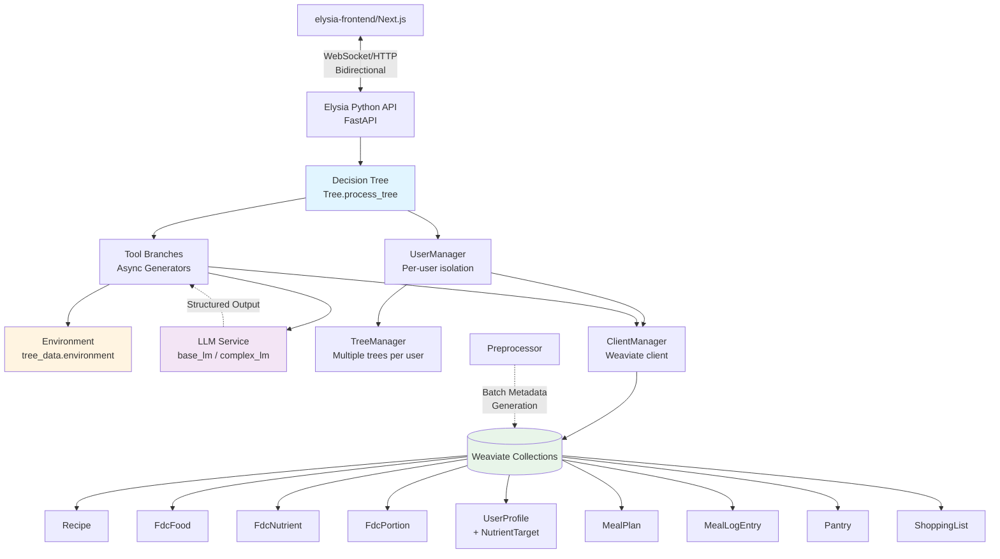
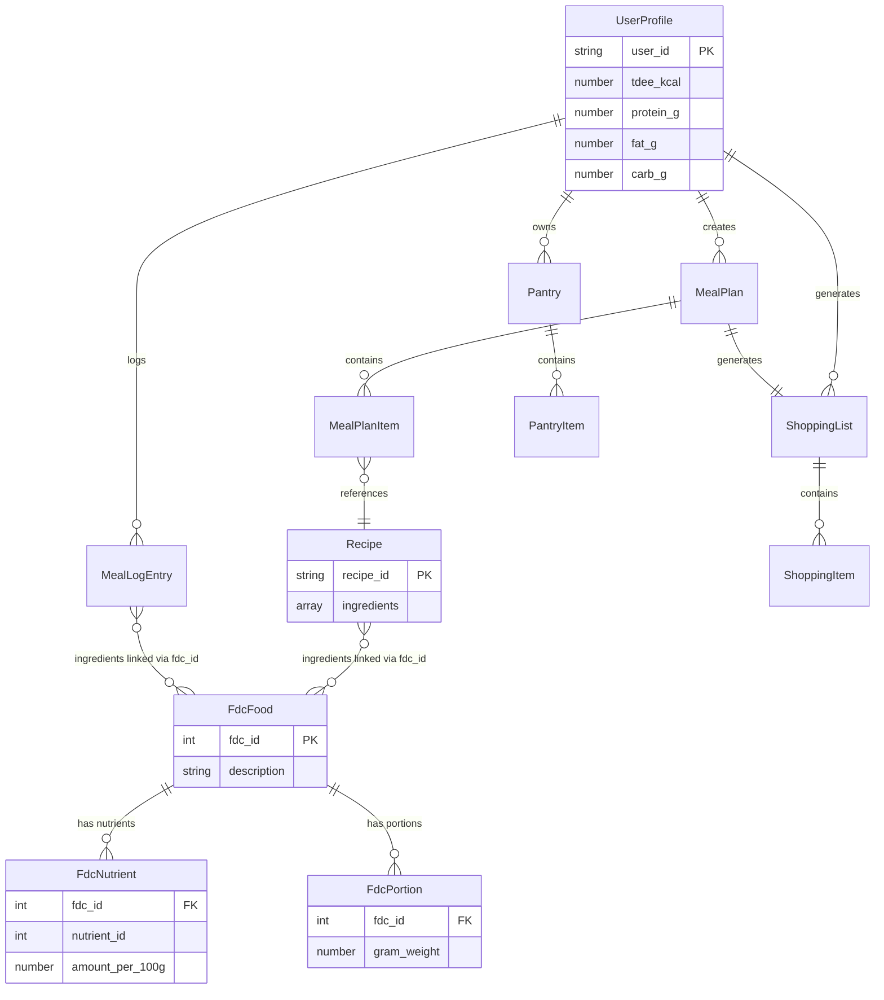
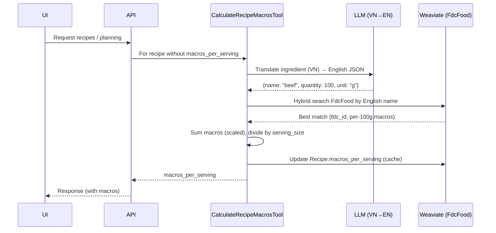
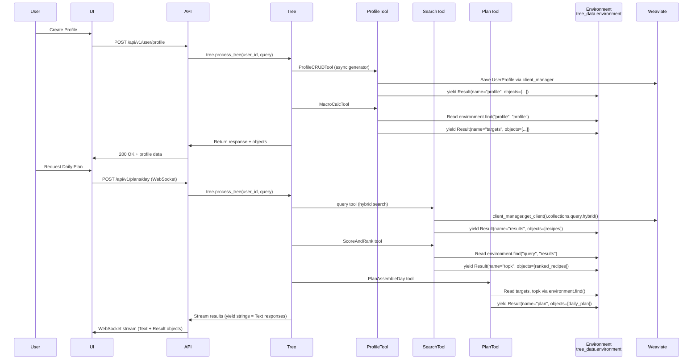
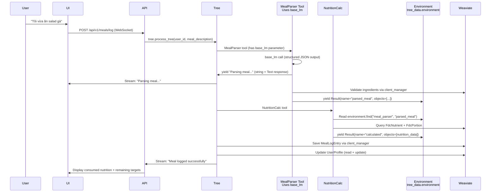

# System Design & Architecture - Meal Planning Agent

## Architecture Overview
**What is the high-level system structure?**

### System Diagram



### Component Responsibilities

- **elysia-frontend (Next.js)**: User interface for profile management, meal browsing, plan viewing, cooking mode
- **Elysia API**: FastAPI-based backend exposing WebSocket (streaming) and REST endpoints
- **Decision Tree**: Orchestrates tool execution based on Environment state and user prompts
- **Tools (async generators)**: Implement specific functionality (search, plan, validate, etc.); yield Result/Text objects
- **Environment**: Shared state container (accessed via `tree_data.environment`) where all Result objects are stored with structure `environment[tool_name][name]` - each tool yields Result objects with a `name` parameter that identifies the data in the environment
- **Managers**: 
  - **UserManager**: Per-user isolation of TreeManager and ClientManager
  - **TreeManager**: Manages decision tree instances and execution context
  - **ClientManager**: Manages Weaviate client connections and query execution
- **Preprocessor**: Runs during setup (batch process) via Elysia's official `preprocess` API to generate collection summaries, field statistics, return type mappings, and save to `ELYSIA_METADATA__` (one-time per collection) [Preprocessor]
- **Weaviate**: Vector database storing recipes, nutritional data, user profiles, plans, pantry, and shopping lists

### Tree Integration (Elysia)

- A dedicated MealAgent Tree is created and populated with branches matching feature areas.
- Tools are registered into branches so Elysia can orchestrate execution per Environment state.
- Factory function:
  - `build_meal_agent_tree(settings: Settings | None = None, user_id: str | None = None) -> Tree`
  - Location: `elysia/elysia/MealAgent/tree/meal_tree.py`
- Alternative registration (when Tree already exists via Managers):
  - `get_meal_agent_tools()` and `try_register_meal_agent_tools(tree_or_manager)`
  - Location: `elysia/elysia/MealAgent/tree/config.py`

Branch layout:
- `profile`, `constraints`, `search`, `nutrition`, `plan_day`, `plan_week`, `pantry`, `shopping`,
  `gap_fill`, `substitution`, `micros`, `logging`, `cooking`, `explain`

Registration rules (align with Elysia docs):
- Tool functions decorated with `@tool` are added to branches via `tree.add_tool(fn, branch_id=...)`.
- Environment key convention: `environment[tool_function_name][result_name]`.
- Workflows in `meal_tree.py` call tools in sequence and stream `Text`/`Result`/`Error`.

### Technology Stack

| Layer | Technology | Rationale |
|-------|-----------|-----------|
| Frontend | Next.js 14, TypeScript, Tailwind CSS, shadcn/ui | Modern React framework with SSR, strong typing, rapid UI development |
| Backend | Python 3.11+, FastAPI, Elysia framework | Async support, Elysia decision tree orchestration, strong ML ecosystem |
| Database | Weaviate 1.25+ | Vector search for semantic retrieval, hybrid search (BM25 + vector), schema enforcement |
| Data Source | USDA FoodData Central | Public domain nutritional data with comprehensive macro/micro coverage |
| Streaming | WebSockets | Real-time streaming of tool results (cooking steps, plan generation progress) |
| Auth (v1) | Session-based (user_id in memory) | Simplified MVP auth; migrate to JWT/OAuth in v2 |
| Deployment | Docker Compose (dev), K8s (prod) | Containerized services for portability and scalability |

## Data Models
**What data do we need to manage?**

### Core Collections (Weaviate Schema)

#### Recipe (CSV-aligned minimal schema + cached macros)
```python
{
    "class": "Recipe",
    "properties": [
        {"name": "food_id", "dataType": ["text"], "indexFilterable": True},
        {"name": "dish_name", "dataType": ["text"]},
        {"name": "dish_type", "dataType": ["text"], "indexFilterable": True},
        {"name": "serving_size", "dataType": ["int"]},
        {"name": "cooking_time", "dataType": ["int"], "indexFilterable": True},
        {"name": "ingredients_with_qty", "dataType": ["text[]"]},
        {"name": "ingredients", "dataType": ["text[]"]},
        {"name": "cooking_method_array", "dataType": ["text[]"]},
        {"name": "image_link", "dataType": ["text"]},
        # Cached field, computed on-demand by tool (VN→EN translation + FDC lookup)
        {"name": "macros_per_serving", "dataType": ["object"],
         "nestedProperties": [
            {"name": "kcal", "dataType": ["number"]},
            {"name": "protein_g", "dataType": ["number"]},
            {"name": "fat_g", "dataType": ["number"]},
            {"name": "carb_g", "dataType": ["number"]}
         ]
        },
        # Cached ingredient mapping to FDC for faster subsequent queries
        {"name": "ingredient_fdc_map", "dataType": ["object[]"],
         "nestedProperties": [
            {"name": "ingredient_vn", "dataType": ["text"]},
            {"name": "ingredient_en", "dataType": ["text"]},
            {"name": "fdc_id", "dataType": ["int"]},
            {"name": "quantity_g", "dataType": ["number"]},
            {"name": "confidence", "dataType": ["number"]}
         ]
        },
        # Constraint filtering fields (required for diet_allergen_guard_tool and time_device_guard_tool)
        # TODO: Add these fields to Recipe schema during migration/ETL
        {"name": "diet_type", "dataType": ["text[]"], "indexFilterable": True,
         "description": "Diet types this recipe supports (e.g., 'vegetarian', 'vegan', 'keto', 'paleo')"},
        {"name": "allergens", "dataType": ["text[]"], "indexFilterable": True,
         "description": "Allergens present in this recipe (e.g., 'peanuts', 'dairy', 'gluten')"},
        {"name": "devices", "dataType": ["text[]"], "indexFilterable": True,
         "description": "Required cooking equipment (e.g., 'oven', 'stovetop', 'microwave', 'blender')"}
    ],
    "vectorizer": "text2vec-transformers"
}
```

Note: We intentionally keep only the CSV fields to reduce redundancy and simplify ingestion.

##### Macros-per-serving strategy (VN→EN tool-only)
- Recipes are Vietnamese; FDC is English. We do NOT precompute mappings during ETL.
- A runtime tool translates ingredients (VN→EN), searches `FdcFood`, computes macros, and caches to `Recipe.macros_per_serving`.
- Subsequent calls read the cached value; no re-computation.

##### Ingredient-to-FDC mapping cache
- To speed up subsequent calculations and queries, each Recipe also stores `ingredient_fdc_map` (object[]):
  - `ingredient_vn` (text), `ingredient_en` (text), `fdc_id` (int), `quantity_g` (number), `confidence` (number)
- The VN→EN macro tool writes/updates this array when it resolves ingredients.

#### FdcFood 
```python
{
    "class": "FdcFood",
    "properties": [
        {"name": "fdc_id", "dataType": ["int"], "indexFilterable": True},
        {"name": "description", "dataType": ["text"]},

        # Macronutrients (per 100g)
        {"name": "energy_kcal_100g", "dataType": ["number"]},
        {"name": "protein_g_100g", "dataType": ["number"]},
        {"name": "fat_g_100g", "dataType": ["number"]},
        {"name": "carbohydrate_g_100g", "dataType": ["number"]},
        {"name": "sugars_g_100g", "dataType": ["number"]},
        {"name": "fiber_g_100g", "dataType": ["number"]},
        {"name": "sodium_mg_100g", "dataType": ["number"]},
        {"name": "sat_fat_g_100g", "dataType": ["number"]},

        # Micronutrients (per 100g)
        {"name": "calcium_mg_100g", "dataType": ["number"]},
        {"name": "iron_mg_100g", "dataType": ["number"]},
        {"name": "potassium_mg_100g", "dataType": ["number"]},
        {"name": "magnesium_mg_100g", "dataType": ["number"]},
        {"name": "zinc_mg_100g", "dataType": ["number"]},
        {"name": "vitamin_a_rae_ug_100g", "dataType": ["number"]},
        {"name": "vitamin_b6_mg_100g", "dataType": ["number"]},
        {"name": "vitamin_b12_ug_100g", "dataType": ["number"]},
        {"name": "thiamin_b1_mg_100g", "dataType": ["number"]},
        {"name": "riboflavin_b2_mg_100g", "dataType": ["number"]},
        {"name": "niacin_b3_mg_100g", "dataType": ["number"]},
        {"name": "vitamin_c_mg_100g", "dataType": ["number"]},
        {"name": "vitamin_d_ug_100g", "dataType": ["number"]},
        {"name": "vitamin_e_mg_100g", "dataType": ["number"]}
    ],
    "vectorizer": "text2vec-transformers"
}
```

#### FdcNutrient (derived via ETL from source data)
```python
{
    "class": "FdcNutrient",
    "properties": [
        {"name": "fdc_id", "dataType": ["int"], "indexFilterable": True},  # Links to FdcFood
        {"name": "nutrient_id", "dataType": ["int"], "indexFilterable": True},
        {"name": "amount_100g", "dataType": ["number"]}
        # Optional enrichments during ETL: nutrient_name, unit (filled from mapping)
    ]
}
```

#### FdcPortion (derived via ETL from source data)
```python
{
    "class": "FdcPortion",
    "properties": [
        {"name": "fdc_id", "dataType": ["int"], "indexFilterable": True},  # Links to FdcFood
        {"name": "amount", "dataType": ["number"]},
        {"name": "measure_unit", "dataType": ["text"]},  # "waffle, square", "cup", "oz", etc.
        {"name": "gram_weight", "dataType": ["number"]}
    ]
}
```

#### UserProfile (includes NutrientTarget)
```python
{
    "class": "UserProfile",
    "properties": [
        # Basic Profile Info
        {"name": "user_id", "dataType": ["text"], "indexFilterable": True},
        {"name": "age", "dataType": ["int"]},
        {"name": "gender", "dataType": ["text"]},  # "male", "female", "other"
        {"name": "weight_kg", "dataType": ["number"]},
        {"name": "height_cm", "dataType": ["number"]},
        {"name": "activity_level", "dataType": ["text"]},  # "sedentary", "light", "moderate", "very_active", "extra_active"
        
        # Dietary Constraints
        {"name": "diet_type", "dataType": ["text"]},
        {"name": "allergens", "dataType": ["text[]"]},
        {"name": "preferences", "dataType": ["text[]"]},  # Liked cuisines/ingredients
        {"name": "max_cooking_time_min", "dataType": ["int"]},  # Optional constraint
        {"name": "available_equipment", "dataType": ["text[]"]},  # Optional constraint
        
        # Nutritional Targets (calculated from profile)
        {"name": "tdee_kcal", "dataType": ["number"]},  # Harris-Benedict calculated TDEE
        {"name": "protein_g", "dataType": ["number"]},  # Daily protein target
        {"name": "fat_g", "dataType": ["number"]},  # Daily fat target
        {"name": "carb_g", "dataType": ["number"]},  # Daily carb target
        {"name": "micronutrient_targets", "dataType": ["object"]},  # {"vitamin_c_mg": 90, "iron_mg": 18, ...}
        
        # Metadata
        {"name": "created_at", "dataType": ["date"]},
        {"name": "updated_at", "dataType": ["date"]},
    ]
}
```

**Note**: NutrientTarget properties are embedded directly in UserProfile for simplicity. This avoids the need for separate collection queries and maintains data locality.

### Data Relationships



### ETL Mapping Notes (FDC)

- FdcFood stores base macro/micro values per 100g as columns; no JSON payloads are persisted in FdcFood.
- FdcNutrient rows are created via ETL from the source dataset for each (fdc_id, nutrient_id, amount_100g).
- FdcPortion rows are created via ETL for each (fdc_id, amount, measure_unit, gram_weight) available in the source.
- Optional enrichment: a nutrient-id lookup table can be used during ETL to add `nutrient_name` and `unit`; schema supports these as optional properties.

### Runtime Tool: CalculateRecipeMacrosTool (VN→EN)
Purpose: On-demand calculation of `macros_per_serving` for a recipe whose ingredients are Vietnamese.

Flow:
1) Check `Recipe.macros_per_serving`. If present → return cached.
2) For each item in `ingredients_with_qty`:
   - Translate/normalize to English (LLM or local model)
   - Hybrid search on `FdcFood.description`
   - Take best match above threshold
3) Accumulate macros using per-100g fields on `FdcFood`; scale by quantity; divide by `serving_size`.
4) Write back `macros_per_serving` to the Recipe object.

Notes:
- No ETL-side Vietnamese→English mapping is maintained; translation occurs at runtime for flexibility.
- Implemented as an async tool and invoked by scoring/plan tools when macros are missing.

#### VN→EN Macro Calculation Sequence (mermaid)


### Non-Functional Requirements (Design Summary)
- Hybrid search latency: < 2s for 4k corpus; < 3s for 10k+
- Daily plan generation: < 5s end-to-end
- Weekly plan generation: < 15s
- Macro aggregation for 21 meals: < 3s
- Meal logging (parse + calc + save): < 2s
- Vectorizer: `text2vec-transformers`; consistent across collections

### API Notes (Macros Cache)
- `Recipe.macros_per_serving` is a cached, optional field; may be absent on first read.
- When absent, backend calls CalculateRecipeMacrosTool to compute and persist it before returning.
- `Recipe.ingredient_fdc_map` may also be populated on-demand by the same tool and persisted for subsequent requests.

Cross-reference:
- Environment key conventions and per-tool keys: `docs/ai/design/environment_keys.md`
- Implementation patterns and route integration: `docs/ai/implementation/feature-meal-planning-agent.md`
- Elysia Preprocessor reference: [Preprocessor]

### Environment Keys (Minimal Reference)
| Tool | Reads | Writes |
|------|-------|--------|
| query_tool | constraints filters | query_tool.results |
| query_postprocessing_tool | query_tool.results | query_postprocessing_tool.deduped |
| score_and_rank_tool | deduped, targets | score_and_rank_tool.topk |
| plan_assemble_day_tool | topk, targets | plan_assemble_day_tool.plan |
| calculate_recipe_macros_tool | Recipe (by id) | calculate_recipe_macros_tool.macros and Recipe.macros_per_serving |

### Environment Keys Reference

- Tools follow the `environment[tool_name][name]` convention.
- Quick reference is maintained in `docs/ai/design/environment_keys.md`. Keep this file updated alongside tool changes and link it from implementation docs.

**Key Relationships:**
- **UserProfile → MealPlan**: One user can create multiple meal plans (one-to-many)
- **MealPlan → MealPlanItem**: One plan contains multiple meal items (one-to-many)
- **MealPlanItem → Recipe**: Each meal item references one recipe (many-to-one)
- **Recipe → FdcFood**: Recipe ingredients link to FDC foods via `ingredients[].fdc_id` (many-to-many)
- **FdcFood → FdcNutrient**: One food has multiple nutrients (one-to-many, linked by `fdc_id`)
- **FdcFood → FdcPortion**: One food has multiple portion options (one-to-many, linked by `fdc_id`)
- **UserProfile → MealLogEntry**: User logs multiple meals (one-to-many)
- **MealLogEntry → FdcFood**: Logged meals link ingredients to FDC foods (many-to-many via `ingredients[].fdc_id`)

#### MealPlan / MealPlanItem
```python
{
    "class": "MealPlan",
    "properties": [
        {"name": "plan_id", "dataType": ["text"], "indexFilterable": True},
        {"name": "user_id", "dataType": ["text"], "indexFilterable": True},
        {"name": "plan_type", "dataType": ["text"]},  # "day", "week"
        {"name": "start_date", "dataType": ["date"]},
        {"name": "created_at", "dataType": ["date"]},
    ]
}

{
    "class": "MealPlanItem",
    "properties": [
        {"name": "plan_id", "dataType": ["text"], "indexFilterable": True},
        {"name": "day_index", "dataType": ["int"]},  # 0-6 for weekly
        {"name": "meal_type", "dataType": ["text"]},  # "breakfast", "lunch", "dinner", "snack"
        {"name": "recipe_id", "dataType": ["text"]},
        {"name": "servings", "dataType": ["number"]},  # Portion multiplier
        {"name": "actual_macros", "dataType": ["object"]},  # Calculated for this portion
    ]
}
```

#### Pantry / PantryItem
```python
{
    "class": "Pantry",
    "properties": [
        {"name": "user_id", "dataType": ["text"], "indexFilterable": True},
        {"name": "updated_at", "dataType": ["date"]},
    ]
}

{
    "class": "PantryItem",
    "properties": [
        {"name": "user_id", "dataType": ["text"], "indexFilterable": True},
        {"name": "ingredient_name", "dataType": ["text"]},
        {"name": "quantity", "dataType": ["number"]},
        {"name": "unit", "dataType": ["text"]},
        {"name": "fdc_id", "dataType": ["int"]},  # Optional link to FdcFood
        {"name": "expiry_date", "dataType": ["date"]},  # Optional
    ]
}
```

#### ShoppingList / ShoppingItem
```python
{
    "class": "ShoppingList",
    "properties": [
        {"name": "list_id", "dataType": ["text"], "indexFilterable": True},
        {"name": "user_id", "dataType": ["text"], "indexFilterable": True},
        {"name": "plan_id", "dataType": ["text"]},  # Links to MealPlan
        {"name": "created_at", "dataType": ["date"]},
    ]
}

{
    "class": "ShoppingItem",
    "properties": [
        {"name": "list_id", "dataType": ["text"], "indexFilterable": True},
        {"name": "ingredient_name", "dataType": ["text"]},
        {"name": "quantity", "dataType": ["number"]},
        {"name": "unit", "dataType": ["text"]},
        {"name": "category", "dataType": ["text"]},  # "produce", "dairy", "meat", etc. for grouping
        {"name": "purchased", "dataType": ["boolean"]},
    ]
}
```

#### MealLogEntry (NEW - For Meal Logging Feature)
```python
{
    "class": "MealLogEntry",
    "properties": [
        {"name": "log_id", "dataType": ["text"], "indexFilterable": True},
        {"name": "user_id", "dataType": ["text"], "indexFilterable": True},
        {"name": "logged_at", "dataType": ["date"]},
        {"name": "meal_description", "dataType": ["text"]},  # Original user input (e.g., "I ate chicken salad")
        {"name": "parsed_dish", "dataType": ["text"]},  # LLM-parsed dish name
        {"name": "ingredients", "dataType": ["text"]},  # JSON string: [{"name": str, "amount": float, "unit": str, "fdc_id": int?}]
        {"name": "portion_size", "dataType": ["number"]},  # Portion multiplier
        {"name": "calculated_macros", "dataType": ["text"]},  # JSON string: {"kcal": float, "protein_g": float, "fat_g": float, "carb_g": float}
        {"name": "calculated_micros", "dataType": ["text"]},  # JSON string: micronutrients if available
        {"name": "validation_status", "dataType": ["text"]},  # "complete", "partial", "failed"
        {"name": "parsing_method", "dataType": ["text"]},  # "llm", "manual_fallback"
    ]
}
```

Note: `ingredients`, `calculated_macros`, and `calculated_micros` are stored as TEXT (JSON strings) in Weaviate. Tools must serialize/deserialize these fields when reading/writing.

### Data Flow



### Meal Logging Data Flow (NEW)



## API Design
**How do components communicate?**

### External API Endpoints

#### REST Endpoints

All endpoints use prefix `/api/v1/meal/` for consistency.

**User Profile Management**
```
POST   /api/v1/meal/user/profile           # Create/update user profile
GET    /api/v1/meal/user/profile/{user_id} # Retrieve profile
```

**Request (POST /api/v1/meal/user/profile):**
```json
{
  "user_id": "user_123",
  "age": 30,
  "gender": "male",
  "weight_kg": 75.0,
  "height_cm": 180.0,
  "activity_level": "moderate",
  "diet_type": "vegetarian",
  "allergens": ["nuts", "dairy"],
  "preferences": ["italian", "asian"],
  "max_cooking_time_min": 45,
  "available_equipment": ["oven", "stovetop"]
}
```

**Response:**
```json
{
  "status": "created" | "updated",
  "profile": {
    "user_id": "user_123",
    "tdee_kcal": 2450.5,
    "protein_g": 183.8,
    "fat_g": 81.7,
    "carb_g": 245.0,
    ...
  }
}
```

**Recipe Search**
```
GET    /api/v1/meal/recipes?query={query}&limit={limit}  # Search recipes (hybrid query)
GET    /api/v1/meal/recipes/{recipe_id}                  # Get recipe details
```

**Response (GET /api/v1/meal/recipes):**
```json
{
  "recipes": [
    {
      "recipe_id": "recipe_001",
      "title": "Vegetarian Pasta",
      "macros_per_serving": {"kcal": 450, "protein_g": 15, "fat_g": 12, "carb_g": 70},
      "ingredient_fdc_map": [
        {"ingredient_vn": "mì ống", "ingredient_en": "pasta", "fdc_id": 174506, "quantity_g": 80, "confidence": 0.9},
        {"ingredient_vn": "cà chua", "ingredient_en": "tomato", "fdc_id": 169091, "quantity_g": 100, "confidence": 0.93}
      ]
    }
  ],
  "total": 42
}
```

**Meal Planning**
```
POST   /api/v1/meal/plans/day              # Generate daily meal plan
POST   /api/v1/meal/plans/week             # Generate weekly meal plan
GET    /api/v1/meal/plans/{plan_id}         # Retrieve plan
DELETE /api/v1/meal/plans/{plan_id}         # Delete plan
```

**Request (POST /api/v1/meal/plans/day):**
```json
{
  "user_id": "user_123",
  "query": "healthy breakfast options",
  "date": "2025-01-27"
}
```

**Response:**
```json
{
  "plan_id": "plan_abc123",
  "user_id": "user_123",
  "plan_type": "day",
  "meals": {
    "breakfast": {
      "recipe_id": "recipe_001",
      "title": "Vegetarian Pasta",
      "macros_per_serving": {"kcal": 450, "protein_g": 15, "fat_g": 12, "carb_g": 70},
      "ingredient_fdc_map": [
        {"ingredient_vn": "mì ống", "ingredient_en": "pasta", "fdc_id": 174506, "quantity_g": 80, "confidence": 0.9}
      ]
    },
    "lunch": {...},
    "dinner": {...}
  },
  "total_macros": {"kcal": 2100, "protein_g": 150, ...}
}
```

**Pantry Management**
```
GET    /api/v1/meal/pantry/{user_id}        # Get pantry inventory
POST   /api/v1/meal/pantry/{user_id}        # Update pantry items
```

**Shopping Lists**
```
GET    /api/v1/meal/shopping/{plan_id}                   # Get shopping list for plan
POST   /api/v1/meal/shopping/{plan_id}/generate         # Generate shopping list from plan
```

**Meal Logging**
```
POST   /api/v1/meal/meals/log                          # Log consumed meal via natural language
GET    /api/v1/meal/meals/history/{user_id}             # Get meal log history
GET    /api/v1/meal/meals/consumed-today/{user_id}      # Get today's consumed nutrition
```

**Request (POST /api/v1/meal/meals/log):**
```json
{
  "user_id": "user_123",
  "meal_description": "Tôi vừa ăn salad gà với dầu olive"
}
```

**Response:**
```json
{
  "log_id": "log_xyz789",
  "calculated_macros": {"kcal": 320, "protein_g": 25, ...},
  "remaining_targets": {"kcal": 1780, "protein_g": 125, ...}
}
```

**Explanations**
```
POST   /api/v1/meal/explain/{plan_id}       # Get explanation for plan decisions
```

**HTTP Status Codes:**
- `200 OK`: Success
- `201 Created`: Resource created successfully
- `400 Bad Request`: Validation error or invalid input
- `404 Not Found`: Resource not found
- `500 Internal Server Error`: Server error

#### WebSocket Endpoints

All WebSocket endpoints support bidirectional communication for streaming.

```
WS     /ws/tree/{user_id}                  # Main Tree execution stream (tool results)
WS     /ws/cook/{recipe_id}                # Cooking mode step-by-step stream
WS     /ws/meals/log/{user_id}             # Real-time meal parsing and nutrition calculation
```

**WebSocket Message Format:**

**Client → Server:**
```json
{
  "action": "generate_plan" | "search" | "log_meal",
  "user_id": "user_123",
  "query": "Create a healthy meal plan",
  "conversation_id": "conv_abc"  // Optional, for resuming conversations
}
```

**Server → Client (streaming):**
```json
{
  "type": "text" | "result" | "error",
  "data": {
    // For type="text": string message
    "message": "Searching recipes...",
    
    // For type="result": Result object structure
    "tool_name": "query",
    "name": "results",
    "objects": [...],
    "metadata": {...}
    
    // For type="error": error info
    "error": "Invalid input",
    "recoverable": true
  }
}
```

### Internal Interfaces (Tool Contracts)

All tools follow the Elysia async generator pattern with automatic parameter injection:

```python
from typing import AsyncGenerator
from elysia import tool
from elysia.tree.objects import TreeData, Result, Error
from elysia.api.services.user import UserManager
from elysia.util.client import ClientManager

@tool
async def profile_crud_tool(
    tree_data: TreeData,           # Automatically injected - access environment via tree_data.environment
    client_manager: ClientManager,  # Automatically injected - Weaviate client access
    base_lm,                       # Optional - LLM for structured output
    complex_lm,                    # Optional - More powerful LLM if needed
    action: str = "create",        # LLM-chosen or default parameter
    profile_data: dict = None      # LLM-chosen parameter
) -> AsyncGenerator[Result | str | Error, None]:
    """
    Create, read, or update user profile in UserProfile collection.
    
    Parameters:
        action: "create", "read", or "update"
        profile_data: Dictionary with user profile fields (required for create/update)
    
    Environment:
        Reads: None (first tool in workflow)
        Writes: environment["profile_crud_tool"]["profile"] - stores profile data
    """
    # Yield strings = Text responses shown to user
    yield f"Processing profile {action}..."
    
    # Access environment (structure: environment[tool_name][name])
    # Reading example:
    # existing_profile = tree_data.environment.find("profile_crud", "profile")
    
    # Get Weaviate client
    client = client_manager.get_client()
    collection = client.collections.get("UserProfile")
    
    try:
        if action == "create" or action == "update":
            # Validate and save
            result = collection.data.insert(profile_data)
            
            # Yield Result to add to environment
            yield Result(
                name="profile",  # Environment key: environment["profile_crud_tool"]["profile"]
                objects=[profile_data],
                metadata={"action": action, "user_id": profile_data.get("user_id")}
            )
            yield f"Profile {action}d successfully"
            
        elif action == "read":
            user_id = profile_data.get("user_id") if profile_data else None
            result = collection.query.fetch_objects(
                where={"path": ["user_id"], "operator": "Equal", "valueString": user_id},
                limit=1
            )
            
            if result.objects:
                profile = result.objects[0].properties
                yield Result(
                    name="profile",
                    objects=[profile],
                    metadata={"action": "read"}
                )
            else:
                yield Error(f"Profile not found for user {user_id}")
                return
                
    except Exception as e:
        yield Error(f"Profile operation failed: {str(e)}")
        return
```

**Key Points:**
- **Automatic Injection**: `tree_data`, `client_manager`, `base_lm`, `complex_lm` are automatically provided by Elysia
- **Environment Access**: Use `tree_data.environment.find(tool_name, name)` to read, `Result` objects are automatically added
- **Result Structure**: `Result(name="key", objects=[...], metadata={...})` creates `environment[tool_name]["key"]`
- **String Yields**: Plain strings automatically become Text responses shown to user
- **Error Handling**: Yield `Error()` objects for recoverable errors (Tree can retry or continue)

**Environment Key Convention:**
- Use `tool_name` = function name (e.g., "profile_crud_tool" → use full function name "profile_crud_tool")
- Use descriptive `name` parameter (e.g., "profile", "targets", "results", "plan")
- Structure: `environment[tool_name][name]` = list of `{objects: [...], metadata: {...}}`
- When using `@tool` decorator, the tool_name is automatically set to the function name

### Authentication/Authorization (v1 Simplified)

- **Session-based**: User logs in → receives session token → token stored in cookie
- **user_id** passed to all endpoints and used for data isolation in UserManager
- **No role-based access control** in v1 (all users have same permissions)
- **Future (v2)**: Migrate to JWT with OAuth2 providers (Google, Apple, etc.)

## Component Breakdown
**What are the major building blocks?**

### Frontend Components (elysia-frontend)

1. **ProfilePage**: User profile creation/editing form with TDEE calculation preview
2. **RecipeExplorer**: Browse/search recipes with filters (diet, allergens, time, tags)
3. **PlannerPage**: Daily/weekly plan generation with live streaming of tool results
4. **PlanView**: Display generated plan with macros per meal/day/week
5. **MealLoggingChat**: Chat interface for natural language meal input with real-time nutrition preview and confirmation
6. **MealHistoryView**: Display logged meals with nutrition breakdown and daily progress tracking
7. **CookingMode**: Step-by-step instructions with timer and progress tracking
8. **PantryManager**: CRUD interface for pantry items with expiry tracking
9. **ShoppingListView**: Checklist interface with category grouping and print/export
10. **ExplainDialog**: Modal showing decision explanation with data references

### Backend Services (Elysia Python)

#### Tool Branches (elysia/tools/)

1. **profile/** (ProfileCRUDTool, MacroCalcTool)
2. **constraints/** (DietAllergenGuard, TimeDeviceGuard)
3. **search/** (query, query_postprocessing, ScoreAndRank)
4. **plan_day/** (TargetResolver, PlanAssembleDay, PlanValidate, BuildShoppingList)
5. **plan_week/** (PlanAssembleWeekly, VarietyGuard)
6. **meal_logging/** (MealParser, NutritionCalc, ProfileUpdate, MealHistoryRetrieval)
7. **pantry/** (PantryCRUDTool, PantryDiff)
8. **gap_fill/** (GapCalc, SuggestSnack, ApplySnack)
9. **substitution/** (SuggestSubstitutes, ApplySubstitute)
10. **family/** (MergeConstraints, PlanFamily)
11. **micros/** (MicronutrientCheck, SuggestMicrosFoods)
12. **cook_mode/** (CookMode - parse/stream cooking steps)
13. **explain/** (Explain - generate decision explanations)

#### Core Modules (elysia/)

- **objects.py**: Custom Result/Error types for MealAgent domain
- **preprocessing/**: Preprocessor implementations for each collection
- **tree/tree.py**: Main decision tree logic and tool orchestration
- **util/client.py**: Weaviate client wrapper with retry logic
- **config.py**: Settings and environment variable management

### Database Layer (Weaviate)

- **Collections**: 10 primary collections (Recipe, FdcFood, FdcNutrient, FdcPortion, UserProfile [includes NutrientTarget], MealPlan, MealPlanItem, MealLogEntry, Pantry/PantryItem, ShoppingList/ShoppingItem)
- **Indexing**: Filterable properties on user_id, fdc_id, diet_type, allergens, tags, time_min, logged_at
- **Vectorization**: text2vec-openai (or local transformers) for Recipe descriptions, FdcFood descriptions
- **Hybrid Search**: BM25 + vector similarity with alpha=0.5 default (configurable per query - 0.0 = BM25 only, 1.0 = vector only, 0.5 = balanced)

### Third-Party Integrations (v1)

- **USDA FoodData Central**: Offline batch import of CSV files into FdcFood/FdcNutrient/FdcPortion collections
- **OpenAI (optional)**: Embeddings for recipe vectorization, optional LLM for explanations/substitutions

### References
- Preprocessor: https://weaviate.github.io/elysia/Reference/Preprocessor/
- Tree: https://weaviate.github.io/elysia/Reference/Tree/
- Client: https://weaviate.github.io/elysia/Reference/Client/
- Managers: https://weaviate.github.io/elysia/Reference/Managers/
- Settings: https://weaviate.github.io/elysia/Reference/Settings/
- Objects: https://weaviate.github.io/elysia/Reference/Objects/
- Payload Types: https://weaviate.github.io/elysia/Reference/PayloadTypes/
- Util: https://weaviate.github.io/elysia/Reference/Util/

## Design Decisions
**Why did we choose this approach?**

### 1. Elysia Framework for Orchestration
**Decision**: Use Elysia's decision tree + async generator pattern for all business logic
**Rationale**:
- **Transparency**: Environment automatically tracks all intermediate results (key for explanations)
- **Streaming**: Async generators natively support progressive UI updates
- **Composability**: Tools are isolated, testable units that read/write to shared Environment
- **Trace-ability**: Full execution history available for debugging and user explanations

**Alternatives Considered**:
- **LangChain/LlamaIndex**: More LLM-centric; less transparent intermediate state
- **Custom state machine**: More implementation overhead; Elysia provides battle-tested patterns

### 2. Code-Based (Deterministic) Core Logic
**Decision**: Macro calculations, constraint validation, and retrieval filtering are pure Python (no LLM)
**Rationale**:
- **Reliability**: Nutritional calculations must be deterministic and auditable
- **Cost**: LLM calls for every calculation would be expensive and slow
- **Trust**: Users need confidence that allergen filtering is 100% accurate (no hallucination risk)

**LLM-Enhanced Components** (from Requirements):
- **Meal Logging**: Parse natural language meal descriptions → structured data
- **Query Enhancement**: Expand user search queries for better recipe retrieval
- **Recipe Ranking**: Semantic scoring of recipe fit to user preferences
- **Ingredient Substitution**: Suggest alternatives with nutritional equivalence
- **Cooking Instructions**: Parse unstructured recipe text into structured steps
- **Explanations**: Generate natural language explanations from Environment data
- **Variety Optimization**: Classify cuisine/flavor profiles for diversity scoring

**Pattern**: All LLM tools follow 5-step validation:
1. Yield Text (streaming progress)
2. LLM Call (structured JSON output)
3. Code Validation (verify constraints)
4. Yield Result (to Environment)
5. Error Handling (fallback to code-based approach)

### 3. Weaviate for All Persistence
**Decision**: Use Weaviate for both vector search (recipes) and structured data (profiles, plans, pantry)
**Rationale**:
- **Unified Stack**: Single database reduces operational complexity
- **Hybrid Search**: Recipes need semantic + keyword search; Weaviate excels at this
- **Schema Enforcement**: Strong typing prevents data corruption
- **Scalability**: Horizontally scalable for future growth

**Alternatives Considered**:
- **PostgreSQL + Pinecone**: Split structured data vs vectors; more moving parts
- **Elasticsearch**: Good full-text search but weaker vector support

### 4. FdcPortion Collection (NEW)
**Decision**: Create dedicated FdcPortion collection from FDC's food_portion table
**Rationale**:
- **Unit Conversion**: Recipes use "1 cup onion" but FDC nutrients are per 100g; FdcPortion bridges this gap
- **Accuracy**: Direct gram_weight conversions avoid manual approximations
- **Micronutrient Precision**: Essential for accurate vitamin/mineral aggregation

### 5. Environment Key Namespacing (Elysia Standard)
**Decision**: Use Elysia's standard `environment[tool_name][name]` structure where `tool_name` is derived from the tool function name and `name` is the Result's `name` parameter
**Rationale**:
- **Elysia Convention**: Follows framework's built-in environment structure
- **No Collisions**: Each tool writes to its own `tool_name` namespace
- **Auditability**: Easy to trace which tool produced which data via `tool_name`
- **Scoping**: Tools write to their namespace (`tool_name`) with descriptive `name` keys (read from anywhere via `environment.find()`)
**Implementation**: Tools use `Result(name="descriptive_key", ...)` which automatically creates `environment[tool_name]["descriptive_key"]`

### 6. Session-Based Auth (v1)
**Decision**: Simple session cookies for MVP
**Rationale**:
- **Speed to Market**: Faster implementation than OAuth
- **Sufficient for Beta**: MVP has limited users; migrate to JWT in v2

## Non-Functional Requirements
**How should the system perform?**

### Performance Targets
- **Retrieval Latency**: Hybrid search returns top 100 candidates in <2 seconds (4k demo corpus), <3 seconds (10k+ production)
- **Plan Generation**: Daily plan end-to-end <5 seconds; weekly plan <15 seconds
- **Meal Logging**: Parse + calculate + save completes in <5 seconds (dependent on LLM response time)
- **Streaming Responsiveness**: First tool result streamed to UI within 500ms of request
- **Micronutrient Aggregation**: 21-meal plan micro totals calculated in <3 seconds

**Note:** Performance benchmarks for LLM-dependent features (meal logging, query enhancement, explanations) may vary based on LLM provider latency. System focuses on delivering results reliably rather than strict time constraints for AI-enhanced features.

### Scalability Considerations
- **Horizontal Scaling**: Stateless FastAPI workers (suitable for graduation project scale)
- **Weaviate**: Single-node deployment sufficient for demo (4k recipes, <100 users)
- **Caching**: Optional Redis for frequently accessed data (not required for MVP)

**Note:** System designed for graduation project demonstration. Production scaling (load balancers, Weaviate sharding, Redis cluster) can be added later if needed.

### Security Requirements
- **Input Validation**: All user inputs sanitized (prevent injection attacks)
- **Rate Limiting**: 100 requests/minute per user_id (prevent abuse)
- **Data Encryption**: At rest (Weaviate encryption) and in transit (HTTPS/WSS)
- **Secrets Management**: API keys in environment variables (AWS Secrets Manager in prod)

### Reliability/Availability Needs
- **Uptime**: Best-effort availability (suitable for demo/presentation)
- **Error Handling**: All tools return Error objects (not exceptions) for graceful degradation
- **Retry Logic**: Weaviate queries retry 3x with exponential backoff
- **Fallback**: If vector search fails, fall back to BM25-only retrieval; if LLM fails, use manual input forms

### Data Retention Policy (From Requirements)
- **User profiles**: Retained indefinitely (or until user requests deletion)
- **Meal plans**: 360 days (configurable)
- **Meal log entries**: 360 days (for trend analysis)
- **Shopping lists**: 30 days
- **Activity logs**: 360 days

---

**Status**: ✅ **Updated - Ready for Implementation**
**Last Updated**: 2025-01-27
**Owner**: MealAgent Development Team

**Changelog v0.3:**
- ✅ **Gộp NutrientTarget vào UserProfile**: Embedded nutrient targets directly in UserProfile collection to simplify data model
- ✅ **Cập nhật Architecture Diagram**: Added MealLogEntry, LLM service node, bidirectional WebSocket connections
- ✅ **Cải thiện Tool Contracts**: Updated to match Elysia framework conventions (tree_data, client_manager auto-injection)
- ✅ **Thêm API Schemas**: Added detailed request/response formats for all REST endpoints
- ✅ **Thêm WebSocket Message Format**: Documented client/server message structures
- ✅ **Cập nhật Environment Structure**: Corrected to match Elysia's `environment[tool_name][name]` pattern
- ✅ **Thêm Data Relationship Diagram**: ER diagram showing all collection relationships
- ✅ **Cập nhật Data Flow Diagrams**: More accurate sequence diagrams with Elysia API patterns
- ✅ **Clarify Preprocessor**: Documented batch execution timing
- ✅ **Hybrid Search Alpha**: Added explanation of alpha parameter meaning

**Changelog v0.2:**
- ✅ Added MealLogEntry collection schema
- ✅ Added meal logging API endpoints (REST + WebSocket)
- ✅ Added meal_logging tool branch
- ✅ Added MealLoggingChat and MealHistoryView components
- ✅ Added meal logging sequence diagram
- ✅ Fixed recipe corpus size (100k → 4k demo, 10k+ production)
- ✅ Added LLM usage strategy expansion
- ✅ Added data retention policy
- ✅ Simplified scalability/deployment for graduation project context

