# MealAgent Architecture

Tài liệu này cung cấp các sơ đồ kiến trúc chi tiết cho module MealAgent, tập trung vào cách MealAgent hoạt động trong hệ thống, data pipeline, và cấu trúc tools.

> 📖 **Xem tổng quan hệ thống**: [System Architecture](./system_architecture.md)

## 1. MealAgent Overview

### 1.1. MealAgent trong Hệ Thống

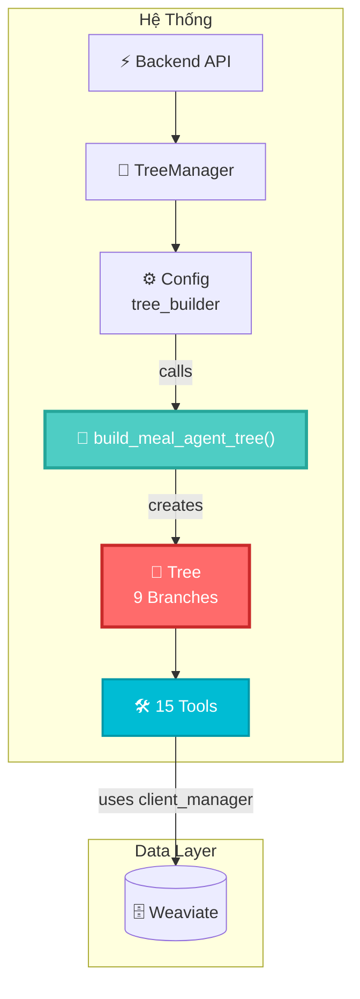

### 1.2. MealAgent Tree Structure

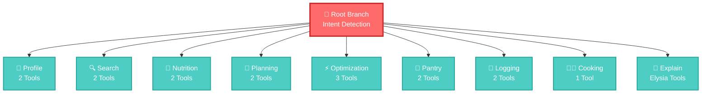

### 1.3. MealAgent Components

```mermaid
graph TB
    subgraph MealAgent["MealAgent Module"]
        TreeBuilder["🔧 Tree Builder<br/>build_meal_agent_tree()"]
        
        subgraph Branches["9 Branches"]
            ProfileBranch["👤 profile"]
            SearchBranch["🔍 search"]
            NutritionBranch["🥗 nutrition"]
            PlanningBranch["📅 planning"]
            OptimizationBranch["⚡ optimization"]
            PantryBranch["🏪 pantry"]
            LoggingBranch["📝 logging"]
            CookingBranch["👨‍🍳 cooking"]
            ExplainBranch["💬 explain"]
        end
        
        subgraph Tools["15 Tools"]
            ProfileTools["👤 Profile (2)"]
            SearchTools["🔍 Search (2)"]
            NutritionTools["🥗 Nutrition (2)"]
            PlanningTools["📅 Planning (2)"]
            OptimizationTools["⚡ Optimization (3)"]
            PantryTools["🏪 Pantry (2)"]
            LoggingTools["📝 Logging (2)"]
            CookingTool["👨‍🍳 Cooking (1)"]
        end
        
        subgraph Schemas["Data Schemas"]
            UserProfile["👤 UserProfile"]
            MealPlan["📅 MealPlan"]
            Recipe["📖 Recipe"]
            FDCData["🥗 FDC Data"]
            MealLog["📝 MealLogEntry"]
            Pantry["🏪 Pantry"]
            Shopping["🛒 ShoppingList"]
        end
        
        subgraph Utils["Utility Functions"]
            NutritionUtils["🥗 Nutrition Utils"]
            PlanningHelpers["📅 Planning Helpers"]
            RecipeClassifiers["📖 Recipe Classifiers"]
            WeaviateFilters["🔍 Weaviate Filters"]
            LLMUtils["🧠 LLM Utilities"]
            ProfileTargets["👤 Profile Targets"]
        end
    end
    
    TreeBuilder --> Branches
    Branches --> Tools
    Tools --> Schemas
    Tools --> Utils
    
    style MealAgent fill:#e0f7fa,stroke:#80deea,stroke-width:2px
    style TreeBuilder fill:#4ecdc4,stroke:#26a69a,stroke-width:3px,color:#fff
```

## 2. MealAgent Data Pipeline

### 2.1. Overall Data Flow

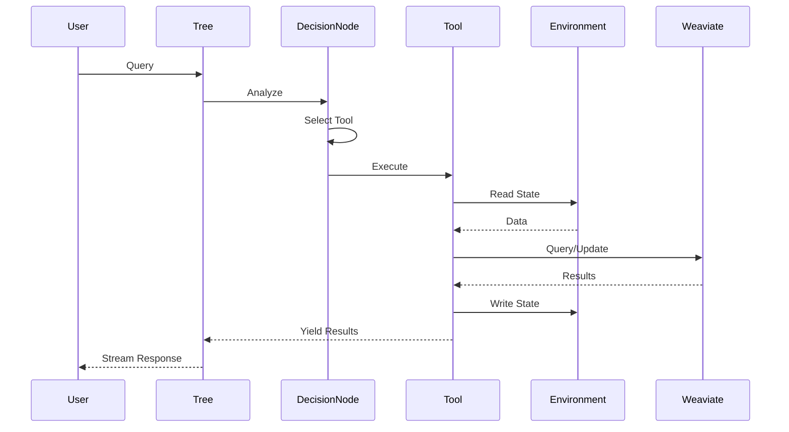

### 2.2. Environment State Flow

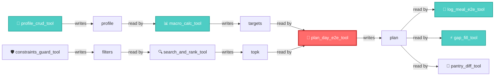

### 2.3. Tool-to-Weaviate Data Flow

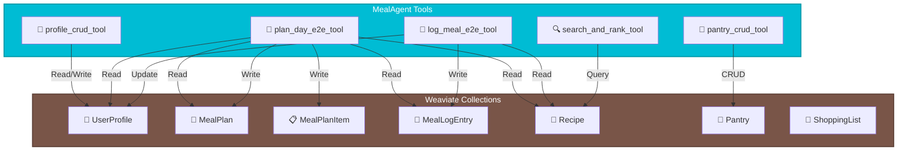

## 3. Tool Architecture

### 3.1. Tools Organization

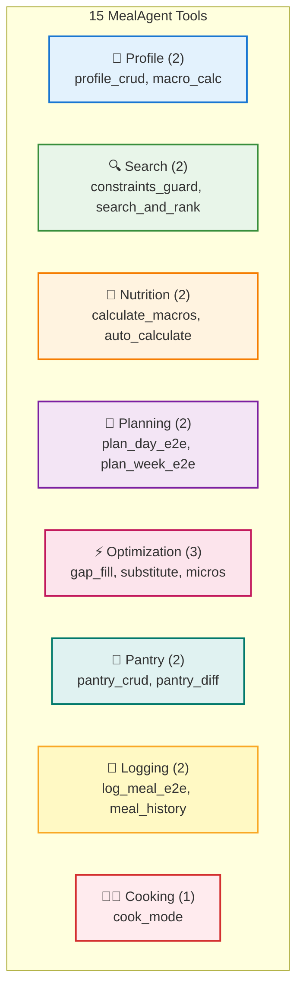

### 3.2. Tool Dependencies

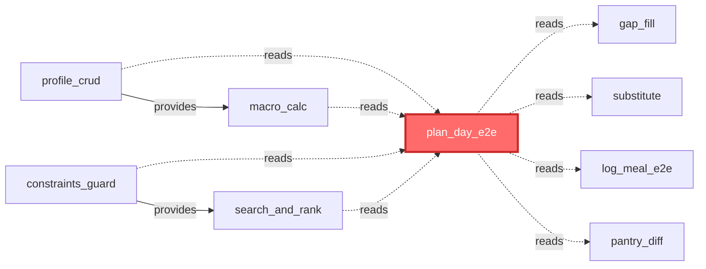

### 3.3. Tool Registration Flow

```mermaid
graph TB
    TreeBuilder["🔧 build_meal_agent_tree()"]
    Config["⚙️ MEAL_AGENT_TOOLS<br/>15 Tools Registry"]
    
    TreeBuilder -->|"reads"| Config
    TreeBuilder -->|"creates"| RootBranch["🌳 Root Branch"]
    TreeBuilder -->|"adds"| ProfileBranch["👤 Profile Branch"]
    TreeBuilder -->|"adds"| SearchBranch["🔍 Search Branch"]
    TreeBuilder -->|"adds"| NutritionBranch["🥗 Nutrition Branch"]
    TreeBuilder -->|"adds"| PlanningBranch["📅 Planning Branch"]
    TreeBuilder -->|"adds"| OptimizationBranch["⚡ Optimization Branch"]
    TreeBuilder -->|"adds"| PantryBranch["🏪 Pantry Branch"]
    TreeBuilder -->|"adds"| LoggingBranch["📝 Logging Branch"]
    TreeBuilder -->|"adds"| CookingBranch["👨‍🍳 Cooking Branch"]
    TreeBuilder -->|"adds"| ExplainBranch["💬 Explain Branch"]
    
    TreeBuilder -->|"registers"| ProfileTools["👤 profile_crud_tool<br/>macro_calc_tool"]
    TreeBuilder -->|"registers"| SearchTools["🔍 constraints_guard_tool<br/>search_and_rank_tool"]
    TreeBuilder -->|"registers"| NutritionTools["🥗 calculate_recipe_macros_tool<br/>auto_calculate_macros_tool"]
    TreeBuilder -->|"registers"| PlanningTools["📅 plan_day_e2e_tool<br/>plan_week_e2e_tool"]
    TreeBuilder -->|"registers"| OptimizationTools["⚡ gap_fill_tool<br/>substitute_tool<br/>micros_tool"]
    TreeBuilder -->|"registers"| PantryTools["🏪 pantry_crud_tool<br/>pantry_diff_tool"]
    TreeBuilder -->|"registers"| LoggingTools["📝 log_meal_e2e_tool<br/>meal_history_tool"]
    TreeBuilder -->|"registers"| CookingTool["👨‍🍳 cook_mode_tool"]
    
    style TreeBuilder fill:#4ecdc4,stroke:#26a69a,stroke-width:3px,color:#fff
```

## 4. E2E Tools Data Pipeline

### 4.1. plan_day_e2e_tool Pipeline

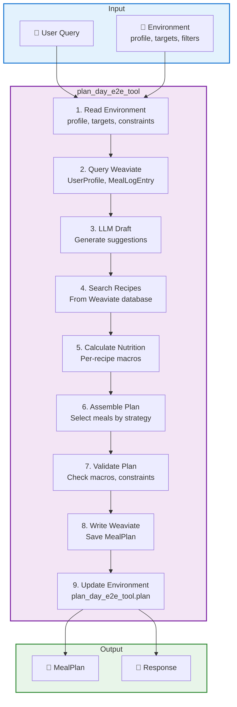

### 4.2. log_meal_e2e_tool Pipeline

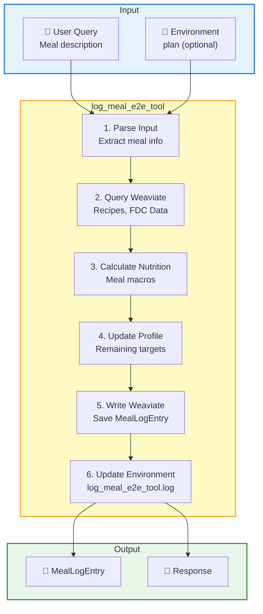

### 4.3. gap_fill_tool Pipeline

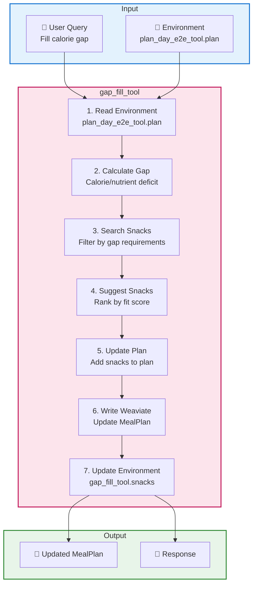

## 5. Individual Tool Details

### 5.1. Profile Tools

#### profile_crud_tool
- **Function**: CRUD operations cho UserProfile
- **Reads**: None
- **Writes**: `profile_crud_tool.profile`
- **Weaviate**: Read/Write UserProfile collection
- **Auto-triggers**: Calls `macro_calc_tool` after create/update

#### macro_calc_tool
- **Function**: Calculate TDEE và macro targets
- **Reads**: `profile_crud_tool.profile`
- **Writes**: `macro_calc_tool.targets`
- **Weaviate**: Read UserProfile

### 5.2. Search Tools

#### constraints_guard_tool
- **Function**: Generate filters từ user constraints
- **Reads**: UserProfile (allergens, diet types)
- **Writes**: `constraints_guard_tool.filters`
- **Weaviate**: Read UserProfile

#### search_and_rank_tool
- **Function**: Hybrid search với ranking
- **Reads**: `constraints_guard_tool.filters`
- **Writes**: `search_and_rank_tool.topk`
- **Weaviate**: Query Recipe collection (vector + keyword search)
- **Features**: Uses Elysia Query tool internally for LLM-driven optimization

### 5.3. Nutrition Tools

#### calculate_recipe_macros_tool
- **Function**: Per-recipe nutrition calculation
- **Reads**: Recipe from Weaviate
- **Writes**: Updates Recipe with calculated macros
- **Weaviate**: Read/Update Recipe collection

#### auto_calculate_macros_tool
- **Function**: Batch nutrition calculation
- **Reads**: Multiple recipes
- **Writes**: Updates multiple recipes with macros
- **Weaviate**: Read/Update Recipe collection

### 5.4. Planning Tools

#### plan_day_e2e_tool
- **Function**: End-to-end daily meal planning
- **Reads**: 
  - `macro_calc_tool.targets`
  - `constraints_guard_tool.filters`
  - `search_and_rank_tool.topk` (optional)
- **Writes**: 
  - `plan_day_e2e_tool.plan`
  - `plan_day_e2e_tool.missing_macros`
- **Weaviate**: 
  - Read UserProfile, MealLogEntry, MealPlan
  - Write MealPlan, MealPlanItem
- **Pipeline**: Xem section 4.1
- **Features**: LLM draft generation, variety filtering, macro validation

#### plan_week_e2e_tool
- **Function**: End-to-end weekly meal planning với variety
- **Reads**: Similar to plan_day_e2e_tool
- **Writes**: `plan_week_e2e_tool.plan`
- **Weaviate**: Similar to plan_day_e2e_tool
- **Features**: Weekly variety, meal distribution across days

### 5.5. Optimization Tools

#### gap_fill_tool
- **Function**: Fill calorie/nutrient gaps với snacks
- **Reads**: `plan_day_e2e_tool.plan` hoặc `plan_week_e2e_tool.plan`
- **Writes**: `gap_fill_tool.snacks`
- **Weaviate**: Read Recipe, Update MealPlan
- **Pipeline**: Xem section 4.3

#### substitute_tool
- **Function**: Recipe substitution suggestions
- **Reads**: `plan_day_e2e_tool.plan`
- **Writes**: `substitute_tool.substitutions`
- **Weaviate**: Read Recipe, Update MealPlan

#### micros_tool
- **Function**: Micronutrient analysis và suggestions
- **Reads**: `plan_day_e2e_tool.plan`
- **Writes**: `micros_tool.micros_analysis`
- **Weaviate**: Read Recipe, FDC data

### 5.6. Logging Tools

#### log_meal_e2e_tool
- **Function**: End-to-end meal logging
- **Reads**: `plan_day_e2e_tool.plan` (optional)
- **Writes**: `log_meal_e2e_tool.log`
- **Weaviate**: 
  - Read Recipe, FDC data
  - Write MealLogEntry
  - Update UserProfile (remaining targets)
- **Pipeline**: Xem section 4.2
- **Features**: LLM parsing, nutrition calculation, profile update

#### meal_history_tool
- **Function**: Meal history retrieval và display
- **Reads**: None
- **Writes**: `meal_history_tool.history`
- **Weaviate**: Read MealLogEntry

### 5.7. Pantry Tools

#### pantry_crud_tool
- **Function**: Pantry inventory management
- **Reads**: None
- **Writes**: `pantry_crud_tool.state`
- **Weaviate**: CRUD Pantry collection

#### pantry_diff_tool
- **Function**: Shopping list generation
- **Reads**: 
  - `plan_day_e2e_tool.plan` hoặc `plan_week_e2e_tool.plan`
  - `pantry_crud_tool.state`
- **Writes**: `pantry_diff_tool.shopping_list`
- **Weaviate**: Read Pantry, Write ShoppingList

### 5.8. Cooking Tools

#### cook_mode_tool
- **Function**: Step-by-step cooking instructions
- **Reads**: Recipe from environment hoặc query
- **Writes**: `cook_mode_tool.instructions`
- **Weaviate**: Read Recipe collection

## 6. Data Schemas

### 6.1. Schema Overview

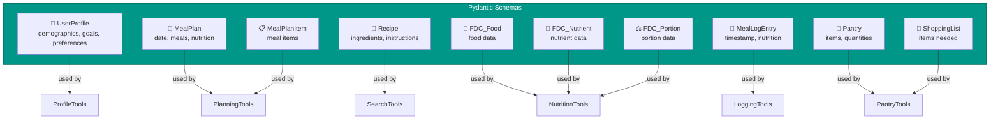

## 7. Utility Functions

### 7.1. Utility Overview

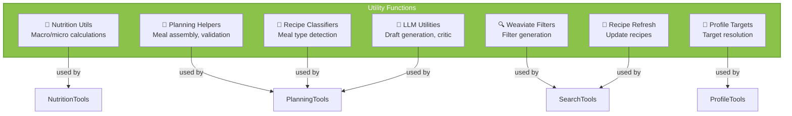

## 8. Key Design Patterns

### 8.1. E2E Tools Pattern
- **Rationale**: Consolidate multiple steps into single atomic operations
- **Benefits**: Reduced round-trips, better error handling, atomic operations
- **Examples**: `plan_day_e2e_tool`, `log_meal_e2e_tool`, `gap_fill_tool`

### 8.2. Environment-Based Communication
- **Pattern**: Tools communicate via shared Environment
- **Read**: `tree_data.environment.find(tool_name, key)`
- **Write**: `tree_data.environment.add_objects(tool_name, key, objects)`
- **Benefits**: Loose coupling, flexible ordering, easy extension

### 8.3. Branch-Based Organization
- **Pattern**: 9 specialized branches for different meal planning tasks
- **Benefits**: Clear separation, better routing, easier maintenance

### 8.4. Tool Chaining
- **Pattern**: Tools can be chained via `chain` parameter in `add_tool()`
- **Examples**: 
  - `macro_calc_tool` chains after `profile_crud_tool`
  - `search_and_rank_tool` chains after `constraints_guard_tool`
  - `pantry_diff_tool` chains after `pantry_crud_tool`
