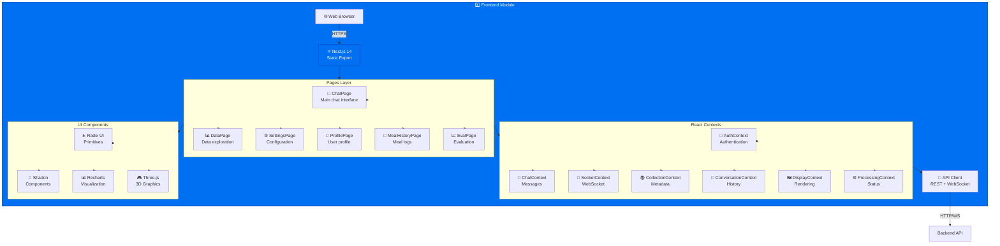
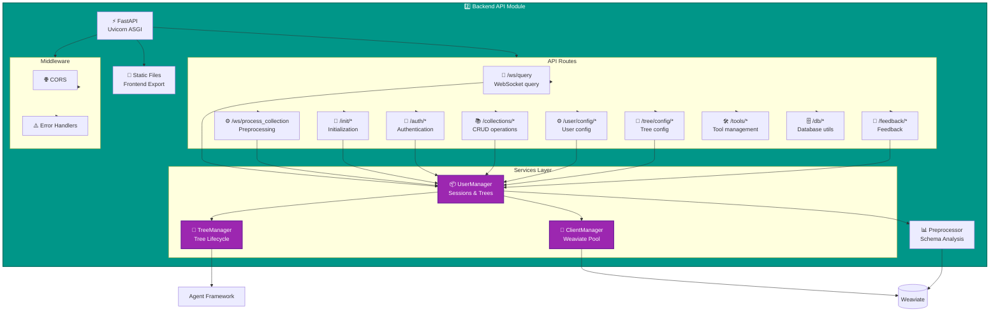
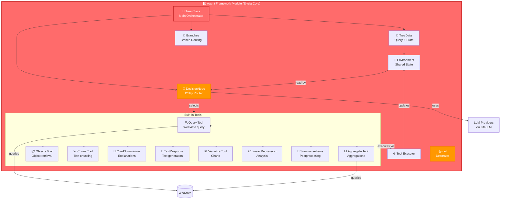
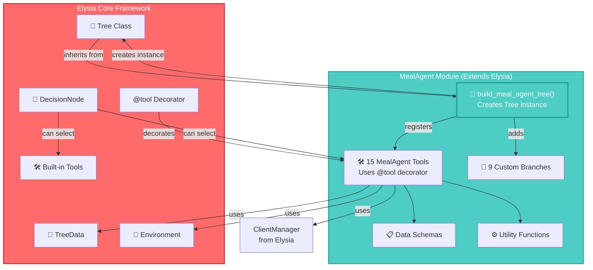
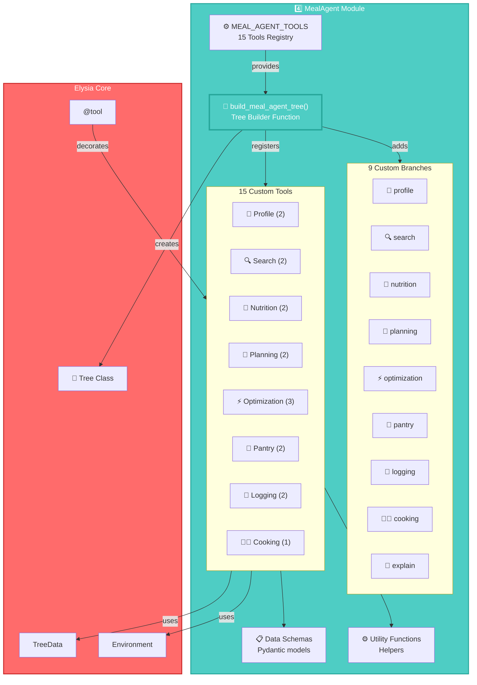
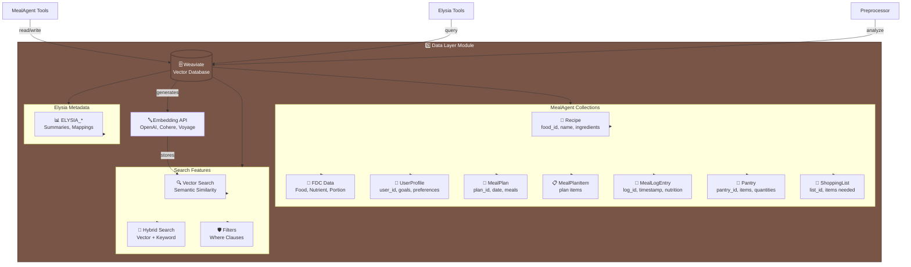
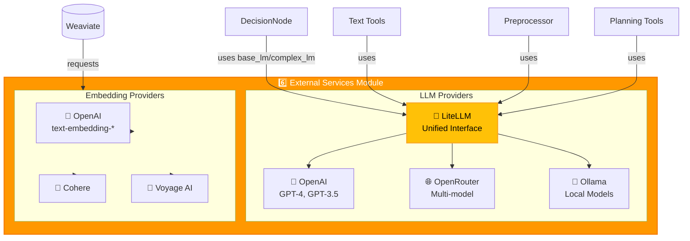

# Module Architectures

Tài liệu này cung cấp các sơ đồ chi tiết cho từng module trong hệ thống MealAgent.

> 📖 **Xem tổng quan hệ thống**: [System Architecture](./system_architecture.md)  
> 📖 **Xem chi tiết MealAgent**: [MealAgent Architecture](./mealagent_architecture.md)

## 1. Frontend Module

### Architecture Diagram

### Key Components

- **Pages**: ChatPage, DataPage, SettingsPage, ProfilePage, MealHistoryPage, EvalPage
- **Contexts**: AuthContext, ChatContext, SocketContext, CollectionContext, ConversationContext, DisplayContext, ProcessingContext
- **API Client**: REST API và WebSocket communication
- **Components**: Radix UI, Shadcn, Recharts, Three.js

---

## 2. Backend API Module

### Architecture Diagram

### Key Components

- **API Routes**: `/ws/query`, `/ws/process_collection`, `/init/*`, `/auth/*`, `/collections/*`, `/user/config/*`, `/tree/config/*`, `/feedback/*`, `/tools/*`, `/db/*`
- **Services**: UserManager (sessions, trees), TreeManager (tree lifecycle), ClientManager (Weaviate connection pool)
- **Middleware**: CORS, Error Handlers
- **Preprocessor**: Collection schema analysis và metadata generation
- **Static Files**: Serves exported Next.js frontend

---

## 3. Agent Framework Module (Elysia Core)

### Architecture Diagram

### Key Components

- **Tree**: Main orchestrator với branch routing và tool execution
- **DecisionNode**: DSPy-based tool selection using base_lm/complex_lm
- **Environment**: Shared state giữa tools (read/write via `find()` và `add_objects()`)
- **Branches**: Route queries to specialized branches
- **Built-in Tools**: Query, Aggregate, Objects, Chunk, CitedSummarizer, TextResponse, Visualize, Regression, SummariseItems
- **@tool Decorator**: Decorator để đăng ký tools vào Tree
- **Tool Executor**: Executes tools và updates Environment

---

## 4. MealAgent Module (Extends Elysia Core)

> 📖 **Xem chi tiết**: [MealAgent Architecture](./mealagent_architecture.md)

### Integration with Elysia Core

### Architecture Diagram

### Key Components

- **Tree Builder**: `build_meal_agent_tree()` function creates Elysia Tree instance with custom configuration
- **9 Custom Branches**: profile, search, nutrition, planning, optimization, pantry, logging, cooking, explain
- **15 Custom Tools**: Domain-specific meal planning tools using Elysia's `@tool` decorator
- **Elysia Integration**: 
  - Uses `TreeData`, `Environment`, `ClientManager` from Elysia
  - Tools decorated with `@tool` from Elysia
  - Tools registered to Tree via `tree.add_tool()`
  - DecisionNode can select both built-in and custom tools
- **Schemas**: Pydantic data models (UserProfile, MealPlan, Recipe, etc.)
- **Utils**: Nutrition, planning, recipe utilities

---

## 5. Data Layer Module

### Architecture Diagram

### Key Collections

- **Recipe**: Recipe data với ingredients và instructions
- **FDC_Food, FDC_Nutrient, FDC_Portion**: Food Data Central data
- **UserProfile**: User profiles với goals và preferences
- **MealPlan**: Daily và weekly meal plans
- **MealPlanItem**: Individual meal items in plans
- **MealLogEntry**: Logged meals với nutrition
- **Pantry**: Pantry inventory
- **ShoppingList**: Generated shopping lists
- **ELYSIA_***: Collection metadata, summaries, mappings

---

## 6. External Services Module

### Architecture Diagram

### Key Services

- **LLM Providers**: OpenAI (GPT-4, GPT-3.5), OpenRouter (multi-model), Ollama (local models)
- **Unified Interface**: LiteLLM provides unified API cho multiple providers
- **Embeddings**: OpenAI (text-embedding-3-small, text-embedding-3-large), Cohere, Voyage AI
- **Usage**: 
  - DecisionNode uses LLM for tool selection
  - Text tools use LLM for generation
  - Preprocessor uses LLM for schema analysis
  - Planning tools use LLM for draft generation
  - Weaviate uses embeddings for vectorization
