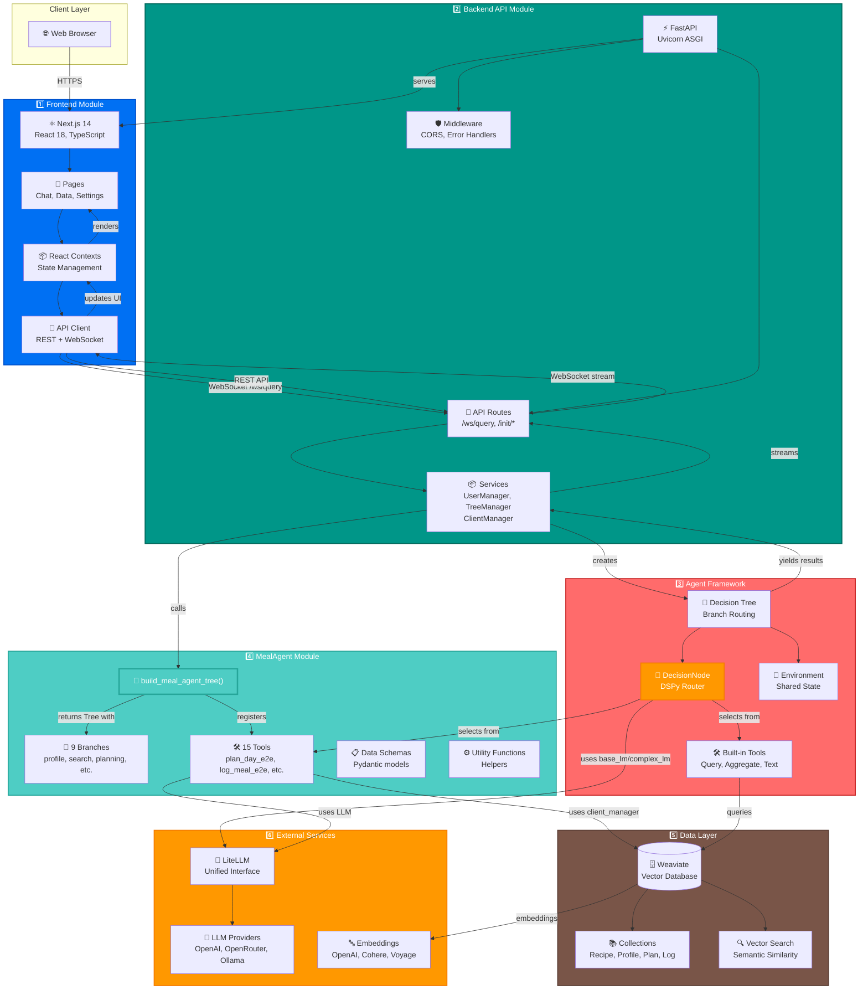
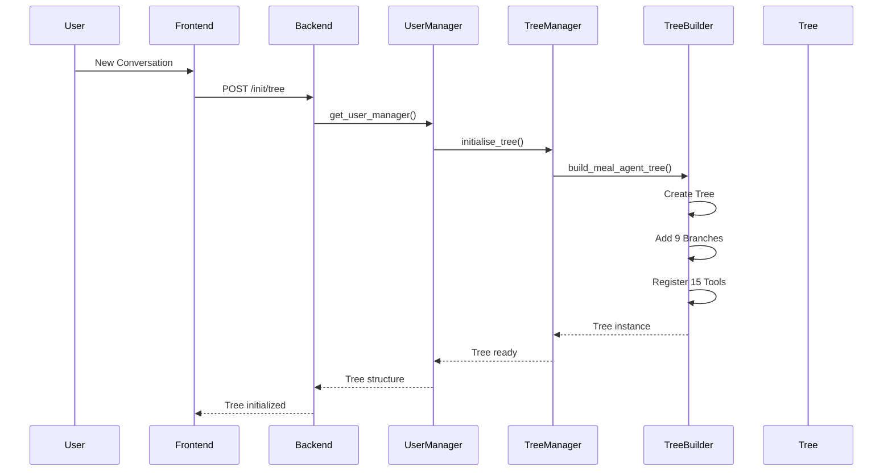

# System Architecture

## Overview

The MealAgent system is a comprehensive meal planning platform built on top of the Elysia agentic framework. It consists of six main modules:

1. **Frontend Module** - Next.js-based single-page application (SPA)
2. **Backend API Module** - FastAPI-based backend server
3. **Agent Framework Module** - Elysia decision tree engine
4. **MealAgent Module** - Custom meal planning tools
5. **Data Layer Module** - Weaviate vector database
6. **External Services Module** - LLM and embedding providers

> 📖 **Xem chi tiết từng module**: [Module Architectures](./module_architectures.md)  
> 📖 **Xem chi tiết MealAgent**: [MealAgent Architecture](./mealagent_architecture.md)

## System Architecture Diagram

## System Flow

### Initialization Flow

## Module Descriptions

### 1. Frontend Module
- **Technology**: Next.js 14, React 18, TypeScript, Tailwind CSS
- **Features**: SPA with client-side routing, real-time chat, data visualization
- **Communication**: REST API and WebSocket connections
- **Components**: Pages, React Contexts, UI Components (Radix UI, Shadcn, Recharts, Three.js)

### 2. Backend API Module
- **Technology**: FastAPI, Uvicorn, Python
- **Components**: UserManager, TreeManager, ClientManager
- **Endpoints**: `/ws/query`, `/init/*`, `/collections/*`, `/auth/*`, `/user/config/*`, `/tree/config/*`, `/feedback/*`, `/tools/*`, `/db/*`
- **Middleware**: CORS, Error Handlers
- **Preprocessor**: Collection schema analysis

### 3. Agent Framework Module
- **Technology**: Elysia Tree, DSPy, LiteLLM
- **Components**: Decision Tree, DecisionNode, Environment, Built-in Tools
- **Function**: Routes queries to appropriate tools via LLM-based decision making
- **Built-in Tools**: Query, Aggregate, Objects, Chunk, CitedSummarizer, TextResponse, Visualize, Regression, SummariseItems

### 4. MealAgent Module
- **Technology**: Python 3.11+, Elysia Tree integration
- **Components**: Tree Builder (`build_meal_agent_tree()`), 15 Tools, 9 Branches, Schemas, Utils
- **Function**: Provides domain-specific meal planning capabilities
- **Tools**: Profile, Search, Nutrition, Planning, Optimization, Pantry, Logging, Cooking tools

### 5. Data Layer Module
- **Technology**: Weaviate Vector Database
- **Collections**: Recipe, UserProfile, MealPlan, MealPlanItem, MealLogEntry, Pantry, ShoppingList, FDC data, Elysia metadata
- **Features**: Vector search, hybrid search, semantic similarity
- **Embeddings**: OpenAI, Cohere, Voyage AI

### 6. External Services Module
- **LLM Providers**: OpenAI, OpenRouter, Ollama (via LiteLLM)
- **Embeddings**: OpenAI, Cohere, Voyage AI
- **Function**: Provides AI capabilities for decision making, text generation, and vectorization
- **Usage**: DecisionNode, Text Tools, Preprocessor, Planning Tools use LLM; Weaviate uses embeddings
