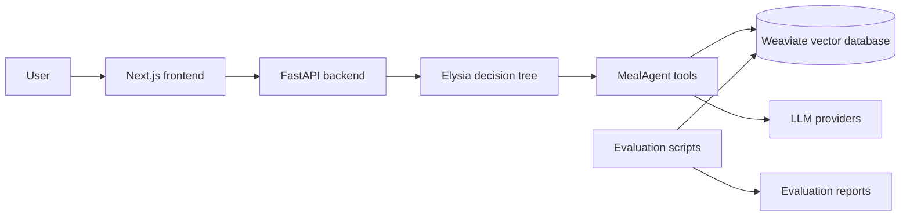

# Thesis overview

This repository is the implementation artifact for the thesis **"AI-Assisted Platform for Personalized Meal Planning and Nutrition Guidance"** by Ngo Cong Huan and Ngo Manh Khuong, University of Information Technology, Vietnam National University Ho Chi Minh City, 2026.

The original thesis document, slide deck, and demo recordings are kept outside normal Git history in the local `ThesisDocsAndVideo/` folder because they are large binary assets. This page summarizes the thesis content as Markdown so the public repository remains readable and lightweight.

## Problem statement

Users often struggle to create daily or weekly meal plans that satisfy nutrition targets while also respecting personal constraints such as diet type, allergies, taste preferences, and pantry inventory. Existing nutrition and meal-planning applications usually provide calorie tracking, static recipe collections, or rigid plans, but they do not fully combine personalization, multi-step reasoning, cultural food adaptation, and explainable recommendations.

The thesis addresses this gap with an **Agentic RAG** system that orchestrates retrieval, reasoning, tool execution, nutrition validation, and user-facing explanations for personalized meal planning.

## Scope and objectives

The project scope is an AI-assisted platform for personalized meal planning, not a clinical diagnostic or long-term medical monitoring system.

Main objectives:

- Generate daily and weekly meal plans tailored to user profiles and nutrition targets.
- Integrate structured nutrition data with Vietnamese recipe knowledge.
- Use Agentic RAG to handle multi-step planning decisions rather than relying on one-shot text generation.
- Provide a complete end-to-end prototype with frontend, backend, vector database, and domain tools.
- Evaluate plan quality through automated LLM-as-a-Judge, nutritional target compliance, and user-experience feedback.

Out of scope:

- Medical diagnosis and clinical diet treatment.
- Long-term medical tracking.
- Clinically validated nutrition prescriptions for disease-specific diets.

## Research context and gaps

The thesis reviewed commercial applications such as Lifesum, Fooducate, MealBoard, MealPrepPro, and Mealime. These systems offer useful features such as clean UI, food education, pantry tracking, macro-based planning, and shopping-list automation, but they remain limited in reasoning depth, nutrient precision, cuisine diversity, or flexibility under personal constraints.

It also reviewed AI-based approaches:

- **Case-Based Reasoning**: reuses and adapts previous diet plans but depends heavily on retrieval and adaptation quality.
- **Genetic algorithms**: optimize plans under constraints but can be computationally expensive.
- **Transformer-based models**: model long-term nutrition patterns but can be costly to train and infer.
- **Teacher-forced REINFORCE**: improves constraint compliance but may produce unrealistic sequences.

The proposed contribution is an Agentic RAG architecture that combines retrieval, tool orchestration, personalization, and explainability.

## System architecture

The implemented system combines:

- **Next.js frontend** for chat, profile management, pantry, meal history, shopping list, settings, and evaluation dashboards.
- **FastAPI backend** built around the Elysia decision-tree framework.
- **MealAgent domain module** for planning, constraints, recipe search, macro adjustment, pantry-aware recommendations, meal logging, shopping lists, and evaluation workflows.
- **Weaviate vector database** for hybrid semantic and keyword search over food, recipe, and user-object collections.
- **LLM providers** accessed through configurable backend settings for generation, routing, critique, and evaluation.

## Dataset sources

The thesis uses two main knowledge sources:

| Dataset | Approximate size | Data type | Role |
| --- | ---: | --- | --- |
| USDA FoodData Central | ~8,200 food items | Numeric + text | Authoritative nutrition reference and nutrient mapping |
| Vietnamese foods dataset | ~4,000 recipes | Text + images | Cultural adaptation and local recipe recommendations |

These datasets support both structured nutrient lookup and semantic recipe retrieval.

## Weaviate collection design

The thesis separates knowledge collections, structured support collections, and user/object collections:

| Collection | Purpose | Source |
| --- | --- | --- |
| `FdcFood` | Standardized nutritional reference for food items | USDA FoodData Central |
| `Recipe` | Semantically searchable recipe knowledge | Vietnamese foods dataset |
| `FdcNutrient` | Structured nutrient metadata | USDA FoodData Central |
| `FdcPortion` | Portion and unit-to-gram conversion data | USDA FoodData Central |
| `UserProfile` | User data and nutrition targets | User registration/profile |
| `MealPlan` | Generated daily/weekly plans | System generated |
| `MealPlanItem` | Individual meals inside plans | System generated |
| `MealLogEntry` | Accepted or consumed meals | User interaction |
| `Pantry` / `PantryItem` | Pantry state and available ingredients | User input |
| `ShoppingList` / `ShoppingItem` | Items needed after meal planning | System generated |

## Meal-planning methodology

The daily planning workflow is structured as a pipeline:

1. Load user profile, nutrition targets, recent meal history, dietary constraints, and pantry state.
2. Generate a structured draft through an LLM using the collected context.
3. Search Weaviate with hybrid retrieval to map draft meal ideas to real recipes.
4. Assemble breakfast, lunch, and dinner with explicit handling for main dishes, carbs, vegetables, and accompaniments.
5. Adjust portions to satisfy calorie and macronutrient targets.
6. Validate allergens, diet constraints, plan completeness, and nutritional plausibility.
7. Produce user-facing explanations and optional critique.
8. Persist accepted plans/logs for future personalization and evaluation.

Weekly planning extends the same principles across multiple days while balancing variety and allowing controlled fallback/reuse when necessary to avoid incomplete plans.

## Evaluation summary

### LLM-as-a-Judge

Purpose: assess reasoning quality, nutrition quality, variety, balance, feasibility, and explainability.

Setup: 41 daily meal plans, including 32 AI-generated plans and 9 accepted meal logs.

| Judge model | Overall | Nutrition | Variety | Balance | Feasibility |
| --- | ---: | ---: | ---: | ---: | ---: |
| Grok 4.1 Fast | 78.66 | 74.83 | 80.02 | 77.61 | 88.95 |
| Gemini 3 Flash | 78.46 | 75.02 | 79.17 | 77.15 | 82.56 |
| MiMo V2 Flash | 74.05 | 68.20 | 76.44 | 75.27 | 75.90 |

Most plans were rated Excellent or Good across judges:

| Judge model | Excellent | Good | Fair | Poor | Excellent + Good |
| --- | ---: | ---: | ---: | ---: | ---: |
| Grok 4.1 Fast | 25 | 11 | 4 | 1 | 87.8% |
| Gemini 3 Flash | 19 | 20 | 2 | 0 | 95.1% |
| MiMo V2 Flash | 7 | 27 | 6 | 1 | 82.9% |

### Nutritional target compliance

Purpose: assess how accurately generated and accepted meal outputs satisfy user-specific nutritional targets.

Setup: 58 meal-related outputs, including 41 generated meal plans and 17 accepted meal logs.

| Category | Error range | Count | Share |
| --- | --- | ---: | ---: |
| Excellent | <10% | 35 | 60.3% |
| Good | 10-15% | 23 | 39.7% |
| Fair | 15-20% | 0 | 0.0% |
| Poor | >=20% | 0 | 0.0% |

The thesis reports a mean overall nutritional error of **6.94%**, with **100%** of evaluated plans classified as Excellent or Good.

### User experience evaluation

Purpose: assess usability, explainability, trust, usefulness, and adoption potential.

Setup: 20 non-clinical participants with basic to intermediate nutrition knowledge.

| Dimension | Mean | Std |
| --- | ---: | ---: |
| Usability & Interaction | 4.65 | 0.13 |
| Meal Plan Quality | 4.26 | 0.02 |
| Explainability & Trust | 4.11 | 0.09 |
| Usefulness & Adoption | 4.74 | 0.07 |
| Overall score | 4.44 | 0.07 |

All user-experience dimensions scored above 4.0/5.0, with usefulness and adoption ranking highest.

## Demo assets

The local thesis folder contains the following demo recordings:

| Local asset | Intended public description |
| --- | --- |
| `Demo.mp4` | Full end-to-end system demonstration |
| `Phase1.mp4` | Initial setup/profile/configuration flow |
| `phase 3.mp4` | Intermediate MealAgent feature flow |
| `phase 4.mp4` | Final integration/evaluation flow |
| `meal day.mp4` | Daily meal-planning workflow |
| `week plan.mp4` | Weekly meal-planning workflow |
| `admin.mp4` | Admin/review workflow |

Publish these as GitHub Release assets or external video links, then update [Demo and thesis materials](../demo/README.md).

## Limitations

- Dataset scale is limited compared with commercial nutrition databases.
- Nutrition values are estimated and not clinically validated.
- The system targets healthy users rather than medical diets.
- User study size is limited.
- Long-term usage was not evaluated.

## Future directions

- Expand recipe and nutrition datasets.
- Add richer personalization from long-term user feedback.
- Improve nutrition validation and clinical safety boundaries.
- Add larger-scale user studies.
- Provide more deployment profiles for CPU-only, GPU, and cloud environments.

## Related documentation

- [Root README](../../README.md)
- [Demo and thesis materials](../demo/README.md)
- [Evaluation framework](../../evaluation/README.md)
- [Academic evaluation documentation](../EVALUATION_DOCUMENTATION.md)
- [MealAgent data pipeline](../../MealAgent/docs/DATA_PIPELINE.md)
- [Plan-day workflow](../../MealAgent/docs/PLAN_DAY_WORKFLOW.md)
